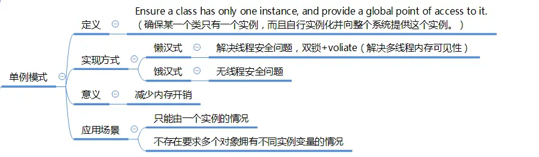

---

title: "设计模式之单例模式"
slug: "设计模式之单例模式"
description:
date: "2019-04-07"
lastmod: "2019-04-07"
image:
math:
license:
hidden: false
draft: false
categories: ["学习笔记"]
tags: ["设计模式"]

---
单例模式应该都很熟悉，就简单上一张图吧：

本文原载于[runningccode.github.io](https://runningccode.github.io)，遵循CC BY-NC-SA 4.0协议，复制请保留原文出处。