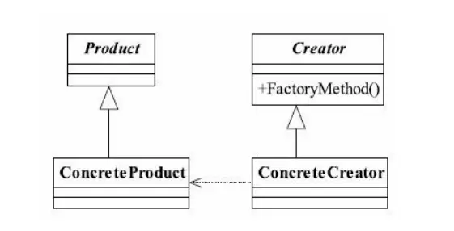

---

title: "设计模式之工厂模式"
slug: "设计模式之工厂模式"
description:
date: "2019-04-07"
lastmod: "2019-04-07"
image:
math:
license:
hidden: false
draft: false
categories: ["学习笔记"]
tags: ["设计模式"]

---
# 一、定义
Define an interface for creating an object,but let subclasses decide which class to
instantiate.Factory Method lets a class defer instantiation to subclasses.（定义一个用于创建对象的接口，让子类决定实例化哪一个类。工厂方法使一个类的实例化延迟到其子类。）

类图：

# 二、用法
1. 定义工厂抽象方法，产品抽象
2. 新建工厂的具体子类去实现工厂抽象方法（可以有参数，如传入产品抽象实现类的Class），返回产品抽象。(所有的产品可以抽象为多个产品族，此时可以考虑定义多个具体工厂类分别对应每个产品族的生产-这就是抽象工厂模式)
# 三、优点
1. 封装创建过程、高层模块与创建过程的解耦，使得程序易于扩展。
2. 符合迪米特法则--业务只和工厂抽象打交道，隔离了复杂的创建过程。
3. 符合依赖倒置原则--业务通过抽象完成，具体的创建产品的细节被工厂方法隐藏了。
4. 符合里氏替换原则
# 四、应用场景
很多业务都会用到某些产品，但是产品却不一样，创建产品对象的流程有点复杂。
# 五、扩展
## （一）简单工厂模式
弱化了工厂方法模式，即业务模块只需要一个工厂，则不对工厂进行抽象，同时工厂方法转为静态方法。缺点是不能进行扩展，不符合开闭原则，如果以后创建出的产品流程需要修改，则简单工厂模式必须修改代码。
## （二）延迟初始化（有点类似缓存）
一个对象被消费完毕后，并不立刻释放，工厂类保持其初始状态（最简单的保存在LinkedHashMap（可以做一个LRU容器）里面），等待再次被使用。

本文原载于[runningccode.github.io](https://runningccode.github.io)，遵循CC BY-NC-SA 4.0协议，复制请保留原文出处。