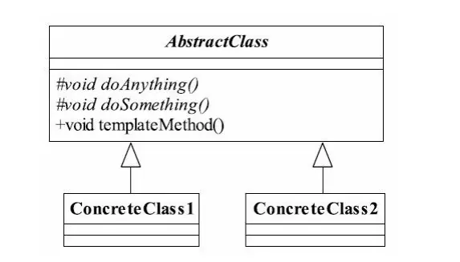

---

title: "设计模式之模板方法模式"
slug: "设计模式之模板方法模式"
description:
date: "2019-04-09"
lastmod: "2019-04-09"
image:
math:
license:
hidden: false
draft: false
categories: ["学习笔记"]
tags: ["设计模式"]

---
# 一、定义
Define the skeleton of an algorithm in an operation,deferring some steps to subclasses.Template Method lets subclasses redefine certain steps of an algorithm without changing the algorithm's structure.（定义一个操作中的算法的框架，而将一些步骤延迟到子类中。使得子类可以不改变一个算法的结构即可重定义该算法的某些特定步骤。）

在JDK的IO流中就提供了抽象类InputStream和OutPutStream中就定义了许多模板方法，而基本方法只有一个read()和write()，实现对流单个字节的读入和写出，其他方法抽象类都提供模板，当然子类处于优化的目的也可以进行重写。

# 二、结构
##（一）类图

##（二）名词解释
- 抽象模板:子类的抽象默认实现类，类图中为AbstractClass。
- 基本方法：由子类实现的方法，类图中为doAnything()和doSomething()，权限修饰符尽量为protectd。
- 模板方法：抽象类的默认实现方法，实现对基本方法的调度。类图中为templateMethod()，一般加final关键字禁止被重写。
# 三、优点
代码复用，扩展良好。
# 四、应用场景
- 多个子类有公有的方法，并且逻辑基本相同时。
- 重要、复杂的算法，可以把核心算法设计为模板方法，周边的相关细节功能则由各个子类实现
- 重构时，模板方法模式是一个经常使用的模式，把相同的代码抽取到父类中，然后通过钩子函数（Hook Method）约束其行为。(钩子函数：即模板方法存在分支，这可以定义一个钩子方法供子类实现，末班方法中根据钩子方法返回值来控制分支走向)

本文原载于[runningccode.github.io](https://runningccode.github.io)，遵循CC BY-NC-SA 4.0协议，复制请保留原文出处。