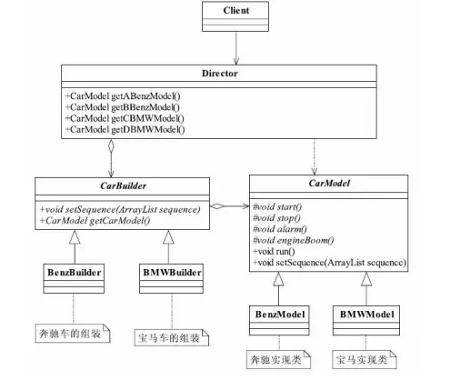

---

title: "设计模式之建造者模式"
slug: "设计模式之建造者模式"
description:
date: "2019-04-11"
lastmod: "2019-04-11"
image:
math:
license:
hidden: false
draft: false
categories: ["学习笔记"]
tags: ["设计模式"]

---
# 一、定义
Separate the construction of a complex object from its representation so that the same construction process can create different representations.（将一个复杂对象的构建与它的表示分离，使得同样的构建过程可以创建不同的表示。）

# 二、构成
## （二）类图
引用《设计模式之禅》中的类图：

其中：
- Product产品抽象
- ConcreteProduct具体产品类
- Builder抽象建造者
  规范产品的组建，一般是由子类实现。
- ConcreteBuilder具体建造者
  实现抽象类定义的所有方法，提供设置产品类成员变量的方法以及返回产品类对象的方法，也就是只提供一系列建造对象的行为。
- Director导演类
  负责准备基础数据，调用具体建造者进行建造，只关注建造对象的过程。
- 注：其中产品类的特点是，同一个类成员变量不同则行为也有不同
# 三、优点
封装各个产品的生成逻辑，上层业务只关心需要获取哪个产品。
# 四、使用场景
- 我对建造者模式使用场景的理解是同一个类的成员变量不同则行为也有不同，通过组装成员变量封装该类对象的创建。

对于一类对象，对一个行为的区别我们使用成员变量区分更方便，这意味着我们将某一个行为抽象到了成员变量上面，成员变量不同，导致的产品特征也不同。这个时候用建造者模式来获取这些具体的对象更方便。这时候我们可以将设置成员变量和获取对象两个行为抽象到建造者对象的方法中，其中建造者产出的是一类对象，这一类对象仅仅是成员变量的不同，那么导演类的职责就是为场景方提供确切的对象，只关注构建的过程，上层场景只关注获取某一个确切的类。当我们需要某一个特殊的产品时仅仅通过导演类去调用建造者的设置变量的方法(setPart()方法)和获取对象的方法（build()方法）就能得到想要的对象
# 五、与工厂模式的区别
个人理解是，工厂模式里面的工厂关注的是直接实例化某类对象得到产品，但对于建造者模式里面的建造者而言，建造者并不直接返回产品，建造者只是提供建造方法（关注的是setPart方法-设置成员变量，product方法-产出设置后的产品）去获取产品，真正获取产品是由导演类获取，通过同一个建造者，两种应用场景的区别是我们需要获取的产品对应的JAVA类，是否是依赖成员变量不同来维护一种需求上的变化。

本文原载于[runningccode.github.io](https://runningccode.github.io)，遵循CC BY-NC-SA 4.0协议，复制请保留原文出处。