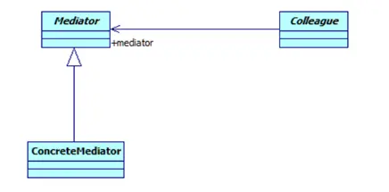

---

title: "设计模式之中介者模式"
slug: "设计模式之中介者模式"
description:
date: "2019-04-14"
lastmod: "2019-04-14"
image:
math:
license:
hidden: false
draft: false
categories: ["学习笔记"]
tags: ["设计模式"]

---
# 一、什么是中介者模式
Define an object that encapsulates how a set of objects interact.Mediator promotes loose coupling by keeping objects from referring to each other explicitly,and it lets you vary their interaction independently.（用一个中介对象封装一系列的对象交互，中介者使各对象不需要显示地相互作用，从而使其耦合松散，而且可以独立地改变它们之间的交互。）
## （一）类图

## （二）角色定义
- Mediator: 抽象中介者
- ConcreteMediator: 具体中介者
- Colleague: 抽象同事类
- ConcreteColleague: 具体同事类
# 二、优缺点
- 优点：将原本一对多的依赖关系，通过中介者转换为1对1的依赖关系，使得类间依赖关系更为直观；同时通过中间者封装了与所有同事之间的交互，分离了对象自身业务逻辑与其依赖的同事关系行为，使得职责更清晰，业务逻辑也更易于修改了。
- 缺点：在具体中介者类中包含了多个同事之间的交互细节，有可能会导致具体中介者类变得很复杂；抽象同事类难以抽象出同事类行为的共性，如果提取不出来则中介类直接引入同事类的具体实现，与依赖倒置原则相冲突。
# 三、应用场景
一个业务需要多个对象参与，他们之间的依赖关系联系紧密，但却很混乱。
# 四、个人理解
一系列的对象依赖关系复杂，层次混乱，那么可以用中介者模式进行重构，抽象对象的关系为中介者与同事类的关系。重构后的架构有一个中介者，多个同时类，原来的每一个类都有一个对应的同事类，
完成自己的事情，如果这一个类需要完成的事情需要其他类来协作的话，统一用中介者的方法来代理，中介者该方法的实现实际上就是调用另一个具体的同事类来完成的。这样可以避免类之间调用关系的混乱。原来的如原来的A->B->C->B->A优化为了A->中介者，B->中介者，C->中介者，然后中介者->A,B,C,D

本文原载于[runningccode.github.io](https://runningccode.github.io)，遵循CC BY-NC-SA 4.0协议，复制请保留原文出处。