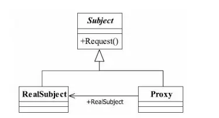
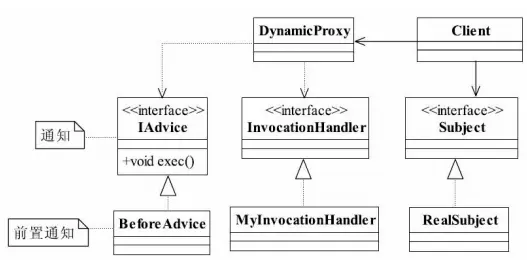

---

title: "设计模式之代理模式"
slug: "设计模式之代理模式"
description:
date: "2019-04-14"
lastmod: "2019-04-14"
image:
math:
license:
hidden: false
draft: false
categories: ["学习笔记"]
tags: ["设计模式"]

---
# 一、定义
Provide a surrogate or placeholder for another object to control access to it.（为其他对象提供一种代理以控制对这个对象的访问。）
# 二、基本组成
## （一）类图

## （二）角色定义
- Subject抽象主题角色。抽象主题类可以是抽象类也可以是接口，是一个最普通的业务类型定义，无特殊要求
- RealSubject具体主题角色。也叫做被委托角色、被代理角色。是业务逻辑的具体执行者。
- Proxy代理主题角色。也叫做委托类、代理类。它负责对真实角色的应用，把所有抽象主题类定义的方法限制委托给真实主题角色实现，并且在真实主题角色处理完毕前后做预处理和善后处理工作。一个代理类可以代理多个被委托者或被代理者。
# 三、代理方式与实现
- 普通代理。客户端可以指定代理类对象，其实现为客户端创建被代理对象，然后将被代理对象注入代理对象，用代理对象去执行业务。
- 强制代理。客户端只能使用业务对象规定的代理对象，其实现为客户端创建被代理对象，通过被代理对象获取代理对象，然后用代理对象去执行业务。
# 四、说一说动态代理
代理模式的高级应用是动态代理。动态代理的优势在于相较于普通的使用代理模式需要为每个具体类创建一个类，而动态代理是动态的生成代理类而不需要定义代理类。
## （一）动态代理的两种方式
- JDK提供的java.lang.reflect.Proxy动态代理
- cglib库

两者的区别在于：

- 实现原理的区别：jdk是基于业务类实现的接口动态生成代理类定义，然后将代理类方法的实现转发给InvocationHanlder（InvocationHanlder需先注入被代理对象），而cglib是基于继承动态生成其子类，然后重写其子类方法来实现的。
- 限制上的区别：jdk限制被代理类必须实现接口，而cglib没有这个限制。
- 创建的对象个数不同：因为原理的不同，jdk需要实例化两个对象，而cglib只实例化一个对象。
## （二）基于动态代理的代理模式（以jdk方式为例）
类图：

其中，动态代理DynamicProxy实现代理的职责，业务逻辑Subject实现相关的逻辑功能。
# 三、代理模式的优点
在不改变原方法的基础上通过代理提供访问控制、日志记录等等，与业务逻辑相独立，符合单一职责原则。
# 四、与装饰器模式的区分
个人感觉装饰器模式和代理模式用法上来说差不多，同样的代码不看其他地方的应用说不清楚到底是装饰器模式和代理模式，两者最重要的区别只是说关注的点不一样罢了。一个是注重的是装饰，一个注重的是代理。需要注意的是装饰类或代理类本身也可以再次装饰和代理。装饰注重的是增强对象原有的功能，而代理模式注重的是控制访问。

**代理模式对于整个系统来说是控制了真实对象的访问，我们往往只需要使用代理类完成相关业务功能就行了，被代理类相对透明。如果是装饰器模式，那么我们需要关注的是被装饰的类需要添加什么装饰这个过程，系统中的代码还是得依赖被装饰对象。**

本文原载于[runningccode.github.io](https://runningccode.github.io)，遵循CC BY-NC-SA 4.0协议，复制请保留原文出处。