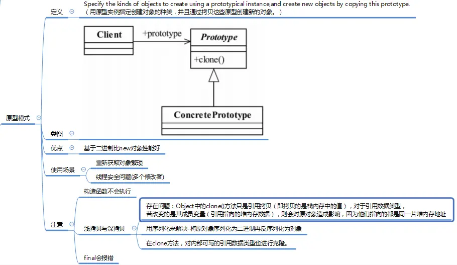

---

title: "设计模式之原型模式"
slug: "设计模式之原型模式"
description:
date: "2019-04-14"
lastmod: "2019-04-14"
image:
math:
license:
hidden: false
draft: false
categories: ["学习笔记"]
tags: ["设计模式"]

---

简而言之，原型模式就是通过一个创建好的已经初始化完成的一个模板对象，拷贝获取另一个一样的对象，能便利的获取基于原型模板的对象。并且能解决并发修改问题。

本文原载于[runningccode.github.io](https://runningccode.github.io)，遵循CC BY-NC-SA 4.0协议，复制请保留原文出处。