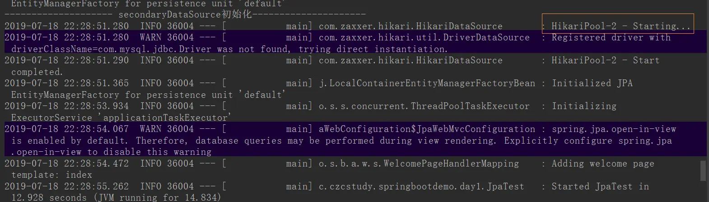

---

title: "Springboot 2.1.5 配置JPA多数据源"
slug: "Springboot 2.1.5 配置JPA多数据源"
description:
date: "2019-07-18"
lastmod: "2019-07-18"
image:
math:
license:
hidden: false
draft: false
categories: ["学习笔记"]
tags: ["多数据源"]

---
最近在学springJpa，照着网上博客想试着配一下Jpa的多数据源，但发现因为springboot版本太高的问题，网上的demo都不适用，导致找了很久才找到解决办法。现在把操作过程记录如下。
# 一、yml配置
```
spring:
  datasource:
    test1:
      driver-class-name: com.mysql.jdbc.Driver
      password: 123456
      #url: jdbc:mysql://localhost:3306/test?useUnicode=true&characterEncoding=UTF-8&serverTimezone=UTC&useSSL=false
      #springboot2.0以上
      jdbc-url: jdbc:mysql://localhost:3306/test?useUnicode=true&characterEncoding=UTF-8&serverTimezone=UTC&useSSL=false
      username: root
    test2:
      driver-class-name: com.mysql.jdbc.Driver
      password: 123456
      #url: jdbc:mysql://localhost:3306/test2?useUnicode=true&characterEncoding=UTF-8&serverTimezone=UTC&useSSL=false
      #springboot2.0以上
      jdbc-url: jdbc:mysql://localhost:3306/test2?useUnicode=true&characterEncoding=UTF-8&serverTimezone=UTC&useSSL=false
      username: root
  jpa:
    ## 是否打印sql
    show-sql: true
    properties:
      hibernate:
        # 指定引擎为Innodb
        dialect: org.hibernate.dialect.MySQL5InnoDBDialect
        hbm2ddl:
          # create： 每次加载 hibernate 时都会删除上一次的生成的表，
          # 然后根据你的 model 类再重新来生成新表，哪怕两次没有任何改变也要这样执行，
          # 这就是导致数据库表数据丢失的一个重要原因。
          # create-drop ：每次加载 hibernate 时根据 model 类生成表，但是 sessionFactory 一关闭,表就自动删除。
          # update：最常用的属性，第一次加载 hibernate 时根据 model 类会自动建立起表的结构（前提是先建立好数据库），以后加载 hibernate 时根据 model 类自动更新表结构，即使表结构改变了但表中的行仍然存在不会删除以前的行。要注意的是当部署到服务器后，表结构是不会被马上建立起来的，是要等 应用第一次运行起来后才会。
          # validate ：每次加载 hibernate 时，验证创建数据库表结构，只会和数据库中的表进行比较，不会创建新表，但是会插入新值。
          auto: update
```
# 二、注册datasource到spring容器
```
@Configuration
public class DataSourceConfig {
    @Bean(name = "primaryDataSource")
    @Primary
    @Qualifier("primaryDataSource")
    @ConfigurationProperties(prefix = "spring.datasource.test1")
    public DataSource primaryDataSource() {
        System.out.println("-------------------- primaryDataSource初始化 ---------------------");
        return DataSourceBuilder.create().build();
    }

    @Bean(name = "secondaryDataSource")
    @Qualifier("secondaryDataSource")
    @ConfigurationProperties(prefix = "spring.datasource.test2")
    public DataSource secondaryDataSource() {
        System.out.println("-------------------- secondaryDataSource初始化---------------------");
        return DataSourceBuilder.create().build();
    }
}
```
# 三、注册jpa相关对象进入spring容器
数据源1:

```
@Configuration
@EnableTransactionManagement
@EnableJpaRepositories(
        entityManagerFactoryRef="entityManagerFactoryPrimary",
        transactionManagerRef="transactionManagerPrimary",
        basePackages= { "com.czcstudy.springbootdemo.day1.dao.test1" }) //设置Repository所在位置
public class RepositoryPrimaryConfig {
    @Autowired
    @Qualifier("primaryDataSource")
    private DataSource primaryDataSource;
    @Autowired
    private JpaProperties jpaProperties;
    @Autowired
    private HibernateProperties hibernateProperties;

    @Primary
    @Bean(name = "entityManagerFactoryPrimary")
    public LocalContainerEntityManagerFactoryBean entityManagerFactoryPrimary(
            EntityManagerFactoryBuilder builder) {
		//网上文章大多数都是jpaProperties.getHibernateProperties(dataSource);就直接得到了hibernate的配置map，
		//但这个方法在springboot2.0+好像就舍弃了，所以这里改成这样。
        Map<String, Object> properties = hibernateProperties.determineHibernateProperties(
                jpaProperties.getProperties(), new HibernateSettings());
        return builder.dataSource(primaryDataSource).properties(properties)
                .packages("com.czcstudy.springbootdemo.day1.bean.po").build();//实体包路径
    }

    @Primary
    @Bean(name = "transactionManagerPrimary")
    public PlatformTransactionManager transactionManagerPrimary(EntityManagerFactoryBuilder builder) {
        return new JpaTransactionManager(entityManagerFactoryPrimary(builder).getObject());
    }

```

数据源2：

```
@Configuration
@EnableTransactionManagement
@EnableJpaRepositories(
        entityManagerFactoryRef="entityManagerFactorySecondary",
        transactionManagerRef="transactionManagerSecondary",
        basePackages= { "com.czcstudy.springbootdemo.day1.dao.test2" }) //设置Repository所在位置
public class RepositorySecondaryConfig {
    @Autowired
    @Qualifier("secondaryDataSource")
    private DataSource secondaryDataSource;
    @Autowired
    private JpaProperties jpaProperties;
    @Autowired
    private HibernateProperties hibernateProperties;

    @Bean(name = "entityManagerFactorySecondary")
    public LocalContainerEntityManagerFactoryBean entityManagerFactorySecondary(
            EntityManagerFactoryBuilder builder) {
		//网上文章大多数都是jpaProperties.getHibernateProperties(dataSource);就直接得到了hibernate的配置map，
		//但这个方法在springboot2.0+好像就舍弃了，所以这里改成这样。
        Map<String, Object> properties = hibernateProperties.determineHibernateProperties(
                jpaProperties.getProperties(), new HibernateSettings());
        return builder.dataSource(secondaryDataSource).properties(properties)
                .packages("com.czcstudy.springbootdemo.day1.bean.po").build();//实体的包路径
    }

    @Bean(name = "transactionManagerSecondary")
    public PlatformTransactionManager transactionManagerPrimary(EntityManagerFactoryBuilder builder) {
        return new JpaTransactionManager(entityManagerFactorySecondary(builder).getObject());
    }
}
```
# 四、使用spring事务例
```
@Service
public class JpaTestServiceImpl implements JpaTestService {
    @Autowired
    private UserJpaTest2Dao userRepository2;

    @Override
    @Transactional(value = "transactionManagerSecondary",rollbackFor = RuntimeException.class)
    public void test(){
        List<UserJpaTest> userJpaTestList  = userRepository2.findAll();
        System.out.println(userJpaTestList);
    }
}
```

其中指定的value就是前面注册的PlatformTransactionManager对象名称，多数据源时需要指定。

# 五、小结
以上就是springboot2.1.5 配置jpa多数据源的方法，启动项目我们可以看到



HikariPool连接池已经启动了，这是springboot的默认数据库连接池，所以连接池我们这里就不自己配了。


本文原载于[runningccode.github.io](https://runningccode.github.io)，遵循CC BY-NC-SA 4.0协议，复制请保留原文出处。