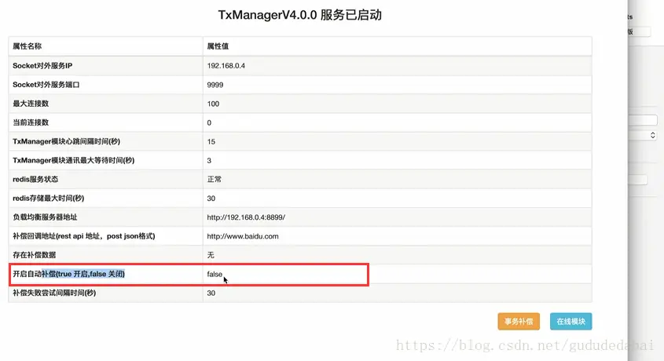

---

title: "初识LCN分布式事务框架"
slug: "初识LCN分布式事务框架"
description:
date: "2019-07-27"
lastmod: "2019-07-27"
image:
math:
license:
hidden: false
draft: false
categories: ["学习笔记"]
tags: ["LCN"]

---

今天无意中发现了一款分布式事务框架，LCN,看了下网上介绍感觉挺强大的。这里做一下笔记。
# 一、环境基础
LCN框架基础需要一台服务器作为事务管理器TxManager，此外还需要Redis和Eureka做配合，eureka负责为TxManager注册，redis主要是用于TxManager存放事务组和补偿的信息。
# 二、一个事务所涉及的角色
- 事务发起方服务
- TxManager事务管理器
- 事务下游服务（可能有多个）
# 三、原理
TxManager是基于本地事务的，这里有一个事务组的概念，事务组是所有涉及的微服务的本地事务的集合。

它主要原理是对通过重写dataSource的close方法，本身的close方法是需要关闭本地事务的，但是重写后并没有关闭事务，而是把事务信息记录在txmanager的redis中，等待事务发起方服务业务执行完成或异常的时候再发通知给各个服务通知本地事务提交或回滚的。在代理连接池中，并不是都不真实提交事务，它可以自动识别连接的读或写操作，如果全是读操作，那么将返回本地连接对象。如果该方法被重复执行，连接也可以被重用，同时也有超时限制，参与模块等待通知超时会自动提交或者回滚（这里具体不清楚到底是提交还是回滚，暂时存疑，不过看后面的补偿机制说明，好像是自动提交？）

TxManager类似于二阶段提交，只不过二阶段提交的事务发起方和事务管理器在同一台机器，而TxManager是作为独立的中间件。
# 四、事务补偿
事务补偿指的是当事务发起方服务异常或正常执行的时候发送事务组关闭的请求到TxManager，让TxManager通知下游服务回滚或提交事务，二阶段模型中这一步没有解决结束事务操作能否正确提交到资源管理端的问题，在LCN中提供了一种自动补偿机制。

首先看一看TxManager后台页面：

这里，有两项值得注意，第一项是补偿回调地址，这正是在TxManager发送通知下游服务回滚或提交事务失败的时候回调事务信息给事务发起方服务的回调地址
第二项是是否开启自动补偿。
不开启补偿的话，TxManager还是会回调。
自动补偿是怎么实现的勒？首先TxManager回调事务发起方服务（携带了事务信息，切面拦截信息），那么事务发起方在回调方法中就写一个重复业务的操作，这个操作中还是会模拟上次的请求。但是针对已经上次通知成功commit的服务，这次就需要回滚了，只有通知失败的服务需要commit。

# 五、小结
git地址：https://github.com/syzpig/tx-lcn

demo地址：https://github.com/codingapi/springcloud-lcn-demo

官方文档地址：https://txlcn.org/zh-cn/docs/preface.html

Lcn支持springcloud和dubbo。拉了springcloud的demo代码下来看，看了使用方法，环境搭好以后只需要在事务发起方法里使用@TxTransaction(isStart = true)注解，然后在下游服务方法中使用@TxTransaction就行了，使用方法很简单，代码侵入很低，值得推荐。

另外，提一点，对于消息队列异步调用的形式，这款框架并不能满足事务一致性，需要结合其他方案。

在最新版本的Lcn中发现也支持TCC和TXC模式~~~~~~~~

本文原载于[runningccode.github.io](https://runningccode.github.io)，遵循CC BY-NC-SA 4.0协议，复制请保留原文出处。