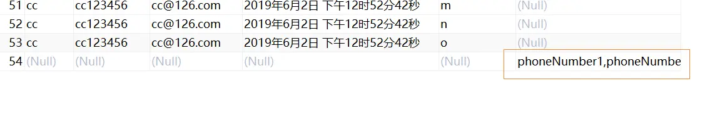

---

title: "Mybatis自定义全局TypeHander"
slug: "Mybatis自定义全局TypeHander"
description:
date: "2019-08-13"
lastmod: "2019-08-13"
image:
math:
license:
hidden: false
draft: false
categories: ["学习笔记"]
tags: ["mybatis"]

---
# 一、TypeHander介绍
typeHander就是mybatis处理Java类型和Jdbc类型时转换策略。mybatis在查询设置参数和从查询结果映射到Java类型时会调用相应的typeHander的方法完成转换。这里我写了一个小demo以完成自定义List到数据库的转换关系，mybatis自动注册了很多typeHander，比如Java中的基本类型，包装类型，mybatis都为我们注册了，当我们不指定具体的typeHander时，mybatis会自动选择合适的typeHander以完成java类型和jdbc类型的相互转换。
# 二、过程
## 1.首先创建List的TypeHander
```
/**
 * @author chenzhicong
 * @time 2019/8/13 20:37
 * @description
 */
public class ListTypeHandler extends BaseTypeHandler<List<String>> {


    @Override
    public void setNonNullParameter(PreparedStatement ps, int i, List<String> parameter, JdbcType jdbcType) throws SQLException {
        if (jdbcType == null) {
            ps.setString(i, StringUtils.collectionToCommaDelimitedString(parameter));
        } else {
            ps.setObject(i, parameter, jdbcType.TYPE_CODE);
        }
    }

    @Override
    public List<String> getNullableResult(ResultSet rs, String columnName) throws SQLException {
        String s = rs.getString(columnName);
        return s==null ? null : new ArrayList<String>(Arrays.asList(s.split(",")));
    }

    @Override
    public List<String> getNullableResult(ResultSet rs, int columnIndex) throws SQLException {
        String s = rs.getString(columnIndex);
        return s==null ? null : new ArrayList<>(Arrays.asList(s.split(",")));
    }

    @Override
    public List<String> getNullableResult(CallableStatement cs, int columnIndex) throws SQLException {
        String s = cs.getString(columnIndex);
        return s==null ? null : new ArrayList<>(Arrays.asList(s.split(",")));
    }
}
```
首先继承BaseTypeHandler,指定其泛型参数为我们需要转换的java类型，BaseTypeHandler运用了模板方法模式，封装了很多空值判断，异常处理。说明一下：这里这个类型转换器没有指定具体的jdbcType，所以mybatis会自动判断当java类型为List的时候就匹配这个这个转换器。
## 2.然后注册到Mybatis的TypeHandlerRegistry
注册到TypeHandlerRegistry是为了全局自定义效果，如果不注册，需要在Mapper，xml里面的resultMap去指定typeHander如：

```
<resultMap id="personMap" type="person">
        <id property="id" column="id"/>
        <result property="name" column="name"/>
        <result property="sex" column="sex"/>
        <result property="hobbys" column="hobbys" typeHandler="com.sankuai.lkl.typeHandler.ListTypeHandler"/>
        <result property="date" column="data_time"/>
 </resultMap>
```

注册的思路是直接在spring容器加载完bean的时候从容器里面取出TypeHandlerRegistry，然后注册我们自定义的转换器：

```
/**
 * @author chenzhicong
 * @time 2019/8/13 22:19
 * @description
 */
@Component
public class CustomTypeHandlerParser implements ApplicationContextAware {
    @Override
    public void setApplicationContext(ApplicationContext applicationContext) throws BeansException {
        //从spring容器获取sqlSessionFactory
        SqlSessionFactory sqlSessionFactory = applicationContext.getBean(SqlSessionFactory.class);
        //获取typeHandler注册器
        TypeHandlerRegistry typeHandlerRegistry = sqlSessionFactory.getConfiguration().getTypeHandlerRegistry();
        //注册List的typeHandler
        typeHandlerRegistry.register(List.class, ListTypeHandler.class);


    }
}
```

# 三、测试

```
@Test
  public void test() {
    UserJpaTest userJpaTest = new UserJpaTest();
    List<String> list = new ArrayList<>();
    list.add("phoneNumber1");
    list.add("phoneNumber2");
    userJpaTest.setPhoneNumber(list);
    userJpaTestMapper.insert(userJpaTest);

  }
```

# 四、效果



可以看到，在数据库中已经把集合转换为了逗号分隔的字符串。

# 五、进阶-创建枚举的TypeHandler
TypeHander还经常应用于枚举与数据库字符串的转换策略，业务中，我们枚举通常有三个变量，一个是给前端的展示字符，一个是存入数据库的字符，另一个是我们在java系统的字符。为了让数据库只识别我们其中存入数据库的字符，同时把数据库中字符转换为我们想要的枚举。我们可以用自定义的转换器来便利的实现。下面介绍下过程：

首先我们可以把所有枚举抽象为一个接口。如下，我们抽象了所有枚举为一个接口枚举的EntityEnumIFace接口，接口的getDbCode方法为需要转换的数据库字符串，我们通过这个转换器去处理这一类枚举抽象的转换：
```
public final class EntityEnumIFaceHandler<T extends Enum<T> & EntityEnumIFace> extends BaseTypeHandler<T> {
    private Class<T> type;

    public EntityEnumIFaceHandler(Class<T> type) {
        if (null == type) {
            throw new IllegalArgumentException("type参数不能为空");
        } else {
            this.type = type;
        }
    }
@Override
    public void setNonNullParameter(PreparedStatement preparedStatement, int i, T t, JdbcType jdbcType) throws SQLException {
        if (jdbcType == null) {
            preparedStatement.setString(i, ((EntityEnumIFace)t).getDbCode());
        } else {
            preparedStatement.setObject(i, ((EntityEnumIFace)t).getDbCode(), jdbcType.TYPE_CODE);
        }

    }
    @Override
    public T getNullableResult(ResultSet resultSet, String s) throws SQLException {
        String value = resultSet.getString(s);
        return value == null ? null : valueOf(this.type, value);
    }
    @Override
    public T getNullableResult(ResultSet resultSet, int i) throws SQLException {
        String value = resultSet.getString(i);
        return value == null ? null : valueOf(this.type, value);
    }
    @Override
    public T getNullableResult(CallableStatement callableStatement, int i) throws SQLException {
        String value = callableStatement.getString(i);
        return value == null ? null : valueOf(this.type, value);
    }

    private static <E extends Enum<E> & EntityEnumIFace> E valueOf(Class<E> enumClass, String dbCode) {
       E[] enumConstants = enumClass.getEnumConstants();
        if (null != enumConstants) {
            for (E e : enumConstants) {
                if (e.getDbCode().equals(dbCode)) {
                    return e;
                }
            }
        }
        throw new BusinessException("ENUM_NOT_EXIST", enumClass.getSimpleName() + "枚举中没有" + dbCode, false);
    }
}
```

可能看了上面会奇怪，为什么前面定义的转换器实例化没有有参构造方法，这里却定义了有参构造方法？这个实例化过程又是怎么样的？别急，等下面我们再看，这里我们先将其注册到容器，我们怎么注册到容器勒？这里可以通过扫描指定包路径然后获取所有枚举的class对象再用typeHandlerRegistry.register注册到mybatis,如：

```
try {
            Set<Class<?>> set =  ClassUtil.listClass(BUSINESS_ENUM_PACKAGE);
            set.forEach(o->{
                if(EntityEnumIFace.class.isAssignableFrom(o.getClass())){
                    typeHandlerRegistry.register(o.getClass(),EntityEnumIFaceHandler.class);
                }
            });
        }catch (Exception e){
           log.error(e.getMessage(),e);
        }
```

其中ClassUtil.listClass方法逻辑就是扫描包路径，然后用类加载器加载class文件获取class对象。

我们可以看到这里和注册ListTypeHandler没有两样都是调用的同一个方法register（register(Class<?> javaTypeClass, Class<?> typeHandlerClass)），我们先进入这个方法看一看源码，源码调用了register(javaTypeClass, getInstance(javaTypeClass, typeHandlerClass)，我们在进去getInstance方法看一看，怎么实例化的typeHandler，源码如下：

```
public <T> TypeHandler<T> getInstance(Class<?> javaTypeClass, Class<?> typeHandlerClass) {
    if (javaTypeClass != null) {
      try {
        Constructor<?> c = typeHandlerClass.getConstructor(Class.class);
        return (TypeHandler<T>) c.newInstance(javaTypeClass);
      } catch (NoSuchMethodException ignored) {
        // ignored
      } catch (Exception e) {
        throw new TypeException("Failed invoking constructor for handler " + typeHandlerClass, e);
      }
    }
    try {
      Constructor<?> c = typeHandlerClass.getConstructor();
      return (TypeHandler<T>) c.newInstance();
    } catch (Exception e) {
      throw new TypeException("Unable to find a usable constructor for " + typeHandlerClass, e);
    }
  }
```

我们可以看到，实例化typeHandler会首先调用有参构造方法，将typeHandlerRegistry.register参数的javaTypeClass传入typeHandlerClass创建typeHandlerClass的实例，若没有反射获取到构造方法即抛了NoSuchMethodException异常，将进行忽略，进而调用无参的构造方法创建typeHandlerClass实例。所以我们ListTypeHandler和EntityEnumIFaceHandler都通过此方法成功实例化了，我想这个方法之所以这么设计应该是想让TypeHandlerClass能够知晓需要处理的具体Class类型然后去做更通用的抽象去处理这一类Class的转换方式吧。


本文原载于[runningccode.github.io](https://runningccode.github.io)，遵循CC BY-NC-SA 4.0协议，复制请保留原文出处。