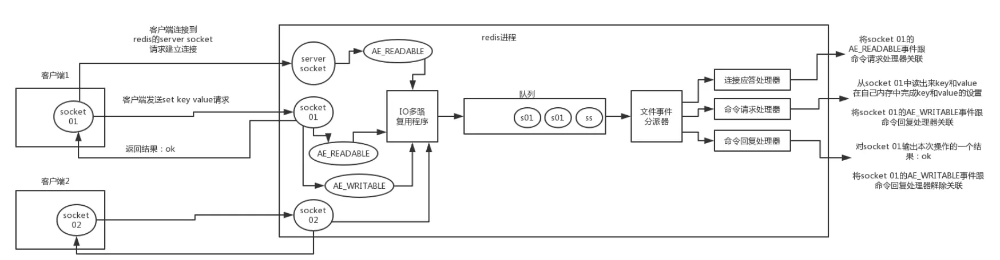

---

title: "Redis学习笔记"
slug: "Redis学习笔记"
description:
date: "2019-08-13"
lastmod: "2019-08-13"
image:
math:
license:
hidden: false
draft: false
categories: ["学习笔记"]
tags: ["redis"]

---
# 一、基础知识
## （一）Redis的线程模型

其中：
### 1.多路IO复用器。
负责轮询监听服务器套接字和客户端套接字，这里是NIO的机制，所以每个套接字中间的可读，可写状态没有阻塞，避免了线程花费时间等待可读、可写状态。多路IO复用器监听之后生成了各个事件，分为可读和可写两类并携带对应套接字，然后遍历事件将其push到一个队列中去，由文件事件分派器去异步处理。
### 2. 文件事件分派器。
它是单线程的，处理一个set命令的业务操作是原子的。文件事件分派器负责根据事件分派到不同的事件应答器去处理。这里分派的逻辑是：
- 如果判断是服务器套接字产生的可读事件则交由应答处理器处理，应答处理器会创建一个客户端套接字，创建这个套接字代表客户端就可以向服务器发送命令了，当下次这个客户端套接字被监听到可读事件时代表服务器接收到了命令。
- 如果判断是客户端套接字产生的可读事件则交由命令请求处理器处理，处理器执行redis真正的业务操作，修改内存数据。之后命令请求处理器会将客户端套接字与命令回复处理器关联，以便下次监听到客户端尝试读取的命令的时候进行回复。
- 如果判断是客户端套接字产生的可写事件则交由命令回复处理器处理，处理器向套接字写入成功回复，然后接触套接字与命令回复器的关联。
# （二）Redis的数据类型
包括string，list（说起是List，其实就是JAVA中的有序队列），hash散列表，set(无序，元素不重复)，sortedset（有序，元素不重复，set时需要指定分数，排序根据分数来排）。
# （三）Redis过期删除策略
过期删除有三种情况：

### 1.定期删除
默认每隔100ms随机抽取一些设置了过期时间的key删除。
### 2.惰性删除
后面在获取某个key时，redis会检查key是否设置了过期时间是否过期，如果过期就删除，不返回任何东西。
### 3.内存淘汰机制时删除
指的是，内存不够了，redis会运行淘汰部分键，这里根据参数不同采取不同的策略，其中有：
- noeviction,新写入会报错
- allkeys-lru,把最近最少使用的key删除
- allkeys-random,随机移除key
- volatile-lru，在设置了过期时间的键中，移除最近最少使用的key
- volatile=random，在设置了过期时间的键中，随机删除
- volatile-ttl，在设置了过期时间的key中，删除马上要过期的key
# （四）持久化
Redis持久化有两种：RDB机制和AOF机制。其中RDB机制是定时全量在磁盘中备份内存中的数据。AOF机制是以命令日志的方式在磁盘中备份数据。当master节点宕机重启后，会根据持久化的数据还原到内存中。如果RDB和AOF被同时开启，将优先用AOF来进行数据恢复。

两种机制的对比：
- QPS影响，AOF对QPS的影响是持续性的，RDB则只是间隔性的。
- 恢复速率，由于RDB不用重放命令，所以恢复速率RDB较快。
- 数据丢失量，由于AOF是近乎实时的，所以比RDB丢失的要少的多。
- 冷备份简易度，RDB非常适合做冷备份，一般的做法是用脚本将RDB文件自动同步到云上，这样可以使得Master节点磁盘文件打不开或者丢失，或者机器都重启不了也能使用冷备份文件复制到其他节点进行故障恢复，

# 二、redis的架构模式
redis架构模式有两种，一种是主从架构，一种是rediscluster架构。下面先总结下主从架构。
## （一）主从架构
主从架构相比rediscluster的优点是可以读写分离，但缺点是不可以通过加服务器的方式横向扩展redis内存空间。
### 1.节点结构
主从架构由1个master节点，n个slave节点构成，master节点负责写，slave节点负责读。
### 2.节点数据同步策略
#### （1）full resynchronization（全量复制）
全量复制场景一般是在slave第一次启动或者长时间离线导致数据和master节点相差过大的时候产生的。其过程是master节点后台开启线程将内存中最新的数据全量生成一份rdb文件，同时这段时间内写入命令也缓存在内存中。slave收到rdb文件之后先持久化到自己磁盘，然后写入自己的缓存，然后master把前面内存中缓存的写命令发送给slave节点，slave再执行一遍写命令。这个过程叫做全量复制。

注：

- 若一段时间内master收到多个slave节点的sync命令（相对PSYNC增量同步，SYNC代表请求全量复制），那么master只会生成一份rdb快照文件，不会重复生成。
- 2.8开始后支持断点续传，master和slave都会保存一个replica offset,用于记录断点的位置，所以如果短时间slave重连不会请求全量复制，默认发送PSYNC命令，请求增量复制。
- 支持无磁盘化复制，开启master将在内存中生成rdb文件。涉及的参数是repl-diskless-sync no（默认no，不使用diskless同步方式 ），repl-diskless-sync-delay 5（默认5秒，等待时间内多个slave连接的话都传这一个rdb）。
#### （2）异步复制
异步复制指的是后续节点保持同步是通过异步复制完成的，master节点收到写命令，写完成后返回客户端写成功，然后异步的复制给slave节点。
### 3.哨兵架构
要保证主从架构的高可用必须配置哨兵集群，故障转移是通过哨兵架构来完成的，哨兵是不同的进程，也是一个集群。下面主要介绍下哨兵架构。
#### （1）哨兵集群通信
其内部通信机制基于Redis的发布订阅，一个哨兵集群会订阅redis同一个channel。通过同一个channel交换信息。
#### （2）sdown和odown
sdown-主观宕机，描述的master节点状态被部分哨兵节点认为宕机，但是没有真正触发到主从切换的条件。

odown-客观宕机，描述的是master节点状态触发了主从切换的条件。

注：当哨兵节点Ping master节点如果延迟超过了is-master-down-agter-millseconds指定毫秒数之后，该节点就认为Master节点宕机
#### （2）主从切换的条件
配置文件的quorum参数，quorum配置的是执行主从切换需要多少个哨兵节点认为master节点宕机。
#### （3）主从切换的过程
当判断master客观宕机后，如果哨兵在线节点超过majority数量（哨兵集群的半数或半数以上），则会选举一个哨兵节点出来执行主从切换，这是这个哨兵节点又会根据slave节点跟master断开连接的时长、slave配置的优先级、复制offset、run id（slave节点的唯一标识）来进行筛选和排序，选举一个最优的slave节点出来继任master。其中断开连接时长如果超过down-after-millseconds（允许master正常延迟时间极限）的10倍加上millseconds_since_master_is_in_sdown_state（master宕机时长）的话，就会排除选举范围之外，剩下的依次根据slave priority（slave配置的优先级）、再根据slae offset排序（越靠后越高）、再根据run id排序（越小优先级越高）来进行排序。为了保证短时间内多次切换，其他哨兵节点不知道master节点时哪个节点，每次执行主从切换时，哨兵会从要切换的从节点获取一个版本号，成功后将版本号发布到所有哨兵节点监听的channel上，其他哨兵依次更新master节点的信息。
#### （4）哨兵集群的高可用性
由于哨兵和redis机器是分不开的，哨兵集群作为redis高可用保证，自身也应该保证是高可用的。所以一般至少需要3个哨兵节点，因为如果只有2个哨兵节点，挂的master节点的机器上又有哨兵进程，那么这时哨兵节点就只剩下两个，而2的majority数又是2，这时是无法完成主备切换的。
### 4.主从+哨兵的数据丢失问题
#### （1）场景
- 异步复制导致的数据丢失，master在正在准备异步向slave节点同步数据的情况下宕机，slave节点被选举为master,会丢掉没有完成异步复制的数据。
- 集群脑裂导致的数据丢失，由于网络分区故障，master与哨兵断了联系，但和客户端又保持着联系，导致新的Master节点被选举，当网络分区故障恢复后，新的master往原来的Master节点同步数据，导致在故障期间原来的master节点收到的数据被丢失。
#### （2）解决方案
- 一是需要注意两个参数，一个是min-slaves-to-write(默认1)，表示slave节点最少要保证有多少个存活，min-slaves-max-lag(默认10)，表示所有slave节点延迟不能同时超过10秒。当这两个参数不满足的时候，master节点就会拒绝客户端的写请求，以此控制丢失的数据量不会太高。
- 二是客户端要进行对应的降级处理，如写到本地数据库或发送到消息队列中，然后每隔一段时间重试连接master，当master节点恢复后，在限流的往master写数据，避免流量涌入过多超过master节点写负载。
## （二）redis cluster集群架构
redis cluster集群架构与主从架构+哨兵模式的区别是，redis cluster集群架构针对的是大数据量场景，其可以横向扩展多个master节点，但是redis官方默认不支持redis cluster的读写分离，其slave只用于故障转移。但可以通过readonly命令，将slave设置成可读，然后通过slave获取相关的key，达到读写分离。如果在redis cluster中强行采用读写分离可能导致读到过期的数据，在Java的Redis操作类库中，如Jedis和Lettuce都默认只针对Master进行读写，若需要修改Jedis则只能做源码级别的改动，Letture修改相比较简单一些，开放了setReadFrom方法，可以通过connection.setReadFrom(ReadFrom.SLAVE)指定读往slave节点读。
### 1.节点结构
多master节点，多slave。
### 2.数据分布算法
数据分布算法一般有三种常用算法：
- 普通的hash取模算法。即通过key的hash值再与master节点数量取模，模为多少就写入或读取哪个master节点。但这种方法有个缺点就是，如果有一个节点失效，master节点数量被改变，我们如果要取某个数据，计算的模打到的节点就与之前的节点不一样了，这就导致以前写入的节点基本上全部失效，必须通过大量的计算重新取模在把数据重新存入剩下的节点。
- 一致性hash算法。一致性hash算法主要是将hash值的整个空间组成一个圆环，每个节点均匀排列在一个圆环上，一个key对应的节点时通过计算Key值的hash值然后判断在圆环的哪个位置，顺时针找到的第一个节点就是我们写入或读取的节点。这种算法可以解决如果一个节点失效，则失效的数据只是该节点的数据，但该失效节点的负载数据请求相当于全部打在了顺时针下一个节点上，优化策略是在圆环上均匀分布大量的虚拟节点替代原本的真实节点，每个真实节点用相同数量的虚拟节点用来表示。由于虚拟节点顺序也是随机的，所以如果失效了某个节点，那么这个节点原本所承载的hash值空间也会均匀分布到剩下的节点当中，这个优化可以使得失效节点的数据请求均匀分布到剩下的节点中。
- hashSlot算法。redis采用的就是hashSlot算法,每个节点均匀接管0-16384的模（称为hashslot），然后key来了之后，先判断与16384的模是多少，获取到模（hashSlot）之后，判断hashSlot是被哪个节点接管，再寻找该节点写入或读取，这能保证当某个节点宕机之后，失效的只是该节点接管的hashslot对应的数据。redis会自动将该失效节点接管的hashslot均匀分配到剩下的节点，所以这也能保证该失效节点原本负载的请求量均匀分配到剩下节点。
### 3.节点间通信机制
在集群内部存在的元数据包括hashslot和Node的映射表、master和slave关系、、故障信息、节点的增加和移除等等是如何通信的勒？redis使用的是Gossip协议来通信维护这些元数据，每个节点将开放两个端口，一个端口是面向客户端提供服务的端口，另一个端口端口号是服务端口+10000集群内部节点通信的端口，称为cluter bus集群总线。Gossip将消息分为4种类型：

- meet，某个节点发送一个goosip meet消息，通知哪个节点加入集群
- ping，每个节点都会频繁的给其他节点发送Ping,其中包含自己的状态还有自己维护的集群元数据，互相通过Ping交换元数据进行更新。
- pong, 返回Ping和meet，包含自己的状态和其他信息，也可用于信息广播和更新
- fail, 某个节点判断另一个节点fail之后，就发送fail给其他节点，通知其他节点，指定的节点宕机了
### 4.redisCluster的主备切换
redisCluster的主备切换类似哨兵模式，其主要流程是：

- 判断节点宕机。对应哨兵模式的客观宕机，SDown在RedisCluster称为PFail,主观宕机ODown称为Fail。在配置的cluster-node-timeout时间内,某个节点一直没有返回Pone,将会被发送ping消息的节点认为是Pfail。如果一个节点认为某个节点Pfail了，那么会在集群总线中，ping其他节点，如果超过半数的节点都认为pfail了，那么就会变成fail，此时将进行主备切换。
- 从节点过滤。若slave节点与master节点断开连接时间超过了cluster-node-timeout 乘以 cluster-slave-validity-factor，就会被排除选举资格。
- 从节点选举。每个master，根据slave的offset指定slave的选举时间，选举时间越靠前，offset最大的slave节点优先开始投票让其他master节点选举，然后获得大部分投票的从节点将成为新的Master节点（投票策略应该也是判断offset）。

### 5.Jedis类库与RedisCluster交互的模式
使用原生命令与Redis集群交互主要一种是随意连接一个节点，在写入数据时，由该节点计算key的hashSlot值，如果该节点不是对应key的处理节点，该请求将重定向到对应节点。另外，在命令上可以加入hashtag手动指定hashslot，如：set myke1:{hash tag} 值，这样免除了节点实例计算hashSlot.

在Jedis框架里本地维护一个hashslot映射表缓存，工作流程失在rediscluster初始化的时候随机找一个节点初始化hashslot映射表到本地，后面发送请求的时候根据映射表寻找节点，如果节点返回Moved(表示进行了重定向)，就以该节点元数据再更新一下自己的缓存。另外，如果hashslot正在迁移，将返回ask（表示hashslot正在迁移中），jedicluster会重定向到目标节点尝试请求，但Jedisscluster不会进行更新映射表。

# 三、缓存方案-Cache Aside Pattern
指的是：

读的时候，先读缓存，缓存没有的话，读数据库，取出数据后放入缓存，同时返回响应。

更新的时候，先更新数据库，在删除缓存

这里主要涉及两个问题，集中在更新的时候：

- 第一是为什么是删除缓存而不是更新，因为如果更新缓存会破坏缓存意义，更新并不代表这个数据是热点访问数据，如果更新可能会破坏缓存的LRU特性，更新缓存应该以访问的动作为驱动。另外有时候数据库数据关联的缓存是经过一定计算才关联的，如果需要去更新缓存可能涉及的计算比较复杂。

- 第二是为什么是先更新数据库，在删除缓存，因为这是为了避免缓存与数据库双写不一致，如：若修改数据数据库事务还没提交，但是已经把缓存从redis中删除，此时来了个读请求，会把旧的数据刷到缓存里面，这样就导致了缓存中的数据直到下一次修改数据库之前肯定是与数据库不一致的。

# 四、redis缓存常见问题整理
## （一）缓存与数据库双写不一致
### 1.场景
读写并发导致，读的时候没读到缓存，同时写的时候删除了缓存但还没来得及更新数据库，导致读的时候去更新缓存更新成了旧的数据。
### 2.应对方案
先更新数据库，在删除缓存，同时用redis主从提高redis可用性，避免redis删除操作失败，另外如果是读写分离的情况可以用阿里的canel组件,监听从库的binlog，再去消费消息删除缓存。
## （二）缓存雪崩
### 1.场景
由于缓存宕机了，大量请求没有命中缓存，数据库接收大量请求压力
### 2.应对方案
- 事前，缓存必须高可用，加哨兵或者cluseter下配置slave
- 事中，本地添加ehcahe（spingboot集成）缓存作为二级缓存，如果集成了hytrix组件则在前面两级缓存没命中之后加上限流+降级策略。
- 事后，开启redis的AOF和RDB,尽快恢复redis可用。
## （三）缓存穿透
### 1.场景
大量恶意攻击（请求数据库没有的数据）请求，直接击穿了缓存，每次都去走数据库。
### 2.应对方案
一是要做好事前的参数校验，高级一点就用布隆过滤器（相当于所有数据都用一定算法放在一个字典中，通过数据hash只判断在字典中存不存在）。
二是采取暴力一点的办法没查到就写一个空值到缓存里去（注意设置过期时间），这种有一定限制效果，因为恶意攻击方必须耗费精力准备足够大的参数字典来攻击。
## （四）缓存并发竞争
### 1.场景
短时间内针对一个key的更新并发，导致缓存更新没有保证顺序，由于顺序错乱，可能缓存的数据就错了。
### 2.应对方案
使用分布式锁，可以基于zookeeper或redis自己，串行化某个key的更新操作，拿到锁之后，判断这把锁的时间戳（value）是否比自己的要新，新的话就不更新缓存了。反之将自己的时间戳打上这把锁，并更新缓存。

本文原载于[runningccode.github.io](https://runningccode.github.io)，遵循CC BY-NC-SA 4.0协议，复制请保留原文出处。