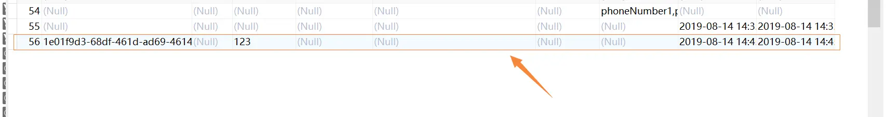

---

title: " MyBatis插件运用之实体自动修改自己的业务主键和时间"
slug: " MyBatis插件运用之实体自动修改自己的业务主键和时间"
description:
date: "2019-08-14"
lastmod: "2019-08-14"
image:
math:
license:
hidden: false
draft: false
categories: ["学习笔记"]
tags: ["mybatis"]

---
# 一、前言
一直很好奇，公司脚手架具体是如何自动在插入或修改数据库的时候自动去改修改时间，创建时间，如何去生成业务主键。今天仔细看了下mybatis的源码和公司的源码大概了解了些。现将心得总结如下。
# 二、MyBatis的插件机制
MyBatis是用了JavaSDK的动态代理机制对Executor、StatementHandler、PameterHandler和ResultSetHandler对象进行了动态的代理，具体是用interceptorChain.pluginAll(executor)方法去生成的代理对象：
```
public Object pluginAll(Object target) {
    for (Interceptor interceptor : interceptors) {
      target = interceptor.plugin(target);
    }
    return target;
  }
```
这个类InterceptorChain，保存了所有Intercpetor拦截器，这个拦截器就是我们接下来需要实现的类。而这个plugin方法就是返回的代理类对象，我们往往就是通过Mybatis提供的Plugin.wrap(target, this)方法来直接返回的生成的代理类，这个方法封装了生成代理类的过程。为了便于理解我们来看看Plugin.wrap的源码：
```
public static Object wrap(Object target, Interceptor interceptor) {
    Map<Class<?>, Set<Method>> signatureMap = getSignatureMap(interceptor);
    Class<?> type = target.getClass();
    Class<?>[] interfaces = getAllInterfaces(type, signatureMap);
    if (interfaces.length > 0) {
      return Proxy.newProxyInstance(
          type.getClassLoader(),
          interfaces,
          new Plugin(target, interceptor, signatureMap));
    }
    return target;
  }
```
这里具体前面几行就不细看了，大概意思就是获取我们实现的拦截器上面的@Signature注解里面的参数（这里可能还不知道到拦截器的@Signature注解是什么，等会解释），获取被代理类需要实现的接口，然后后面就是生成动态代理类的标准写法了，这里顺便解释下newProxyInstance的各个参数把：

- 第一个参数表示的是动态生成的代理类的类加载器。
- 第二个参数表示的动态生成的代理类需要实现的接口，这些接口的方法在动态代理类中统统调用InvocationHander的invoke方法进行处理。
- 第三个参数就是InvocationHander的实现,这里Plugin就是Mybatis专门实现的一个类。

顺带一提：在JavaSDK动态生成的代理类做的事情实际就是初始化了真实类的所有Method对象为成员变量，然后实现了被代理类所有的接口，接口方法实现的逻辑很简单，就是把对应Method对象，以及实现的这个方法上面的参数，和自己交给Proxy.newProxyInstance传入的InvocationHander实例的invoke方法处理。

我们这里再看看Plugin类的invoke方法：
```
public Object invoke(Object proxy, Method method, Object[] args) throws Throwable {
    try {
      Set<Method> methods = signatureMap.get(method.getDeclaringClass());
      if (methods != null && methods.contains(method)) {
        return interceptor.intercept(new Invocation(target, method, args));
      }
      return method.invoke(target, args);
    } catch (Exception e) {
      throw ExceptionUtil.unwrapThrowable(e);
    }
  }
```

大概意思就是根据刚刚取到的拦截器上面的@Signature注解信息标志的方法，执行我们自己拦截器的intercept方法，传入intecepter方法的是Mybatis自己封装的一个Invocation，其包装了动态代理类实例，被执行方法，以及方法参数，有一个proceed方法，就是通过反射真实执行被代理的方法。

由上，我们可以知道，我们实现插件其实只需要创建Interceptor接口，然后Mybatis会自动将被代理的target一层层代理。其他源码诸如insert,update怎么执行的，上面的4大对象在Mybatis里面到底是怎么样的存在，我就没深究了，源码太复杂了。下面直接就来看怎么通过拦截Executor的update方法，修改传入参数，然后实现自动更新自己的业务主键和时间的把。
# 三、实现插件
```
/**
 * @author chenzhicong
 * @time 2019/8/14 22:11
 * @description
 *     首先我们必须要知道我们拦截的是Executor的update方法， 这个方法有两个参数，一个是MappedStatement，
 *     其维护了xml中一条<select|update|delete|insert>节点的封装,另一个则是这个节点的parameterType对应的参数，
 *     我们这里实现的就是若这个参数是我们定义的实体稍微修改一下，把修改时间和业务Code加上
 *     注：
 *     1.Signature注解参数解释：
 *       Type:需要拦截的类，可以为四大对象Executor、StatementHandler、ParameterHandler和ResultSetHandler。
 *       Method：需要拦截的方法的名称
 *       Args：需要拦截的方法有哪些参数 
 *     2.Executor 的 int update(MappedStatement ms, Object parameter) 方法 是处理所有insert和update的方法入口
 */
@Component
@Log4j2
@Intercepts({
  @Signature(
      type = Executor.class,
      method = "update",
      args = {MappedStatement.class, Object.class})
})
public class MyInterceptor implements Interceptor {
  @Override
  public Object intercept(Invocation invocation) throws Throwable {
    MappedStatement mappedStatement = (MappedStatement) invocation.getArgs()[0];
    // 只处理参数为MyEntity子类的情况
    Object param = invocation.getArgs()[1];
    if (param == null || !MyEntity.class.isAssignableFrom(param.getClass())) {
      return invocation.proceed();
    }
    MyEntity myEntity = (MyEntity) param;
    // 获取Sql执行类型
    SqlCommandType sqlCommandType = mappedStatement.getSqlCommandType();
    switch (sqlCommandType) {
      case INSERT:
        if (myEntity.getCreateTime() == null) {
          myEntity.setCreateTime(LocalDateTime.now());
        }
        if (myEntity.getUpdateTime() == null) {
          myEntity.setUpdateTime(LocalDateTime.now());
        }
        if (StringUtils.isEmpty(myEntity.getCode())) {
          // 这里小demo用uuid就行了，具体根据业务来，
          // 我们生产是用的redis生成的全局唯一键
          myEntity.setCode(UUID.randomUUID().toString());
        }
        break;
      case UPDATE:
        if (myEntity.getUpdateTime() == null) {
          myEntity.setUpdateTime(LocalDateTime.now());
        }
        break;
    }
    return invocation.proceed();
  }


  @Override
  public Object plugin(Object target) {
    // 这里就直接用MyBatis为我们提供的Plugin.wrap返回代理类
    return Plugin.wrap(target, this);
  }

  /**
    * 这个方法用于在Mybatis配置文件中指定一些属性的。
    * 具体也不是太懂，这里就算了不深究了
    */
  @Override
  public void setProperties(Properties properties) {}
}
```

以上就是我们自定义的插件，我们测试一下：
```
@Test
  public void test2() {
    UserJpaTest userJpaTest = new UserJpaTest();
    userJpaTest.setNickName("123");
    userJpaTestMapper.insert(userJpaTest);
  }
```

看一看数据库效果：



说明我们自定义的插件生效了，另外基于这个插件还可以做很多补充，比如插入是实体集合的情况入参就是DefaultSqlSession.StrictMap（StrictMap时Mybatis对参数为集合或者数组进行的处理，里面有三个键分为collection,list,array），还有就是TkMybatis封装的updateByExampleSelective方法，这个方法的入参就变成了了MapperMethod.ParamMap类(这个具体也不是太懂，当其键为record或param1时有可能是我们传入的record实体),这些在我们脚手架都是处理了的，由于是公司的代码，就不好放出来了。

# 四、小结
基于Mybatis的插件功能，我们可以实现很多丰富易用的插件，比如我们常用的PageHelper就是基于此开发的。


本文原载于[runningccode.github.io](https://runningccode.github.io)，遵循CC BY-NC-SA 4.0协议，复制请保留原文出处。