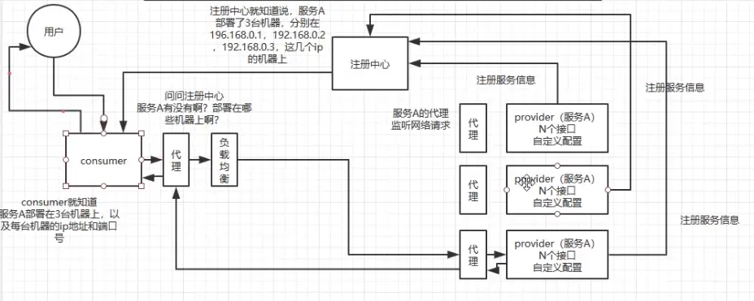

---

title: "dubbo学习笔记"
slug: "dubbo学习笔记"
description:
date: "2019-08-19"
lastmod: "2019-08-19"
image:
math:
license:
hidden: false
draft: false
categories: ["学习笔记"]
tags: ["dubbo"]

---
# 一、流程简图
dubbo的流程简图：



# 二、通信协议
dubbo支持多种通信协议，包括：

- dubbo协议（默认）。单一长连接（消费者和生产者一直保持单一的长连接）+ NIO异步通信（provider作为服务端轮询socket）+ hessian序列化协议。适用传输数据量很小，但是并发量很高，消费者远远大于生产者。
- rmi协议。java序列化+短连接,适用于消费者和提供者数量差不多，适用于文件传输，一般较少用。
- hessian协议。hessian序列化 + 短连接。适用于生产者数量比消费者数量还多，多用于文件传输，一般较少用
- http协议。json序列化
- webservice。soap文本序列化

# 三、功能介绍
## （一）负载均衡
可配置负载均衡策略有：

- random loadbalance（默认，随机）。随机，按权重设置随机概率
- roundrobin loadbalance（轮询）。按公约后的权重设置轮询比率。存在慢的提供者累积请求的问题
- leastactive loadbalance（最少活跃调用数）。最小活跃数负载均衡。活跃调用数越小，表明该服务提供者效率越高，单位时间内可处理更多的请求。此时优先将请求分配给该服务提供者。在具体实现中，每个服务提供者对应一个活跃数 active。初始情况下，所有服务提供者活跃数均为0。每收到一个请求，活跃数加1，完成请求后则将活跃数减1
- consistanthash loadbalance（一致性 Hash）。相同参数的请求总是发到同一提供者。
## （二）集群容错
可配置的集群容错策略有：

- Faliover Cluster（默认）。失败自动切换，当出现失败，重试其它服务器。通常用于读操作，但重试会带来更长延迟。可通过 retries="2" 来设置重试次数(不含第一次)。
- Failfast Cluster。快速失败，只发起一次调用，失败立即报错。通常用于非幂等性的写操作，比如新增记录。
- Failsafe Cluster。失败安全，出现异常时，直接忽略。通常用于写入审计日志等操作。
- Failback Cluster。失败自动恢复，后台记录失败请求，定时重发。通常用于消息通知操作。
- Forking Cluster。并行调用多个服务器，只要一个成功即返回。通常用于实时性要求较高的读操作，但需要浪费更多服务资源。可通过 forks="2" 来设置最大并行数。
- Broadcast Cluster。广播调用所有提供者，逐个调用，任意一台报错则报错。通常用于通知所有提供者更新缓存或日志等本地资源信息。

## （三）动态代理
dubbo动态生成代理类主要有两种方式，一种是基于Javassist方式动态生成代理类（默认）-基于，另一种是用jdk动态代理。个人也不是很了解Javassist、Cglib、JDK动态代理的底层原理区别。只能说这三种方式都能生成代理类，区别在于Javassist相比较而言比较灵活，API接近底层。JDK的动态代理限制较大，必须实现接口，Cglib生成的动态代理类直接是被代理类的父类。
## （四）SPI机制-Service Provider Interface
SPI，我的理解就是框架方提供接口，使用方自己实现接口，提高框架扩展性的一个机制。意思就是框架方通过接口约定方法的职责实现了一套逻辑。并没有明确表明这个接口一定要按照那种具体方式实现。所以就用SPI机制让我们自己可以在不改变框架的基础上去自己定义具体的实现。JDK提供了SPI机制的实现方式，但是dubbo不是直接使用的JDK实现的SPI，而是采用了自己的实现。下面介绍两种方式的用法：

### 1.JDK实现SPI
#### 第一步：在jar包或工程的meta-inf/service文件夹下，创建文件，文件名为提供的接口名（包含全路径）
#### 第二步：编辑文件内容，文件内容为实现类的全路径。
#### 第三步：框架方，加载实现类：
```
ServiceLoader<DriverService> serviceLoader = ServiceLoader.load(DriverService.class);
        for (DriverService driverService: serviceLoader){
            System.out.println(driverService.getName());
        }
```
DriverService为接口，遍历得到的是在Jar包内找到的实现类。
### 2、Dubbbo实现SPI
#### 名词解释：
- 扩展点,称 Dubbo 中被 @SPI 注解的 Interface 为一个扩展点。
- 扩展,被 @SPI 注解的 Interface 的实现称为这个扩展点的一个扩展。
#### 注解解释：
- @SPI：@SPI 注解标识了接口是一个扩展点 ， 属性 value 用来指定默认适配扩展点的名称。
- @Activate:@Activate 注解在扩展点的实现类上 ，表示了一个扩展类被获取到的的条件，符合条件就被获取，不符合条件就不获取 ，根据 @Activate 中的 group 、value 属性来过滤。
- @Adaptive：@Adaptive 注解在类上,这个类就是缺省的适配扩展。@Adaptive 注解在扩展点 Interface 的方法上时 ，dubbo动态的生成一个这个扩展点的适配扩展类（生成代码 ，动态编译实例化 Class ），名称为扩展点 Interface 的简单类名 + $Adaptive ，例如 ： ProxyFactory$Adpative 。这么做的目的是为了在运行时去适配不同的扩展实例 ， 在运行时通过传入的 URL 类型的参数或者内部含有获取 URL 方法的参数 ，从 URL 中获取到要使用的扩展类的名称 ，再去根据名称加载对应的扩展实例 ，用这个扩展实例对象调用相同的方法  。如果运行时没有适配到运行的扩展实例 ，那么就使用 @SPI 注解缺省指定的扩展。通过这种方式就实现了运行时去适配到对应的扩展。
- 注意：  若@Adaptive标志了实现类，和@SPI标志的默认实现Key，以及SPI接口方法上也标了 @Adaptive接受Url参数解析实现类，优先级次序是 @Adaptive标志的实现类大于Url参数大于@SPI标志的默认实现.
#### 扩展dubbo框架中SPI接口的方式
dubbo自带了一些spi接口，这里介绍下怎么实现这些SPI接口。


- 第一步：添加文件关联实现类

路径可以是：META-INF/services/（扩展点接口的全类名）、 META-INF/dubbo/（扩展点接口的全类名 ）、 META-INF/dubbo/internal/（扩展点接口的全类名）。

文件内容，键为扩展名，值为扩展实现类路径，类似：
```
adaptive=com.alibaba.dubbo.common.extension.factory.AdaptiveExtensionFactory
spi=com.alibaba.dubbo.common.extension.factory.SpiExtensionFactory
spring=com.alibaba.dubbo.config.spring.extension.SpringExtensionFactory
```

- 第二步：为dubbo框架中的可扩展点指定实现类

如 <dubbo：protocol name='my' prot="20000"/> 可以修改protocol的实现为指定扩展名为my的扩展。
#### dubbo框架中的可扩展点：
包括动态代理方式（ProxyFactory）、负载均衡策略（LoadBalance）、RPC协议（Protocol）、拦截器（Filter）、容器类型（Container）、集群方式（Cluster）和注册中心类型（RegistryFactory）等。

## （五）服务降级
### 配置方式例
消费者配置文件：

```
 <dubbo:reference id="iUser" interface="com.dubbosample.iface.IUser"  timeout="10000" check="false" mock="return null">
    </dubbo:reference>
```

其中，关键属性为mock，其有以下几种属性值：

- false，不使用mock
- true/default/fail，mock调用名为接口+Impl类的对应mock方法
- {mockClass}，mock调用${mockClass}对应方法
- return xxx，直接返回xxx的Mock数据，xxx支持json数据
- throw xxxException，直接抛出异常
- force xxx xxx为接口实现类类名，mock表达式只含有force的话，直接走接口相同路径下类名为“接口+Impl类"对应相同方法的逻辑，不掉接口，相当于直接屏蔽接口。

## （六）服务重试
### 配置方式例
生产者端：

- 使用注解：@Service(retries = 1,timeout = 2000)。
- 使用配置：<dubbo:provider retries="0" timeout="3000"/>
# 四、可能导致的问题
## （一）幂等性问题
一些写操作接口需要保证幂等性，特别是包含支付逻辑的接口。
### 1.场景
- 单机接收到重复请求
- 相同服务不同机器接收到重复请求
### 2.解决方案
#### 思路
针对每个请求都需要标识一个唯一id，每次处理之后必须有一个记录标识这个请求处理过，每次接收到请求时判断是否处理过，如果处理过就直接忽略。
#### 具体
- 基于数据库唯一索引
- 单机可直接基于本地MAP或SET
- 分布式的可以基于缓存如redis
## （二）顺序性问题
针对顺序性的业务，比如先修改后删除的操作，如果执行顺序错了，那么业务就错了。
### 1.场景
消费者异步调用的生产者的一组服务接口没有阻塞等待确保顺序问题。
### 2.解决方案
- 使用一致性hash算法负载均衡策略。若这一组服务接口位于同一个服务，可以用一致性hash算法负载均衡策略使得调用的服务被分发到一台机器上，然后这台机器又采取内存队列的形式进行消费。
- 使用分布式锁机制。锁的key为对应业务单号，值为顺序号，每个生产者服务接口获取锁的时候判断下业务Key的value中的顺序值然后判断是不是该轮到自己。若是则获取锁。若不是则阻塞一段时间再去获取锁。

# 五、小结一下设计rpc框架的思路
- 依赖zookeeper或其他做一个注册中心

比如zookeeper，可以为每一个接口的每一个方法注册一个临时节点，然后key为接口方法的唯一标识（包含class路径、方法名称，参数签名），data为服务地址列表

- 消费者调用服务

调用服务应该设计为动态代理，该动态代理类处理，拉取服务信息、负载均衡、序列化参数、发送请求。具体可以设计为先根据调用的接口去查本地缓存有没有该服务地址列表，如果有直接用一定的算法比如轮询取其中之一的地址，然后地址有了之后，将参数和请求id（因为需要将获取的响应关联请求Id）封装为一个对象比如名叫Invoker类，选择一定的序列化协议将数据发送给生产者，同时将Invoker对象放入一个本地内存并发容器中如名叫inProgressInvoker，用requestId作为Key，然后用Invoker对象的wait方法阻塞自己（这里先配置发送通信方式可以使用netty，设定接收到返回的回调方法，接收到生产者响应之后首先压回队列然后通过notifyAll唤醒后台队列的消费线程(1个或多个，可以通过参数配置)）。

后台消费线程的设计是先从队列取出消息（如果没有取到，则调用上面回调方法里notifyAll中的锁资源的wait方法阻塞自己），如果有消息，则先反序列化接收到生产者返回的内容，然后根据requestId去上面的inProgressInvoker取出Invoker对象，将响应设置到Invoker对象中，同时调用notifyAll或notify方法，唤醒消费那里被阻塞的主线程，

- 生产者处理请求

生产者这边的netty监听到事件之后，通过线程池处理请求，将请求数据反序列化解析为对象，通过接口方法唯一标识，以及参数信息来反射调用真正的接口实现类，处理好之后连带请求id在通过一定序列化协议返回给消费者。


本文原载于[runningccode.github.io](https://runningccode.github.io)，遵循CC BY-NC-SA 4.0协议，复制请保留原文出处。