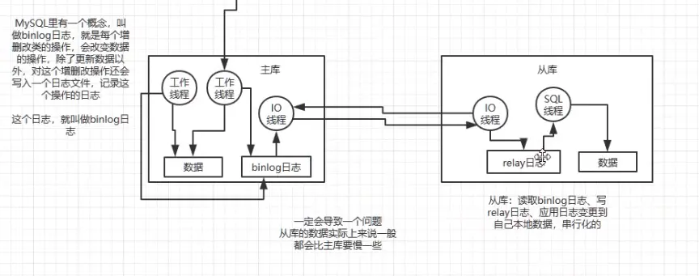
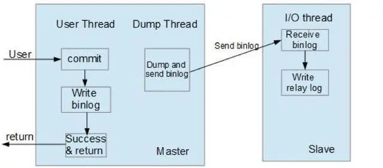
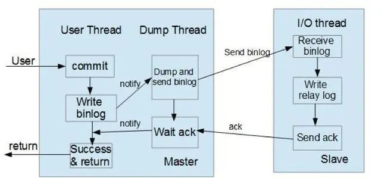

---

title: "分布式环境中分库分表、读写分离相关问题总结"
slug: "分布式环境中分库分表、读写分离相关问题总结"
description:
date: "2019-08-26"
lastmod: "2019-08-26"
image:
math:
license:
hidden: false
draft: false
categories: ["学习笔记"]
tags: ["分库分表","读写分离"]

---
# 一、为什么要用分库分表
当不使用分库分表的情况下，系统的性能瓶颈主要体现在：

- 当面临高并发场景的时候，为了避免Mysql崩溃（MySql性能一般的服务器建议2000/s读写并发以下），只能使用消息队列来削峰。
- 受制于单机限制。数据库磁盘容量吃紧。
- 数据库单表数据量太大，sql越跑越慢

而分库分表正是为了解决这些问题，提高数据库读写并发量，磁盘容量大大提高，单表数据量降低，提高查询效率。

# 二、垂直拆分和水平拆分

## 以表的维度来说：

- 垂直拆分 指根据表的字段进行拆分，其实很常见，有时候在数据库设计的时候就完成了，属于数据库设计范式，如订单表、订单支付表、商品表。
- 水平拆分 表结构一样，数据进行拆分。如原本的t_order表变为t_order_0,t_order_1，t_order_3

## 以库的维度来说：

- 垂直拆分 指把原本的大库，按业务不同拆到不同的库（微服务一般都是这么设计的，即专库专用）
- 水平拆分 一个服务对应多个库，每个库有相同的业务表，如库1有t_order表，库2也有t_order表。业务系统通过数据库中间件或中间层操作t_order表，分库操作对于业务代码透明。

所以，我们平常说的分库分表，一般都是指的水平拆分

# 三、分库分表工具

主要关注MyCat和sharding-jdbc。

两者对比：

- MyCat:基于中间件的形式，提供读写分离、分库、分表功能。只不过好久都没更新了，我使用的是1.6版本，并不支持一个逻辑表的分库、分表同时存在。
- sharding-jdbc：基于jar包中间层的形式，提供读写分离、分库、分表功能。社区较活跃。支持功能强大。

# 四、分库分表的两种策略
- hash分法，按一个键进行hash取模，然后分发到某张表或库。优点是可以平摊每张表的压力，缺点是扩容时会存在数据迁移问题。
- range分法，按范围或时间分发，比如按某个键的值区间、或创建时间进行分发，优点是可以很方便的进行扩容，缺点是会造成数据热点问题。从分表上说还好，如果是分库，将导致某一个库节点压力过大，节点间负载不均。

这里，我认为最好的分法是hash分库、range分表。因为对库来说重要得是负载要均衡，对表来说重要的是可以动态扩容。
# 五、分库分表数据迁移方案
##  停机分库分表
方案很简单，就是停机维护时，用后台临时程序基于数据库中间件将老库数据直接分发到需要迁移的数据库

此方案的主要缺点是一定会出现几个小时的停机，如果没搞定要回滚，第二天继续搞，开发人员心是慌得。

## 不停机双写方案

主要步骤：

- 修改系统中的所有写库的代码，同时写老库和数据库中间件（包括新增、更新、删除操作）
- 然后后台用工具将老库之前的老库数据迁移到新的数据库中间件，注意比对修改时间，若id一样，按修改时间决定是否覆盖。
- 使用后台工具比对一次数据，看是否完全一样，不一样，则后台再用工具进行一次迁移。（避免有些数据因为网络问题没有迁移成功，或业务上的bug导致），这个过程通常需要好几天。
- 以此循环几次，数据完全一样时，就切换为只读写新库

该方案解决了停机造成的服务不可用。

# 六、分库分表下的动态扩容问题

在分库分表的情况下，如何在已经分库分表的基础上进一步分库分表提高系统效率，是一个麻烦的问题。特别是基于hash分片的服务器，再次分库分表，一般只能对服务器进行停机，然后将所有数据又基于新的规则插入到不同的库与表。为了避免这种问题，可以在第一次分库分表的时候就将库切分的较细，避免二次扩容。比如：

- 最开始就将库分为32个库，最开始业务量没那么大，可以将多个库放在同一台机器上，以后按照2-4-8-16-32来进行扩容，如最开始2台机器能够满足数据库读写并发，此时一台服务器上有16个库，后来不够了，就扩容为4台机器，每台机器8个库。。。依次类推，这样做的好处是只需要迁移需要迁移的库，并且是按照整个库进行迁移，不需要重新进行分发，同时分库分表的分片机制也不用修改，只需要修改其数据源就行了。
- 对于分表来说，也可以分的多一些，推荐分为32张表。
- 以上，分为了32个库32张表，总共数据量可以达到32 * 32 = 1024张表，按每张表500万正常的容量来算，可以容纳约50亿数据，足以满足大部分过扩容需求。
- 另外这种方案推荐扩容方案为2-4-8-16-32倍数进行扩容，深层原因是32是这些数的公倍数，按照约数进行扩容更容易让每个机器负载的库都一样。
- 需要注意的是如果按照同一分片键进行同样的分片策略分库分表，会导致数据只会达到某库的某表比如1库的1表，2库的2表，（因为库和表的数量也是一样）所以分库我们可以按32取模策略，分表的话我们可以按整除之后的余数再对32取模进行分表。

# 七、全局id的生成策略
几种生成id的方式对比：

- 通过数据库自增

往公用的一张表（这张表是自增主键）插入一条数据，获取id的返回值，用这个id再去插入中间件当中去。oracle可以通过自增序列。

缺点：不适合并发高的场景，毕竟不管是自增序列还是采取自增键的方式来生成，会并发竞争写锁，效率太低。

- UUID

缺点：uuid太长了，不规则

- 时间戳

一般联合其他业务字段拼接作为一个Id，如时间戳+用户id+业务含义编码

缺点：并发高容易重复

- 雪花算法

原理：前面1位为定值0+41位为时间戳+5位机房id+5位为机器id+12位为序号,唯一需要保证同步的地方是生成一个序号，锁粒度较低。另外这个算法可用于分布式环境中。最大的优点是不需要依赖任何中间件，核心原理是用5位机房id，5位机器id标志了唯一一台机器，所以不需要分布式锁去保证不同机器生成id的同步性，只需要在当前机器保证生成的序号不一样就行了。

- redis中间件生成

原理：利用redis单线程工作线程属性去维护一个自增变量。

# 八、读写分离

## 为什么要读写分离
- 理论上来说读写请求不要超过2000/s，如果加了缓存之后，到数据库请求还是超过2000以上考虑读写分离
- 使得读请求可以在不同机器并发，用了读写分离之后可以通过动态扩展读服务器增加读效率，这与redis中的主从架构读写分离、copyOnWrite机制的并发容器、以及数据库MVCC机制有点相识，都是通过读请求的数据备份增加读写并发效率。
- 适用于业务场景中，读请求大于写请求的情况，读写分离使得系统能够更多的容纳读请求并发。

## 读写分离的实现方式
一般来说是基于mysql自带的主从复制功能。mysql主从复制的流程图如下：

总结mysql的主从复制过程大体是主库有一个进程专门是将将记录的Binlog日志发送到从库，从库有一个io线程（5.6.x之后IO线程可以多线程写入relay日志）将收到的数据写入relay日志当中，另外还有一个SQL进程专门读取relay日志，根据relay日志重做命令(5.7版本之后，从可以并行读取relay log重放命令（按库并行，每个库一个线程）)。

## 主从同步的三种模式：

- 异步模式（mysql async-mode）

异步模式如下图所示，这种模式下，主节点不会主动push bin log到从节点，这样有可能导致failover的情况下，也许从节点没有即时地将最新的bin log同步到本地。

- 半同步模式（mysql semi-sync）

这种模式下主节点只需要接收到其中一台从节点的返回信息，就会commit；否则需要等待直到超时时间然后切换成异步模式再提交；这样做的目的可以使主从数据库的数据延迟缩小，可以提高数据安全性，确保了事务提交后，binlog至少传输到了一个从节点上，不能保证从节点将此事务更新到db中。性能上会有一定的降低，响应时间会变长。如下图所示：

- 同步模式（mysql semi-sync）

全同步模式是指主节点和从节点全部执行了commit并确认才会向客户端返回成功。

## 读写分离场景下主从延迟可能导致的问题

在代码中插入之后，又查询这样的操作是不可靠，可能导致插入之后，查出来的时候还没有同步到从库，所以查出来为null。如何应对这种情况了？其实并不能从根本上解决这种情况的方案。只能一定程度通过降低主从延迟来尽量避免。

降低主从延迟的方法有：

- 拆主库，降低主库并发，降低主库并发，此时主从延迟可以忽略不计，但并不能保证一定不会出现上述情况。
- 打开并行复制-但这个效果一般不大，因为写入数据可能只针对某个库并发高，而mysql的并行粒度并不小，是以库为粒度的。

但这并不能根本性解决这个问题，其实面对这种情况最好的处理方式是：

- 重写代码，插入之后不要更新
- 如果确实是存在先插入，立马就能查询到，然后立马执行一些操作，那么可以对这个查询设置直连主库（通过中间件可以办到）

参考：[深度探索MySQL主从复制原理](https://baijiahao.baidu.com/s?id=1617888740370098866&wfr=spider&for=pc)

本文原载于[runningccode.github.io](https://runningccode.github.io)，遵循CC BY-NC-SA 4.0协议，复制请保留原文出处。