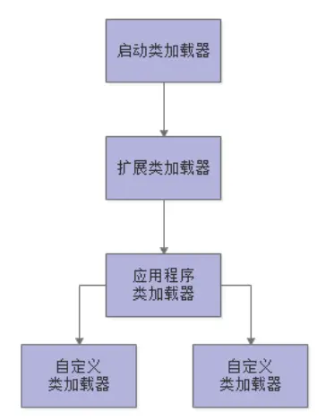
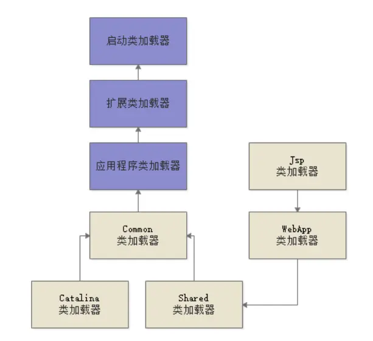
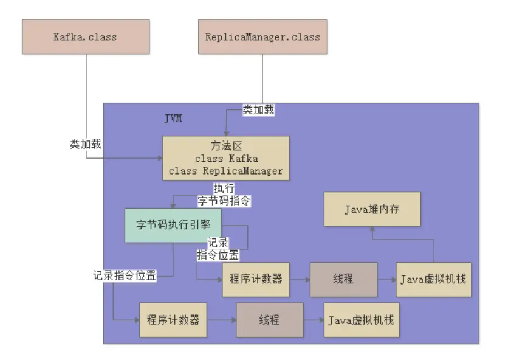
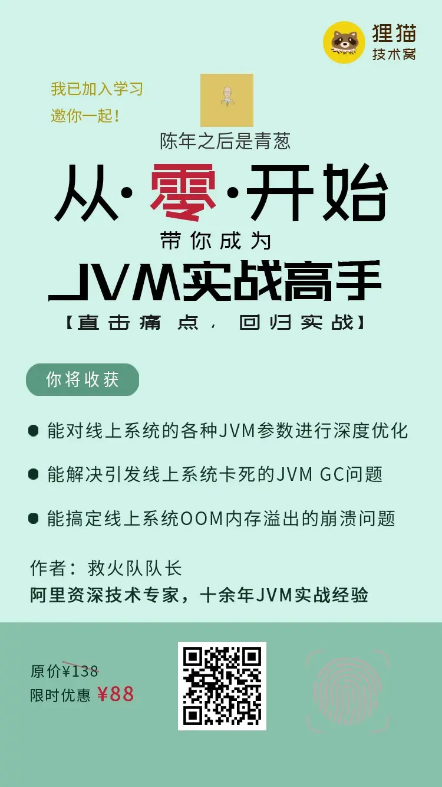

---

title: "JVM从零开始（一）-JVM的类加载、内存区域"
slug: "JVM从零开始（一）-JVM的类加载、内存区域"
description:
date: "2019-08-31"
lastmod: "2019-08-31"
image:
math:
license:
hidden: false
draft: false
categories: ["学习笔记"]
tags: ["JVM"]

---
# 一、前言
自从入行以来，一直没有深入学习过JVM，虽然看过好些书、博客也有一点了解，但都不是专门讲JVM的，所以对JVM停留在浅显的了解上，没有深入了解过，一直想深入学习，不过想学的东西太多了，这就导致JVM成了自己的短板，前些日子在网上看到了救火大队长的《从零开始带你成为JVM实战高手》专栏正在更新中，决定借此机会好好深入学习一下，顺便把学习心得结合以前学习的知识记录下来，加深自己的理解。
# 二、JVM加载类的过程
- 加载，加载为按需加载，主线程需要用到一个类才开始加载一个类。
- 验证，简而言之就是校验class内容是否符合指定规范
- 准备，为类变量分配内存空间，并初始默认值。
- 初始化，执行类的初始化代码（静态代码块，静态赋值代码），注：初始化会检验父类是否初始化，没有则必须先初始化父类。
- 使用
- 卸载
# 三、类加载器
## 种类
- 启动类加载器-Bootstrap ClassLoader，用于加载Java核心类库-java安装目录下的lib目录下的class。
- 扩展类加载器-Extension ClassLoader，用于加载java下的一些扩展类库-java安装目录lib\ext下的class。
- 应用程序类加载器-Application ClassLoader，加载项目ClassPath下所的class。
- 自定义类加载器，自己定义的类加载器
## 双亲委派机制
意思就是即优先让父ClassLoader去加载。原因是避免重复加载，保证应用的classPath下的Class对象在内存中的唯一性。
### 层次图

### tomcat破坏双亲委派
tomcat作为java编码的web容器，本身也是在jvm中运行，怎么让基于tomcat容器的各个web应用正常运行，使得各个web应用包含的应用的class不会乱套，必须破坏双亲委派机制，为每一个web应用的class都用不同的类加载器去加载。

- tomcat的类加载器层次图

其中：

common、catalina、shared负责加载tomcat自己的核心类库，webApp加载web应用的class（隔离web应用引用的三方类库），jsp加载器加载JSP(每个JSP文件都对应一个Jsp类加载器，jsp加载器支持热加载，即Jsp只要修改，就重新加载一次覆盖原来的jsp)。

通过tomcat的类加载机制，可以达成以下目标：

- tomcat支持各个web引用中不同版本的三方类库相互隔离。
- 同一个第三方类库的相同版本在不同web应用可以共享。
- tomcat自身依赖的类库需要与应用依赖的类库隔离 。
- jsp需要支持修改后不用重启tomcat即可生效 为了上面类加载隔离和类更新不用重启，定制开发各种的类加载器。

## 自定义类加载器的作用

- 实际中，可以从Web服务器、数据库或缓存服务器获取bytes数组，这就不是系统类加载器能做到的了。
- 可以从不同的路径中获取同一个类的不同class对象，可以实现隔离，一个复杂的程序，内部可能按模块组织，不同模块可能使用同一个类，但使用的是不同版本，如果使用同一个类加载器，它们是无法共存的，不同模块使用不同的类加载器就可以实现隔离，Tomcat使用它隔离不同的Web应用，OSGI使用它隔离不同模块。
- 可以实现热部署。使用同一个ClassLoader，类只会被加载一次，加载后，即使class文件已经变了，再次加载，得到的也还是原来的Class对象，而使用自定义类加载器，则可以先创建一个新的ClassLoader，再用它加载Class，得到的Class对象就是新的，从而实现动态更新。

# 四、JVM内存区域划分

## 方法区（1.8之后叫metaspace-元数据空间）
存放类的元数据信息，可以理解为反射获取的Class对象的哪些信息。
## 程序计数器
- 记录当前执行的class文件中字节码指令的位置
- 与线程是一对一的关系，每个线程都会有自己的一个程序计数器
## 栈
一个程序计数器对应一个线程、一个线程对应一个栈、一个栈由一个个栈帧组成，一个方法对应一个栈帧，栈帧包含局部变量表、操作数栈、动态链接、方法出口（相当于结束方法时需要跳转的位置）。栈帧在调用方法的时候进栈，方法结束的时候出栈。
## 堆
- 存放对象数据（上述栈中只存在对象的引用（即堆内存中对象的地址）或基本数据类型的值）
- 所有线程共享
- 当引用变量地址数据出栈时，堆中的内存释放由JVM控制回收
## 其他内存区域
- 执行native方法会有线程对应的本地方法栈。
- NIO中ByteBuffer类方法：allocateDirect（int capacity）-堆外分配内存空间返回DirectBuffer，通过DirectBuffer的Api可以操作堆外内存。
## 图示

# 四、小结
这篇文章是JVM总结的第一篇博客，可能会觉得有点Low，不过写这篇博客也是想从零开始学习总结一番，就这样吧。
文中大部分内容来、图片（我也自己画过，但是太丑了，就不贴了）来源于救火大队长的《从零开始带你成为JVM实战高手》专栏文章所学笔记心得，地址在下面，有兴趣的朋友可以去看看（是收费专栏，不过较便宜）。

本文原载于[runningccode.github.io](https://runningccode.github.io)，遵循CC BY-NC-SA 4.0协议，复制请保留原文出处。