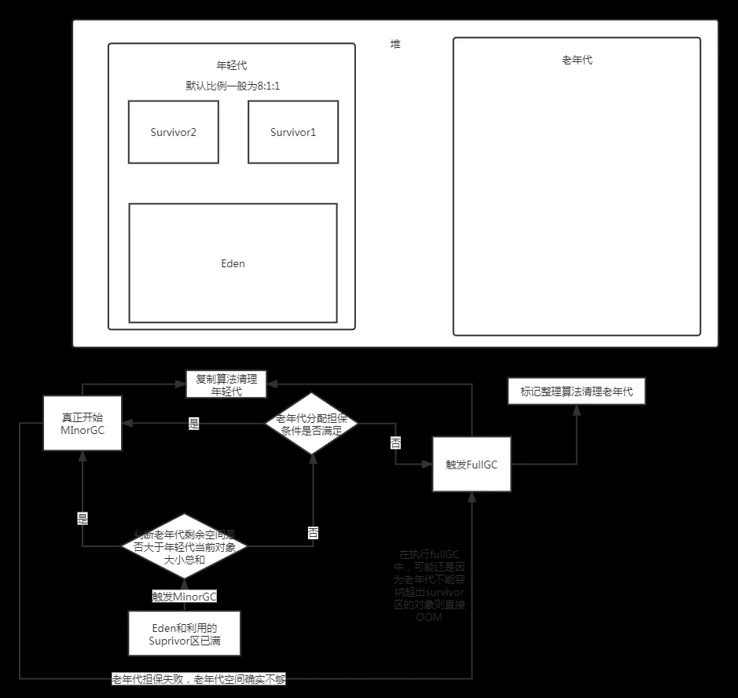
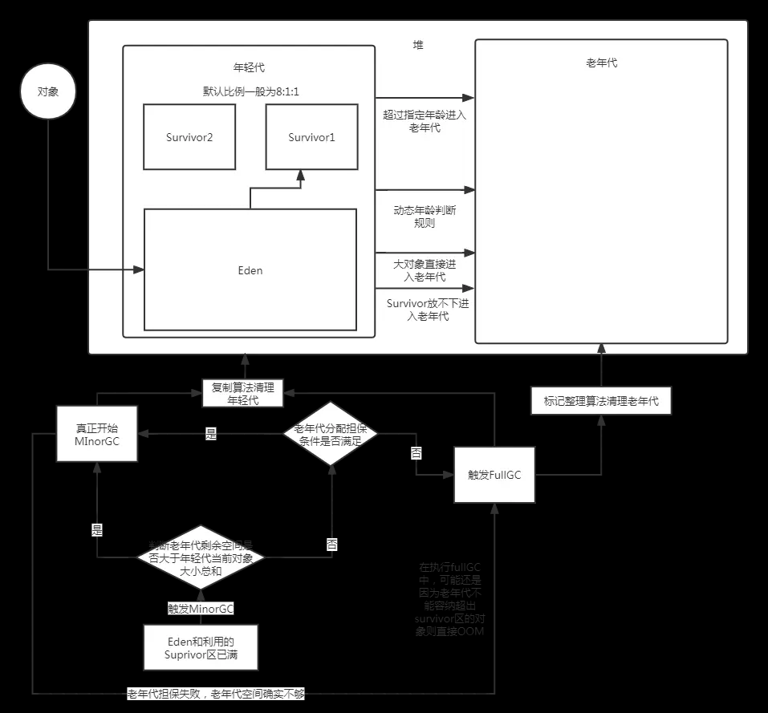
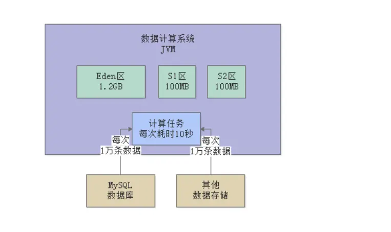
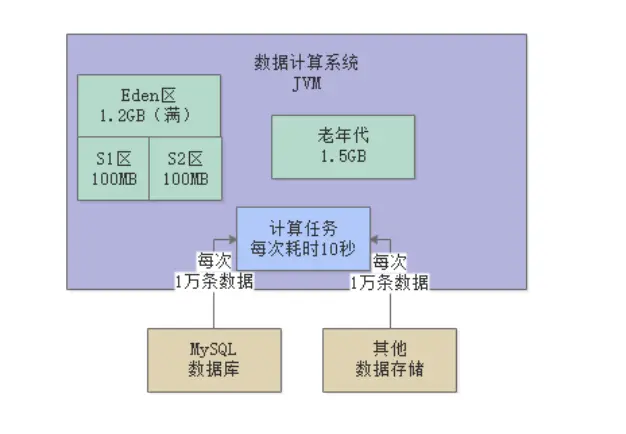
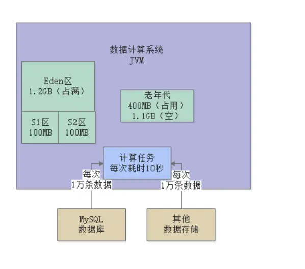
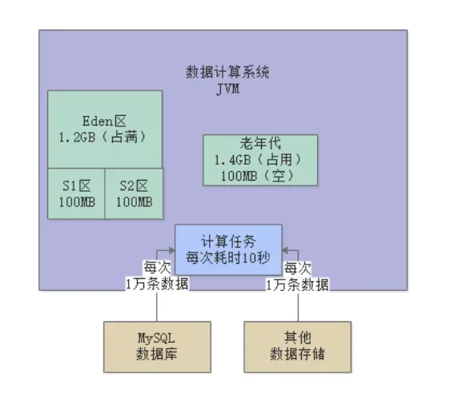
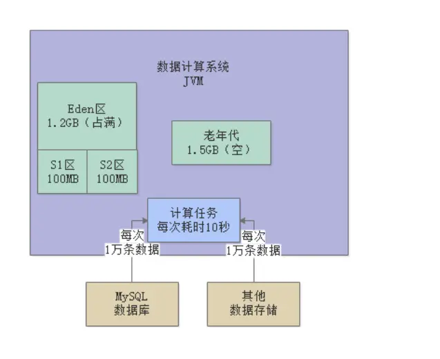

---

title: "JVM从零开始（二） -垃圾回收机制以及内存分代模型"
slug: "JVM从零开始（二） -垃圾回收机制以及内存分代模型"
description:
date: "2019-09-03"
lastmod: "2019-09-03"
image:
math:
license:
hidden: false
draft: false
categories: ["学习笔记"]
tags: ["JVM"]

---
# JVM中垃圾回收的判定标准

最终目的是将内存中无用的对象回收掉。具体的判定方法有：

- 引用计数法，不采用，指的是维护对象被引用的次数，次数为0则意味着是垃圾。
- 可达性算法-GC Roots tracing，指的是从GC Roots开始往下遍历所有引用的对象，（每个GC Root就是一个树状图），所有被引用到的对象就是需要存活的对象，其他对象可以被回收。GC Root指的是，虚拟机栈(栈帧中的本地变量表)中引用的对象，方法区中非基本类型的类静态变量（一个地址）所引用的对象，本地方法栈中JNI(即一般说的Native方法)引用的对象。

# JVM中内存相关参数
- -Xms Java堆内存初始大小
- -Xmx Java堆内存最大大小
- -Xmn Java堆内存中的新生代大小，扣除它就是老年代大小
- -XX:PermSize（1.8之后：-XX:MetaspaceSize） 永久代初始大小
- -XX:MaxPerSize（1.8之后：-XX:MaxMetaspaceSize） 永久代最大大小
- -Xss 每个线程的栈内存大小

注：通常情况下，Xms和Xmx，-XX:PermSize和-XX:MaxPerSize都会设置为一样。

- -XX:MaxTenuringThreshold 多少岁进入老年代-默认15
- -XX:PretenureSizeThreshold 超过多少字节的大对象直接进入老年代
- -XX:HandlePromotionFailure MinorGC时，如果老年代剩余空间小于新生代对象总大小，但是如果大于之前平均进入老年代对象的大小，是否尝试进行MinorGC(默认开启)
- -XX:SurvivorRatio=8 Eden区的比例

上面看不懂的参数不要深究，等下提到回过头再来看，这里只是将所有参数罗列出来方便查找。

# JVM中的内存分代模型
JVM中，将对象在内存中分为了三代：

- 年轻代：很快被回收的对象，存在于堆，具体还在内存中分为了1个eden区，和2个survivor区。
- 老年代：长期存在的对象，存在于堆
- 永久代：指的就是方法区（存放Class元数据），回收条件较苛刻，需满足：该类所有实例对象所有已经从堆内存被回收，该类classLoader已经被回收，该类Class对象没有任何引用

为什么要分代勒，因为针对每个年龄代，都有不同的垃圾回收算法，以及内存分配机制。如果将所有对象放在一起，第一是会造成频繁遍历判断回收的开销，第二是会造成复制、移动的开销，为什么会有复制、移动，因为回收内存必然会造成内存碎片，而内存碎片会导致空间浪费，所以必须通过复制、移动来清理随便，使得空闲内存连续。

# JVM中具体的内存分配模型

如上图，至于年轻代为什么要如此分配，与特定的回收算法有关。

# 对象在内存分代中如何流转
## 年轻代
大部分对象刚创建的时候都会分配在年轻代的Eden区，只要年轻代空间不够就会触发MinorGC(只回收年轻代内存)，minorGC采取复制算法进行回收，当JVM运行触发第一轮minorGC时，会将eden区存活的对象先复制到一个suprivor区。然后删除eden区对象，当触发下一轮minorGC时，又把suprivor区和eden区的存活的对象转移到另一个suprivor区，然后删除这两个区的所有对象。依次类推。至于为什么要用复制算法，包括老年代的标记整理算法，这是考虑到了避免内存碎片。如果对象内存不连续，会造成很多的空间浪费。
## 老年代
老年代的对象都是从年轻代根据一定的规则流转过来的。
具体有几类流转方式：

- 超过指定年龄（参数-XX:MaxTenuringThreshold 配置，默认15），这里年龄指的是没有被垃圾回收，存活下来一次理解为增加一岁。流转到老年代。

- 大对象直接进入，超过参数指定字节数（-XX:PretenureSizeThreshold）设置的字节数的大对象会直接进入老年代，这是因为对象越大，复制开销就越大。

- 动态年龄判断规则进入，意思是不一定要到指定年龄再流转到15，如果某一年龄以上的对象到达一定大小，也会提前进入老年代。当躲过一轮GC的对象加起来超过surrvivor区50%，如年龄1+年龄2+年龄n一直累加，直到年龄n的时候发现加起来超过了surrvivor空间的50%，则年龄n以上的对象直接进入老年代

- minorGC发生时，suprivor区放不下，则所有存活对象转移到老年代。这里涉及一个老年代分配担保规则，指的是每次MinorGC发生时，都会判断老年代可用内存大不大于，年轻代存活对象内存之和，如果大于则直接进行minorGC,如果小于则要看参数XX:HandlePromotionFailure是否启用（默认启用），如果启用则对老年代这次需要承载的转移对象内存进行预估（取前面minorGC被转移的平均内存大小），若大于则也进行MinorGC,若意料状况外转移内存超出了老年代可用空间，则进行FullGC,若fullGC还是不够，则抛出OOM错误。FullGC是采取的标记整理算法，指的是移动存活对象，让内存连续，然后删除需要回收的对象，为什么使用标记整理？因为认为老年代对象存活几率高，复制算法不划算。

## 永久代
永久代存放的是元数据信息，当类加载时，类元数据信息写入永久代，fullGC时永久代数据被回收，回收条件是：该类所有实例对象所有已经从堆内存被回收，该类classLoader已经被回收，该类Class对象没有任何引用。

附图：

## 谈一个JVM优化实例
现一个日处理量上亿数据的计算系统，不断从Mysql和其他数据中间件中提取数据进行计算处理。每分钟执行500次数据提取和计算任务，每次任务处理耗时10秒，每次处理1万条数据（每条数据20个字段），但是集群部署，共5台机器，1台机器每分钟处理100次任务，每台机器是4核8G内配置，JVM分了4G，3G堆内存，1.5G年轻代，1.5G老年代。

我们先来估算一下内存占用：

- 每条数据20个字段，可以估算一条数据为1KB大小左右
- 每次计算1W条，那么一个任务占用内存就是1KB*1W=10MB数据左右，一台机器每分钟处理100次任务，暂用内存约为1G左右，基本上一分钟多点后Eden区就被占满了。

实际生产环境是怎么样的勒？

- 一分钟之后的第一次GC，此时的内存情况:

每个任务处理10S，意味着还有大概六分之一的数据应该存活，算200M，但是200M放不进Survivor区，所以会尝试往老年代放，老年代现在大于1.2G所以直接放就是了。

- 每次MinorGC都会有大概200M进入老年代，当进行到第三次时

此时老年代可用容量小于年轻代对象总内存，默认判断老年代剩余空间是否大于平均每次MinorGC转移过来的老年代对象容量，这里是大于，所以还是继续MInorGC。

- 当进行到第八次时

此时会触发FullGC清理老年代，于是老年代的对象被全部清理掉了：

- 然后继续回到原来的第一次，每8次进行一次FullGC,也就是8分钟进行一次

## 优化策略
- 重新调整新生代老年代比例，扩大新生代内存为2GB，老年代1GB

此时一个Survivor区有200MB，每次MinorGC后都能存放的下存活对象，不用往老年代转移（当然还是有转移，这只是避免了suprivor区过小被迫转移的对象）。JVM优化的策略最核心的就是减少FullGC次数，因为扫描对象多了一个老年代和永久代、永久代标记算法略微复杂、老年代整理时由于对象较多比较慢的原因，FullGC效率是远远低于MinorGC的，一般时间是minorGC的10倍以上。

本文原载于[runningccode.github.io](https://runningccode.github.io)，遵循CC BY-NC-SA 4.0协议，复制请保留原文出处。