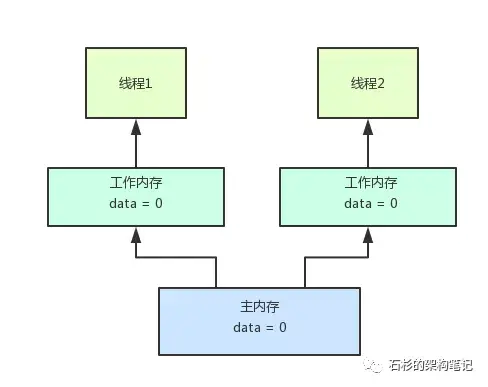

---

title: "JDK并发包温故知新系列（一）—— 竞态条件与内存可见性"
slug: "JDK并发包温故知新系列（一）—— 竞态条件与内存可见性"
description:
date: "2019-10-02"
lastmod: "2019-10-02"
image:
math:
license:
hidden: false
draft: false
categories: ["学习笔记"]
tags: ["并发"]

---
# 前言
今天回家火车上没事情干，一直在看石杉码农老大的技术博客。其中看了些并发系列的文章，虽然都是以前学习JDK源码的时候都了解到的东西，但是隔久了发现自己不是很清晰了，所以到家后把自己笔记捞出来复习一遍，把知识点再串联一次，让自己理解更深刻一点。
# 并发问题
并发问题是指多线程读写共享内存的时候，产生结果不可预期的情况，并发问题的产生的原因可以归结为两种，一是因为竞态条件，二是因为内存可见性、
# 竞态条件
#### 什么是竞态条件
竞态条件，官方解释是如果程序运行顺序的改变会影响最终结果,这就是一个竞态条件。

这句话有点抽象，描述的有点抽象，我个人对竞态条件的理解是多个线程在竞争同一系列资源的使用权，因为使用都是有时间的，不是咔嚓一下完成的，对于每个线程来说它能够正确执行的条件就是要求从获取资源到使用资源完成都是原子性的，不允许其他线程来中途改变资源从而影响了原子性，每个线程都需要这种条件，我把这种多个线程对于共享资源获取到操作完成的原子性的需求叫做竞态条件。

#### 针对竞态条件问题的应对思想
结合自己所学，总结一下应对竞态条件的思想：

1. 通过路由避免竞争，这反映在并发包中有ConcurrentHashMap的分段锁机制、Java8对Cas的优化如LongAdder代替AtomicLong等等，很多地方都是运用了这种思想降低竞争资源粒度。
2. 对资源的获取以及使用资源进行串行化，通过锁、CAS、队列来串行化获取资源和操作资源的操作。
3. 写时复制避免读写竞争。比如ArrayList的写操作，没有必要在写的过程不让读，通过写时复制是可以同时进行读的。对应的并发容器CopyOnWriteArrayList就是采用的写时复制原理使得随时都可以读，类似的还有InnoDb的MVCC快照读、各种读缓存机制如eureka的多级缓存机制。等下讲到的JVM针对共享变量主内存、工作内存都是类似的思想。

# 内存可见性

## 什么是内存可见性
先看这张图：

如图，在Java内存模型中，对于共享变量data，两个工作线程都需要读取这个值的时候，实际上是读取和操作的副本，类似高速本地缓存，这样做的原因是使用缓存机制降低对data的读写并发冲突，不然都去读写同一个内存地址，效率是很低的。

但是这样造成的问题是，各个工作线程的变量不是即时同步的，如线程1将data改为了1，但是对于线程2来说可能他自己的data副本中还没有同步为1，他读取的还是0。这就是内存可见性问题。

## 怎么避免内存可见性导致的问题

- 一是使用synchronized同步锁，锁住共享数据。但是这种对于解决内存可见性来说较重。
- 二是使用volatile关键字，使用volatile关键字修饰时，可理解为对数据的操作都在主存中进行，相比synchronized同步锁，volatile关键字更轻量级一点。另外volatile除了解决了内存可见性，也禁止指令重排（比如懒汉式单例，在初始化一个对象赋值给一个变量的过程(instance = new Instance()这句代码)，可能分为三步，第一步开辟内存空间，第二步调用构造函数初始化对象，第三步将变量指向分配的内存空间，当不加volatile关键字时无法保证这三步的顺序，有可能执行顺序为1,3,2。那么就导致多线程中有可能变量不为null,但是对象却没有初始化完成,然后返回这个变量不为null但是指向的内存却没有初始化完成的变量，可能导致程序报错）。

本文原载于[runningccode.github.io](https://runningccode.github.io)，遵循CC BY-NC-SA 4.0协议，复制请保留原文出处。