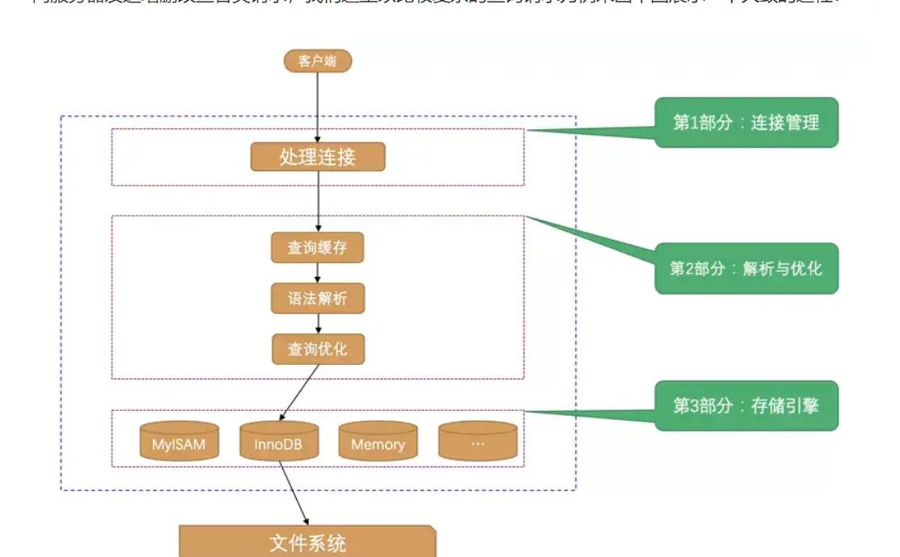
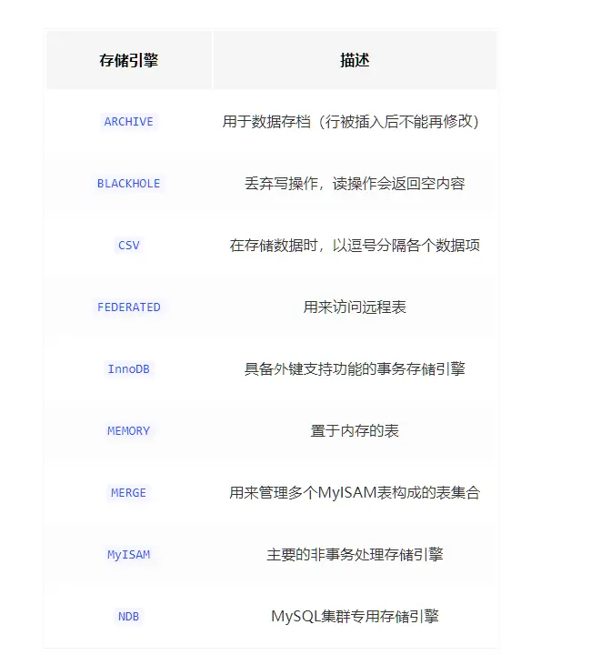

---

title: "Mysql系列（一）—— 简单梳理一下Mysql的查询流程"
slug: "Mysql系列（一）—— 简单梳理一下Mysql的查询流程"
description:
date: "2019-10-06"
lastmod: "2019-10-06"
image:
math:
license:
hidden: false
draft: false
categories: ["学习笔记"]
tags: ["mysql","数据库"]

---
# 写在前面

最近在学习作者小孩子的掘金专栏《MySQL是怎样运行的：从根儿上理解MySQL》,现将学习心得总结梳理为一个系列。

# Mysql查询流程图

# Mysql查询流程
## 处理连接
Mysql有三种连接方式，包括：

- TCP/IP协议，远程连接使用，常规可采用ip端口建立连接。
- 命名管道或共享内存，windows下可以采用命名管道或共享内存进行进程间通信方式，但要求服务器端与连接客服端在同一台机器。
- Unix域套接字，类Unix操作系统可以使用Unix域套接字文件来进行进程间通信。

Mysql会限制同时连接服务器的数量，系统变量（后面我们在解释什么是系统变量、还有状态变量）：max_connections表示的是最大连接数（默认151）。

## 查询缓存

Mysql8.0之前会对查询结果建立缓存，第二次使用同样的语句查询时会先看缓存里面有没有，如果有直接返回查询结果。

**注：从MySQL 5.7.20开始，不推荐使用查询缓存，并在MySQL 8.0中删除（个人觉得，项目小并发量不是很高的可以用，但是并发量不高，相对来说缓不缓存其实影响也不大。但是项目大，数据变更频繁，缓存的开销就会很大，所以无论项目大小，保持关闭状态都是可以的）**

### 缓存的命中条件
- 前后查询语句必须一样，两个查询请求在任何字符上的不同（例如：空格、注释、大小写），都会导致缓存不命中。
- 如果查询请求中包含某些系统函数、用户自定义变量和函数、一些系统表，如 mysql 、information_schema、 performance_schema 数据库中的表，那这个请求就不会被缓存。
### 缓存的删除条件

MySQL的缓存系统会监测涉及到的每张表，只要该表的结构或者数据被修改，如对该表使用了INSERT、 UPDATE、DELETE、TRUNCATE TABLE、ALTER TABLE、DROP TABLE或 DROP DATABASE语句，那使用该表的所有高速缓存查询都将变为无效并从高速缓存中删除。

## 语法解析
这一阶段主要是针对未命中缓存的查询语句进行语法检查，并且将查询语句中使用的表、各种查询条件都提取出来放到MySQL服务器内部使用的一些数据结构上来。

## 查询优化

mysql会针对我们书写的查询语句进行优化，生成一个执行计划（可以在查询语句前面加explain查看执行计划，具体执行计划怎么看，后面有空再总结吧），这个执行计划可以看到将使用哪些索引进行查询，表之间优化后的连接顺序等东西。

## 存储引擎执行

MySQL从2007年开始提供了插件式的存储引擎API，一般来说，连接管理、查询缓存、语法解析、查询优化这些并不涉及真实数据存储的功能我们称为MySQL server的功能，但真正执行查询的是存储引擎的功能，存储引擎真正执行数据存取操作，存储引擎有很多，都是基于mysql的API规范进行开发的。包括下列：

其中，InnoDB和MyISAM是我们最常用的，Mysql的默认存储引擎是InnoDB。

本文原载于[runningccode.github.io](https://runningccode.github.io)，遵循CC BY-NC-SA 4.0协议，复制请保留原文出处。