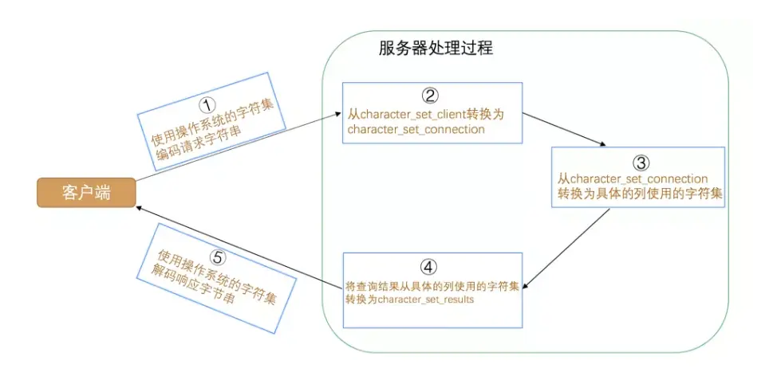

---

title: "Mysql系列（三）—— Mysql字符集和比较规则"
slug: "Mysql系列（三）—— Mysql字符集和比较规则"
description:
date: "2019-10-07"
lastmod: "2019-10-07"
image:
math:
license:
hidden: false
draft: false
categories: ["学习笔记"]
tags: ["mysql","数据库"]

---
# 一、前言
字符集表示的是存储的二进制与字符如何映射的关系，比较规则指的是字符如何排序的规则，比如字符如果使用order by到底按什么规则进行排序。
# 二、查看命令
查看支持的字符集命令是：`SHOW (CHARACTER SET|CHARSET) [LIKE 匹配的模式]`,CHARACTER SET|CHARSET同意，两者都可以用。

查看支持的比较规则命令是：`SHOW COLLATION [LIKE 匹配的模式]`。

注意，比较规则的命名方式有一定规律，一般来说，满足：

- 比较规则名称以与其关联的字符集的名称开头
- 后边紧跟着该比较规则主要作用于哪种语言，比如utf8_polish_ci表示以波兰语的规则比较，utf8_spanish_ci是以西班牙语的规则比较，utf8_general_ci是一种通用的比较规则。
- 名称后缀意味着该比较规则是否区分语言中的重音、大小写啥的，具体可以用的值如下:

  | 后缀|英文释义|描述|
  |:-:|:-:|:-:|
  |_ai|accent insensitive|不区分重音|
  |_as|accent sensitive|区分重音|
  |_ci|case insensitive|不区分大小写|
  |_cs|case sensitive|区分大小写|
  | _bin|binary|以二进制方式比较|

比如我们常用的utf8_general_ci这个比较规则是以ci结尾的，说明不区分大小写进行比较。
# 三、关于utf8与utfmb4
utf8和utfmb4是我们常用的字符集，这两者有什么区别勒？实际上真正的UTF-8 是1-4个字节，但是mysql里面的utf8不是指的这个，而是指的utf8mb3，其中mb表示的是最多占用多少个字节，mysql最开始为了节省空间资源偷偷把utf-8给阉割了，用1-3个字节表示，实际上1-3个字节也足够表示我们平常使用的字符了。而实际上utfmb4才是真正的utf8，能映射所有的unicode码。
# 四、字符集和比较规则的级别
MySQL有4个级别的字符集和比较规则，包括服务器级别、数据库级别、表级别、列级别，对于一个表的列，这几个级别粒度越具体的越优先使用，在创建数据库、表、列的时候，如果没有具体指定用什么字符集和比较规则，自动引用上一级别的配置。我们接下来看看各个级别的字符集和比较规则具体怎么设置。
## 服务器级别
|系统变量|描述|
|:-:|:-:|
|character_set_server|服务器级别的字符集|
|collation_server|服务器级别的比较规则|

如图，服务器级别的字符集和比较规则由系统变量character_set_server和collation_server控制，查看和修改命令上一篇文章介绍过。我们可以通过启动选项、配置文件、运行时更改来设置它。
## 数据库级别
数据库级别的字符集和比较规则的系统变量为：

|系统变量|描述|
|:-:|:-:|
|character_set_database|当前数据库的字符集|
|collation_database|当前数据库的比较规则|

如果想查看当前数据库使用的字符集和比较规则，可以使用以上的变量值进行查看（前提是使用USE语句选择当前默认数据库，如果没有默认数据库，则变量与相应的服务器级系统变量具有相同的值）。

另外，这两个变量是只读的，我们不能直接修改这两个值就把数据库的字符集和比较规则改变了。这两个值只能通过DDL语句去改变。语法格式为：

```
CREATE DATABASE 数据库名
    [[DEFAULT] CHARACTER SET 字符集名称]
    [[DEFAULT] COLLATE 比较规则名称];

ALTER DATABASE 数据库名
    [[DEFAULT] CHARACTER SET 字符集名称]
    [[DEFAULT] COLLATE 比较规则名称];
```

## 表级别

编辑和修改：

``
CREATE TABLE 表名 (列的信息)
[[DEFAULT] CHARACTER SET 字符集名称]
[COLLATE 比较规则名称]]

ALTER TABLE 表名
[[DEFAULT] CHARACTER SET 字符集名称]
[COLLATE 比较规则名称]
``

## 列级别

编辑和修改：

```
CREATE TABLE 表名(
    列名 字符串类型 [CHARACTER SET 字符集名称] [COLLATE 比较规则名称],
    其他列...
);

ALTER TABLE 表名 MODIFY 列名 字符串类型 [CHARACTER SET 字符集名称] [COLLATE 比较规则名称];
```

## 另外
由于字符集和比较规则是互相有联系的，如果我们只修改字符集，则比较规则将变为修改后的字符集默认的比较规则。，只修改比较规则，则字符集将变为修改后的比较规则对应的字符集。

# 五、Mysql中字符集的转换
我们知道从客户端发往服务器的请求本质上就是一个字符串，服务器向客户端返回的结果本质上也是一个字符串，而字符串其实是使用某种字符集编码的二进制数据。这个字符串可不是使用一种字符集的编码方式一条道走到黑的，从发送请求到返回结果这个过程中伴随着多次字符集的转换，在这个过程中会用到3个系统变量:

|系统变量|描述|
|:-:|:-:|
|character_set_client|服务器解码请求时使用的字符集|
|character_set_connection|服务器处理请求时会把请求字符串从character_set_client转为character_set_connection|
|character_set_results|服务器向客户端返回数据时使用的字符集|



多次转码流程如上图，注意，如果某个列使用的字符集和character_set_connection代表的字符集不一致的话，还需要进行一次字符集转换。一般情况下要使用保持这三个变量的值和客户端使用的字符集相同，免得不必要的编解码开销。


本文原载于[runningccode.github.io](https://runningccode.github.io)，遵循CC BY-NC-SA 4.0协议，复制请保留原文出处。