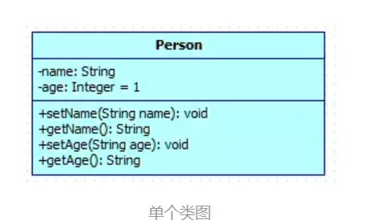
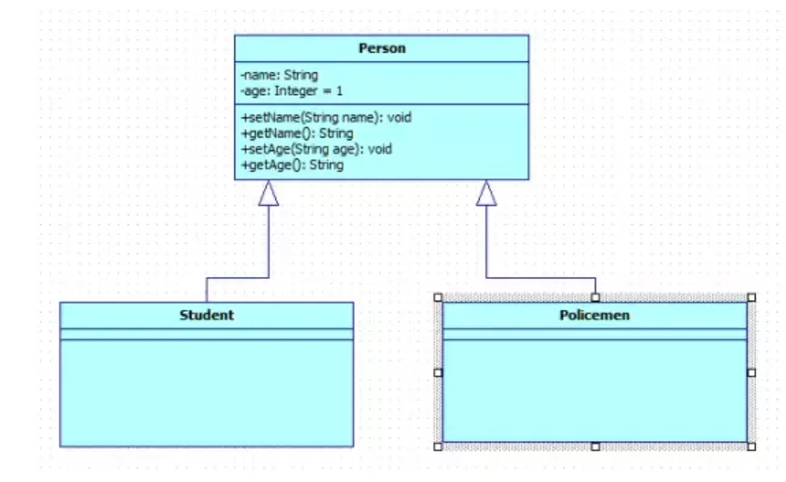
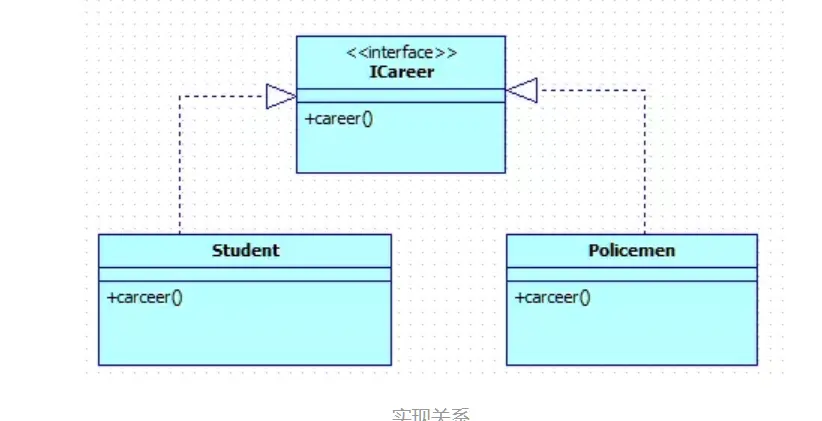
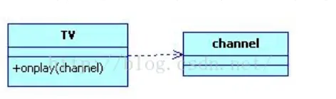
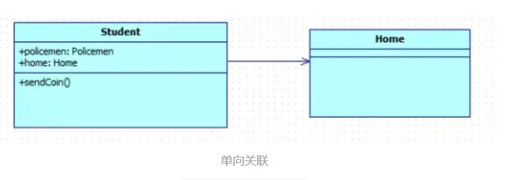
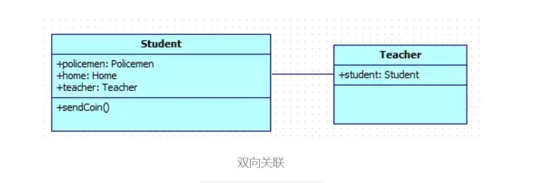
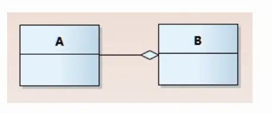
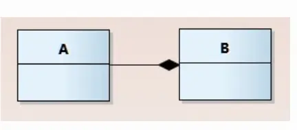

---

title: "UML类图知识整理"
slug: "UML类图知识整理"
description:
date: "2019-11-01"
lastmod: "2019-11-01"
image:
math:
license:
hidden: false
draft: false
categories: ["学习笔记"]
tags: ["画图","UML"]

---
之所以学习UML类图，是因为想把前面看的《设计模式之禅》再看一遍，但文章都用到了uml类图，前面其实都一知半解，觉得自己挺low的，所以觉得还是得看明白才行。才浏览了网上几篇博客，现将知识点整理如下：

博客来源：

[Java 大白话讲解设计模式之 -- UML类图](https://www.jianshu.com/p/2828874af134)

[类之间的关联关系和依赖关系](https://www.cnblogs.com/igoodful/p/9441316.html)

[依赖、关联、聚合、组合](https://blog.csdn.net/lwwl12/article/details/82463441)

[看懂UML类图和时序图](https://design-patterns.readthedocs.io/zh_CN/latest/read_uml.html)

# 一、UML类图中一个类的基本表示

如图，Person类被分为三部分，从上到下依次是：

- 类名
- 成员变量，表示为：*权限 属性名：类型 [ = 默认值 ]*
- 方法，表示为：*权限  方法名称(参数列表) [ : 返回类型]*

其中，权限的表示方法简写为了+、#、~、-,分别表示public、protected、default、privite。

# 二、UML图中的关系表示

## （一）泛化（继承）关系

A指向B，表示B是A的泛化，即继承。

## （二）实现关系

A指向B，表示A实现了B

## （三）依赖关系

A指向B，表示A依赖于B，即在A中使用到了B对象，与关联关系相区分，依赖比关联关系要弱一些，依赖关系一般是类B以参数的形式传入类A的方法（参数依赖）、类B以局部变量的形式存在于类A的方法中（局部依赖），类A调用类B的静态属性或方法（静态依赖）,而关联关系通常是指一个类对象作为另一个类对象的成员变量。

## （四）关联关系

关联又分为单向关联，双向关联。其中：

### 1.单向关联

A指向B表示，一般用于表示B作为成员变量在A中，是一种较强的关系。

### 2.双向关联

表示A和B都作为成员变量在对方类中，代码中应该尽量避免双向关联。

## （五）特殊的关联关系

### 1.聚合关系

一种特殊的关联关系，用以表示整体由部分构成的语义，但与组合关系相区分的是，其中整体和部分又相对独立，可以分开，如学生与选修课，选修课由学生一起选修组成，但是选修课没有了，不代表学生这个实体就失去意义了。

菱形那一边表示整体，这里的图表示B由A组成，但就算没了B，A也有自己的意义。

### 2.组合关系

也是一种特殊的关联关系，与聚合关系类似，表示的也是整体由部分构成，但是区别的是即使聚合的整体被破坏，部分则失去了意义，换句话说部分的生命周期依赖于整体的生命周期，如公司与部门，公司不存在了，则部门也不存在了。

菱形那一边表示整体，这里的图表示B由A组成，也表示没了A，B也不存在（注，与聚合关系图对比这里是实心的菱形）。

本文原载于[runningccode.github.io](https://runningccode.github.io)，遵循CC BY-NC-SA 4.0协议，复制请保留原文出处。