---

title: "安装docker，并在docker下用nexus3搭建maven私服"
slug: "安装docker，并在docker下用nexus3搭建maven私服"
description:
date: "2019-11-04"
lastmod: "2019-11-04"
image:
math:
license:
hidden: false
draft: false
categories: ["学习笔记"]
tags: ["docker"]

---
# 一、前言
前几天阿里云服务器（低配）86块一年，于是赶紧入手了，主要是拿来练练手，今天就是在这个这台服务器上练了下手搭了一个docker和nexus，当自己的私服用，想着平时可以把一些自己写的一些常用的工具、配置类搞上去。现在梳理一下搭建的流程把。
# 二、安装docker
## （一） 安装依赖
```
yum install -y yum-utils
yum install -y device-mapper-persistent-data
yum install -y lvm2
```
## (二) 安装 Docker
运行以下命令：

```
yum install docker
```

Docker 官方为了简化安装流程，提供了一套便捷的安装脚本，CentOS 系统上可以使用这套脚本安装：

```
curl -fsSL get.docker.com -o get-docker.sh
sh get-docker.sh
```

然后执行`docker version`查看是否安装完成，如图：

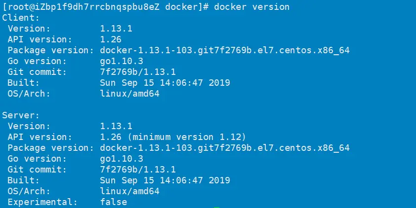

然后启动 Docker：
```
systemctl enable docker
systemctl start docker
```

## （三）配置镜像加速

另外，我们知道，类似maven，如果我们在国内每次都从官方仓库里面去下镜像是很慢的，所以一般也需要配置镜像加速。

```
vi /etc/docker/daemon.json
```

打开配置为：

```
# 填写自己的加速器地址
{
    "registry-mirrors": ["https://xxxxxx.mirror.aliyuncs.com"]
}
```

注意了，我是使用的阿里云镜像加速，实际上还有其他站点，阿里云加速地址需要去阿里云登录后获取，获取地址为[阿里云镜像加速地址获取](https://cr.console.aliyun.com/cn-hangzhou/instances/mirrors)，如图：
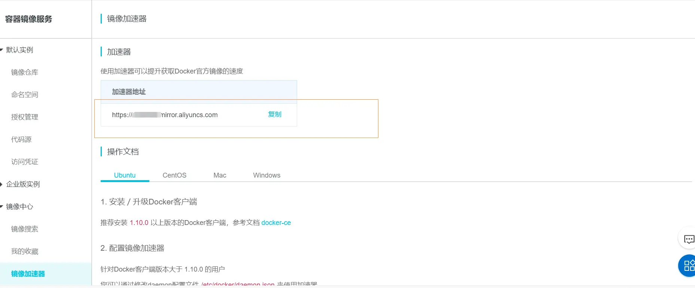

把这个地址复制到daemon.json就行了。然后重启daemon和docker服务：

```
systemctl daemon-reload
systemctl restart docker
```

## （四）docker常用命令总结
概念性的知识我就不介绍了，我也正在学习，这里总结一下常用命令：

- docker search 关键词:搜索镜像
- docker pull xxx:下载镜像
- docker images:查看本地有哪些镜像
- docker rm container_name/container_id:删除镜像
- docker run -t -i container_name/container_id /bin/bash:运行容器中的镜像，并且调用镜像里面的 bash
- docker ps -a:查看有哪些容器在运行
- docker start container_name/container_id:运行容器
- docker stop container_name/container_id:停止容器
- docker restart container_name/container_id:重启容器
- docker attach container_name/container_id:进入容器
- exit:退出容器
- docker rm container_name/container_id:删除容器

# 三、docker下安装nexus3
## （一）查找nexus3镜像
```
docker search nexus3
```

我是下的这个：

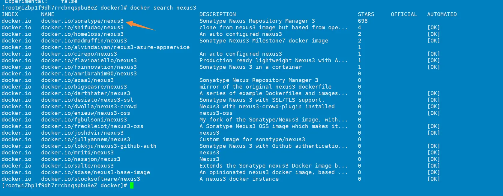
## （二）拉取镜像
```
docker pull docker.io/sonatype/nexus3
```
看拉下来没有可以执行：
```
docker images
```
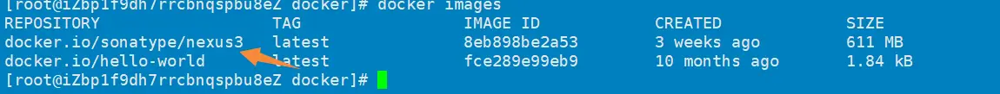

## （三）执行镜像
```
docker run -d -p 8081:8081 --name nexus3 --restart=always sonatype/nexus3
```

这里的参数分别表示：

- -d：表示在docker守护线程运行这个镜像；
- -p：表示绑定端口，前面的端口表示宿主机端口，后面的表示容器端口，如果宿主机的8081端口已经被占用了，那么可以改为8082：8081，为什么后面的是8081端口？这是Nexus服务自己设定的，可以修改，但是跑docker的话没必要了，下面都是以8081为nexus的端口；
- --restart=always：这个指定docker重启启动容器，当服务器或者docker进程重启之后，nexus容器会在docker守护进程启动后由docker守护进程启动容器，容器的重启策略很多，大家可以自己去看看对应的资料；
- --name <container-name>：这里是指定了容器建立后的名称；
- 最后面的sonatype/nexus3是镜像名。

如果需要查看日志执行：
```
docker logs nexus3
```

## (四)进入nexus

访问你的服务器地址+端口8081进入nexus管理后台。

这里可能会遇到两个问题：

第一个问题是阿里云服务器端口必须要配置一下外网才可以访问。

第二个问题是密码错误的问题。

默认nexus的账号和密码是admin/admin123，但是不知道为什么可能是版本原因我这里下的nexus需要默认密码要进入容器内去找，怎么查看勒,执行：
```
docker exec -it 容器id或者容器名 /bin/bash
```

容器id或容器名通过`docker ps -a`查看。

然后cd到nexus-data目录，cat admin.password，查看密码：

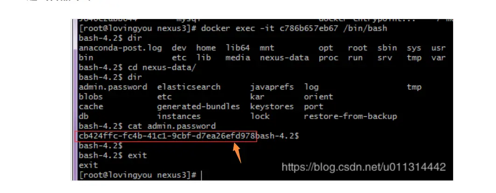

将密码复制出来，进行登录就可以了。

## （五）创建仓库
然后登录nexus，根据需要创建自己的仓库或者就用默认的仓库也行，我是创建了一个新的仓库，如果需要创建依次点击如图：

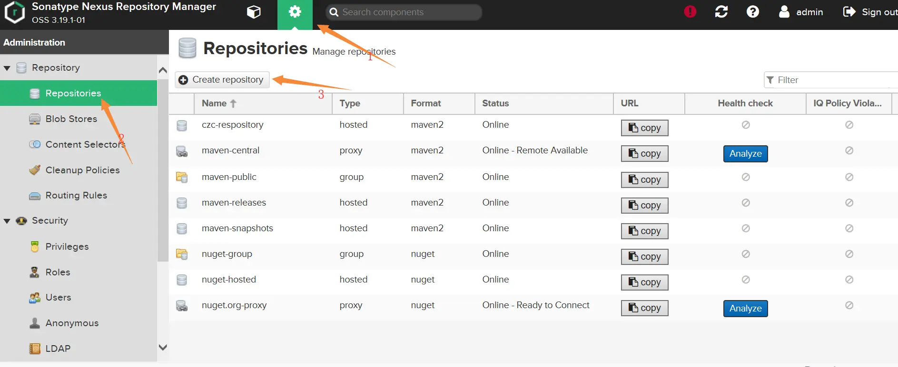

选择maven2(hosted)

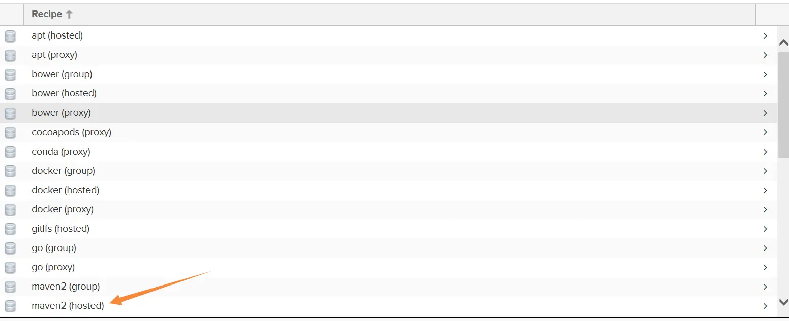

不同的类型区别是：

- hosted：本地存储。像官方仓库一样提供本地私库功能
- proxy：提供代理其它仓库的类型
- group：组类型，能够组合多个仓库为一个地址提供服务

然后创建仓库，用默认设置就行：

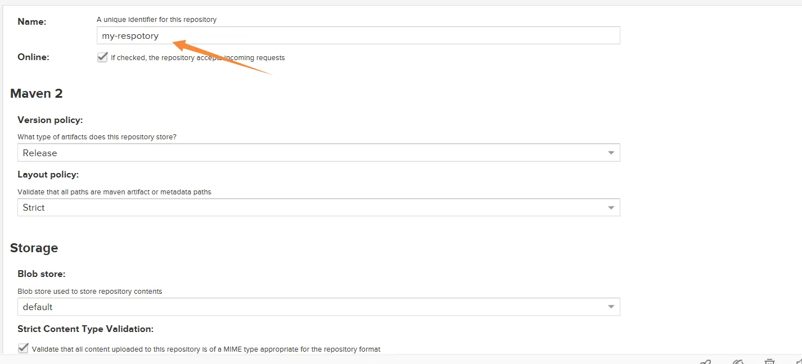
## （六）将仓库地址copy出来
接下来把刚刚的仓库地址copy出来就行了。

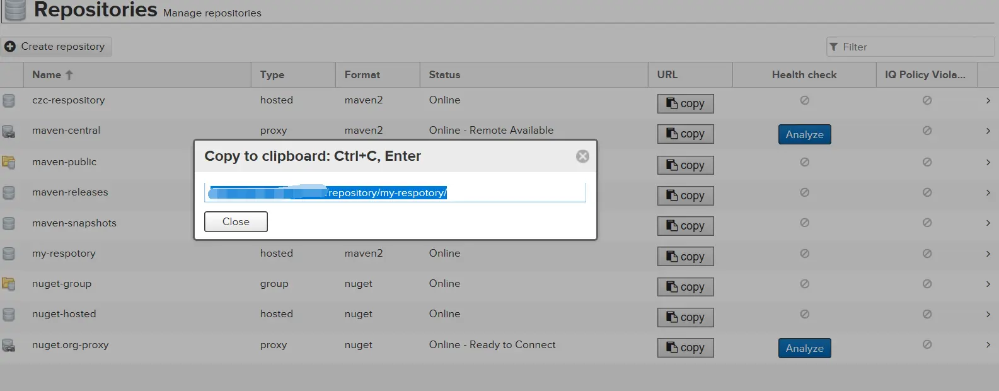

# 四、设置maven的setting.xml以及pom文件并上传jar包
## （一）配置setting.xml
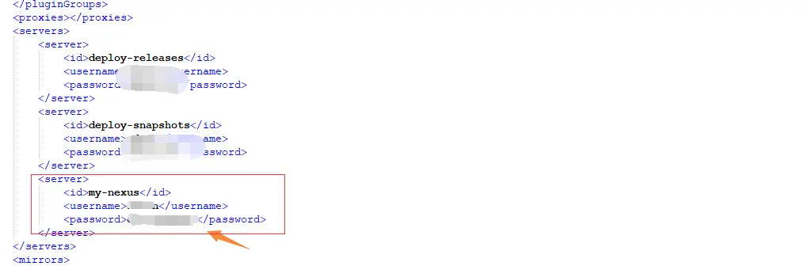

注意了，这里的id必须与设定下载jar主仓库的<repositories>标签和设定发布仓库的<distributionManagement>标签内的id保持一致。

设置下载Jar仓库可以在Pom里面写也可以在setting.xml里面写，在setting.xml写表示全局，我是在setting.xml里面写的：

<profiles>标签下添加：
```
<profile>
		<id>my-nexus</id>
		<repositories>
			<repository>
			<id>my-nexus</id>
			<name>my-nexus</name>
			<url>刚刚复制的仓库地址</url>
			</repository>
		</repositories>
</profile>
```

<activeProfiles>标签下添加：

```
<activeProfile>my-nexus</activeProfile>
```

然后如果需要上传到私服，配置pom：

```
<distributionManagement>
   <repository>
      <id>my-nexus</id>
      <url>你的仓库地址</url>
   </repository>
</distributionManagement>
```

以上保证repository标签下的Id和server下的id一样就行。

配置好了就可以使用maven打包了，我是用的idea自带的maven插件直接deploey就行了：
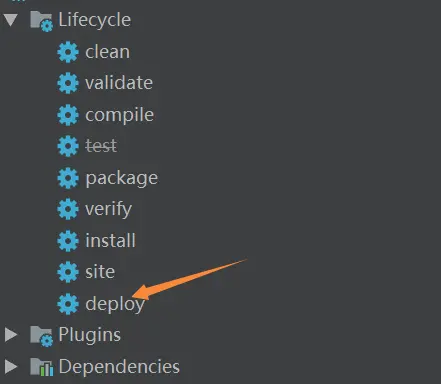


本文原载于[runningccode.github.io](https://runningccode.github.io)，遵循CC BY-NC-SA 4.0协议，复制请保留原文出处。