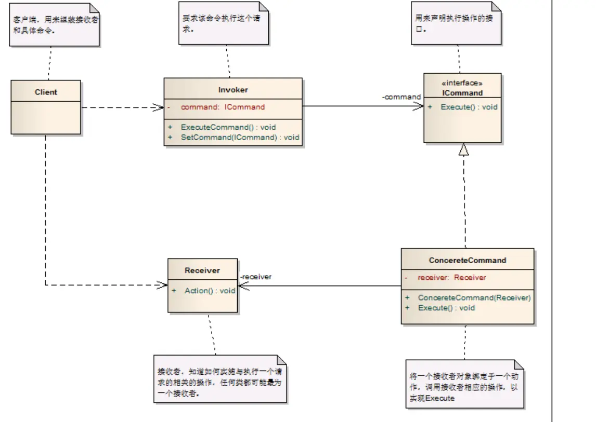

---

title: "设计模式之命令模式"
slug: "设计模式之命令模式"
description:
date: "2019-11-14"
lastmod: "2019-11-14"
image:
math:
license:
hidden: false
draft: false
categories: ["学习笔记"]
tags: ["设计模式"]

---
# 定义

Encapsulate a request as an object,thereby letting you parameterize clients with different requests,queue or log requests,and support undoable operations.（将一个请求封装成一个对象，从而让你使用不同的请求把客户端参数化，对请 求排队或者记录请求日志，可以提供命令的撤销和恢复功能。）

# 命令模式的类图

其中的角色有：

- Client 客户端。只依赖于调用者Invoker、接收者Receiver、以及Command（网上找的图片这里没有画出来）,不用关注接收者如何执行命令，只需要告诉调用者需要执行什么命令，以及会用到什么接收者去执行，但是这里得注意，虽然类图中同时依赖了接收者，但是实践中，通常没有依赖接收者，而是利用Command的命名处理与接收者的耦合关系，如在实例化Command实现类默认构造函数自动为自己设置1个或多个默认的接收者，同时也对外提供自定义接收者的构造方法。这样Client就只需要关心Comand然后交给Invoker去执行，而不需要关新接收者是谁。
- Invoker 调用者，调用者主要是对Command的抽象进行执行。抽象一类Command的调用。只关注执行什么命令。
- Command 命令，最重要的角色，是命令模式的核心，命令模式正是将客户端的需求抽象为了一个个命令，当需要扩展命令时只需要增加一个Command实现就行了。Command只关注如何组织接收者完成业务。
- Receiver 接收者，执行命令的角色。是业务逻辑执行的角色。只关注本角色需要执行什么业务。

个人理解：命令模式最大的优点是类间解耦。Invoker和Receiver之间没有任何依赖关系，Receiver只需要关注怎么实现自己的功能，Invoker只需要关注调用什么Command，然后将Receiver之间的组织封装在Command内部，实现高内聚，职责非常清晰，并且Command可以随时扩展。实在是一个非常优秀的设计。

本文原载于[runningccode.github.io](https://runningccode.github.io)，遵循CC BY-NC-SA 4.0协议，复制请保留原文出处。