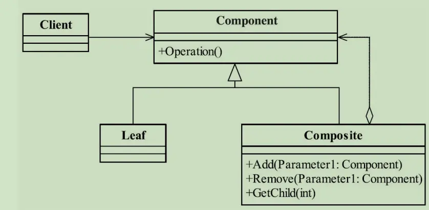
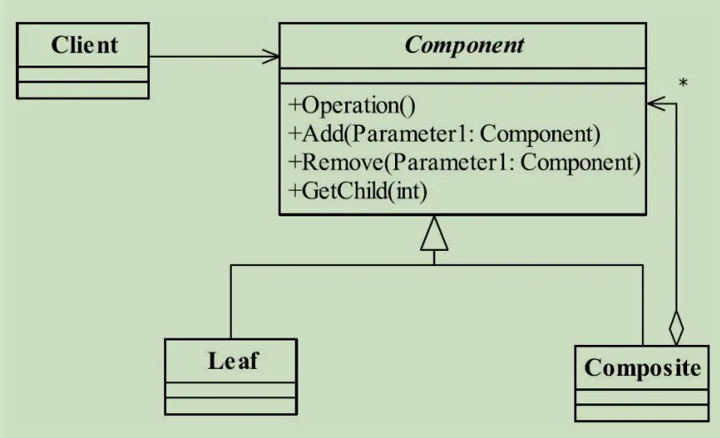

---

title: "设计模式之组合模式"
slug: "设计模式之组合模式"
description:
date: "2019-11-17"
lastmod: "2019-11-17"
image:
math:
license:
hidden: false
draft: false
categories: ["学习笔记"]
tags: ["设计模式"]

---
# 定义
将对象组合成树形结构以表示“部分-整体”的层次结构，使得用户对单个对象和组合对象的使用具有一致性。
# UML类图
组合模式有两种不同的实现，一种是安全模式的组合模式，叶子节点没有实现树枝节点独有的方法，UML图为：

另一种是透明模式的组合模式，将树枝节点的方法定义在了节点抽象里面，只是子类的实现是抛出一个异常（所以是不安全的）：

# 角色
- Component,树枝节点与树叶节点统一抽象，主要是被树枝节点类关联。
- Composient,树枝节点类
- Leaf,树叶节点类

# 思考
组合模式主要是通过把树枝节点和树叶节点统一抽象为了一个类，也就是树枝节点的getChildren方法并不关心返回的是树枝还是叶子类对象，返回的是Component。该模式主要是一种反映树状模型的设计。

本文原载于[runningccode.github.io](https://runningccode.github.io)，遵循CC BY-NC-SA 4.0协议，复制请保留原文出处。