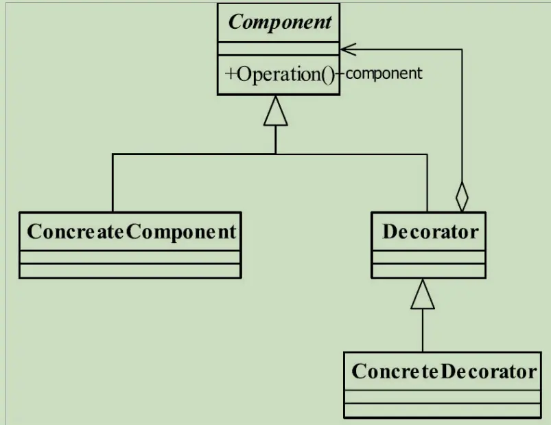

---

title: "设计模式之装饰器模式"
slug: "设计模式之装饰器模式"
description:
date: "2019-11-17"
lastmod: "2019-11-17"
image:
math:
license:
hidden: false
draft: false
categories: ["学习笔记"]
tags: ["设计模式"]

---
# 定义
> Attach additional responsibilities to an object dynamically keeping the same interface.Decorators provide a flexible alternative to subclassing for extending functionality.（动态地给一个对象添加一些额外的职责。 就增加功能来说，装饰模式相比生成子类更为灵活

# UML类图


# 角色
- Component 抽象构件，就是装饰器与被装饰类共有的抽象。
- ConcreteComponent 具体构件，就是被装饰类
- Decorator 装饰器抽象，就是装饰器的抽象
- ConcreteDecorator 装饰器的具体实现

# 应用
应用中通常代码如：

装饰类实现：

```
//构造方法，初始化成员变量为装饰类
public ConcreteDecorator1(Component component){
   //抽象装饰器中定义的构造方法，初始化被装饰类到成员变量
   super(component);
}
public void operate(){
//这里可以添加一些功能增强
this.component.operate()
//这里可以添加一些功能增强
}
```


场景类应用：
```
Component component = new ConcreteComponent();
//第一次修饰 
component = new ConcreteDecorator1(component);
//第二次修饰 
component = new ConcreteDecorator2(component);
//修饰后运行 
component.operate();
```

## 思考
装饰器模式最大的好处是动态扩展一类对象的功能，并且可以应用嵌套装饰无限扩展下去。
这是单单用继承来增强父类行为这种方式来扩展远比不了的吗，因为继承是静态的，扩展哪个类都已经在定义类的时候决定了。

# 与代理模式的对比
代理模式在前篇梳理过：
[设计模式之代理模式](https://my.oschina.net/u/4101481/blog/3036565)。

总结下两者的区分：

**代理模式对于整个系统来说是控制了真实对象的访问，我们往往只需要使用代理类完成相关业务功能就行了，被代理类相对透明。
如果是装饰器模式，那么我们需要关注的是被装饰的类需要添加什么装饰这个过程，系统中的代码还是得依赖被装饰对象。**


本文原载于[runningccode.github.io](https://runningccode.github.io)，遵循CC BY-NC-SA 4.0协议，复制请保留原文出处。