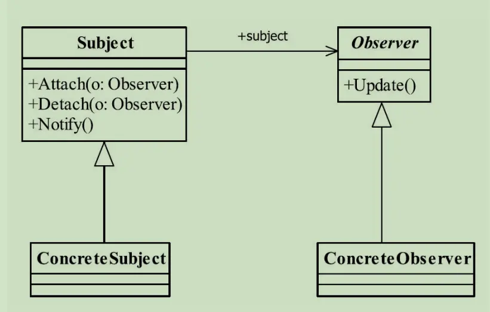

---

title: "设计模式之观察者模式"
slug: "设计模式之观察者模式"
description:
date: "2019-11-17"
lastmod: "2019-11-17"
image:
math:
license:
hidden: false
draft: false
categories: ["学习笔记"]
tags: ["设计模式"]

---
# 定义
> Define a one-to-many dependency between objects so that when one object changes state,all its dependents are notified and updated automatically.（定义对象间一种一对多的依赖关系，使得每 当一个对象改变状态，则所有依赖于它的对象都会得到通知并被自动更新。）

# 类图


# 角色
- Subject 被观察者接口，定义添加观察者，减少观察者，通知观察者的方法。
- ConcreateSubject 被观察者实现类，实现观察者接口的方法，在适当业务场景代码中调用notify来通知观察者。

其中notify的代码如：
```
private List<Observer> obsList = new CopyOnWriteArrayList<>();
//通知所有观察者
public void notify(){
	for(Observer o:this.obsList){
	o.update();
	}
}
```

- Observer 观察者接口，定义收到信息后的处理方法update。
- ConcreateObserver 观察者实现类，实现update方法。

# 高级应用
- 这种在JDK中已经实现了一套如java.util.Observable实现类和java.util.Observer接口
- 上述的例子中通知多个观察者是采用的循环中顺序执行的方法，在这种情况下，一个观察者如果效率非常慢，将影响其他观察者的处理进度，所以可以采取队列+多线程的方式进行处理。
- 消息中的发布订阅就是观察者模式的高级应用


本文原载于[runningccode.github.io](https://runningccode.github.io)，遵循CC BY-NC-SA 4.0协议，复制请保留原文出处。