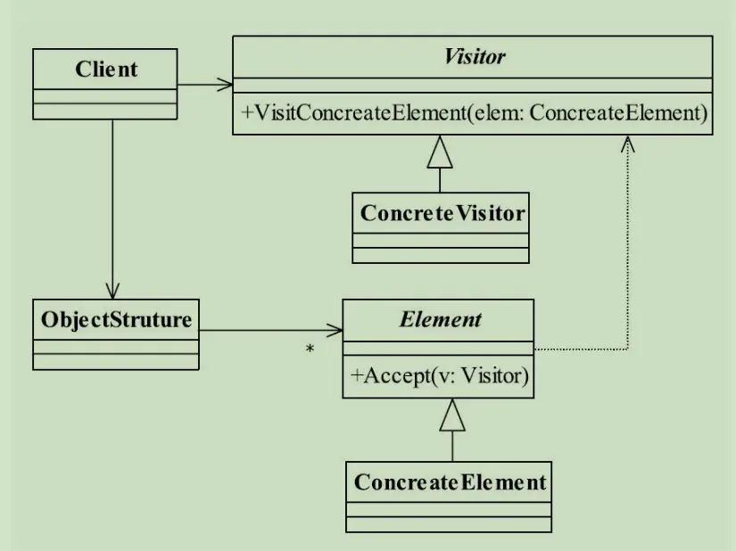

---

title: "设计模式之访问者模式"
slug: "设计模式之访问者模式"
description:
date: "2019-11-17"
lastmod: "2019-11-17"
image:
math:
license:
hidden: false
draft: false
categories: ["学习笔记"]
tags: ["设计模式"]

---
# 定义
Represent an operation to be performed on the elements of an object structure. Visitor lets you define a new operation without changing the classes of the elements on which it operates. （封装一些作用于某种数据结构中的各元素的操作，它可以在不改变数据结构的前提下定义作用于这些元素的新的操作。）
# UML类图


角色：

- ObjectStruture 结构对象，大白话就是容器如List,Set，Queue，Map等。
- Element 元素抽象，就是容器类的元素
- ConcreateElement 元素的具体实现
- Vistor 访问者接口
- ConcreateVistor 具体访问者

# 应用场景

个人觉得是常用于迭代当中针对统一抽象不同的具体类，做出不同的操作，比如以下代码：

```
for(Element element: elementList){
element.accept(visitor1);
element.accept(visitor2);
}
```

注意了accept的代码基本上都是直接把自己传入visitor，即visitor.visitorElement(this)。


这里乍一眼看很普通的一个调用，对调用类来说好像每个元素就是添加了一个观察者而已，貌似是走的一套逻辑，这里是如何实现针对不同的Element实现类进行不同的操作的勒？原理是对重载和重写的合理运用。element的accept由不同的子类重写。内部调用了visitor重载的不同方法visitorElement（ConcreateElement element），所以这里实际上根据子类类型做了动态绑定，走的不同的逻辑。也许大家又会说那么为什么要引入一个访问者勒，直接在子类里实现重写方法，不一样实现了动态绑定。确实是可以这么做，但访问者模式的意义在引入了了访问者，封装了这种不同，而不是将这种不同分散在一个个实现类当中。


本文原载于[runningccode.github.io](https://runningccode.github.io)，遵循CC BY-NC-SA 4.0协议，复制请保留原文出处。