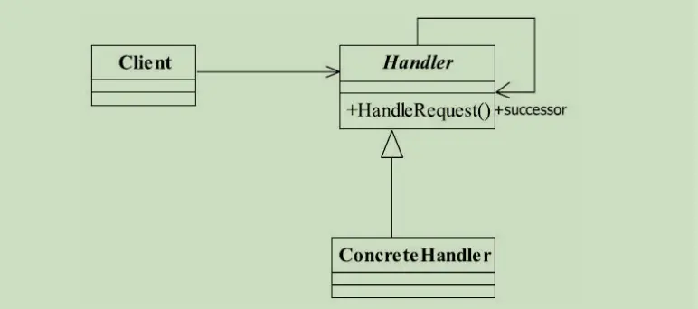

---

title: "设计模式之责任链模式"
slug: "设计模式之责任链模式"
description:
date: "2019-11-17"
lastmod: "2019-11-17"
image:
math:
license:
hidden: false
draft: false
categories: ["学习笔记"]
tags: ["设计模式"]

---
# 定义

> Avoid coupling the sender of a request to its receiver by giving more than one object a chance to handle the request.Chain the receiving objects and pass the request along the chain until an object handles it.（使多个对象都有机会处理请求，从而避免了请求的发送者和接受者之间的耦合关 系。将这些对象连成一条链，并沿着这条链传递该请求，直到有对象处理它为止。）

# UML类图


角色：

- Hanlder 抽象处理者
- ConcreateHander 处理者实现

# 应用场景
针对一类请求，有多个处理方法，如果不用责任链模式代码会类似为：

```
if(type = 1){
//这么处理
}else if(type = 2){
//这么处理
}else if(type =3){
//这么处理
}else{
//这么处理
}
```

针对这种if-elseif-else结构的分支，可以将处理方式进行抽象封装为Hanlder。用链的形式传递请求到各个实现类。
比如针对一个请求Request，抽象的Hanlder处理逻辑为：
```
public final void hanlderMessage(Request request){
//如果自己能够处理
if(request.getType().equals(this.getType)){
	//自己进行处理
	this.response()
	}else{
		if(this.getNextHanlder() == null){
		   //如果没有接替者,按默认情况处理
			this.hanlderMessageDefault(request);
		}else{
			//交给自己的接替者进行处理
			this.getNextHanlder().hanlderMessage（request）；
		}
	}
}

```

大概就是这种结构，其中运用了模板方法模式，hanlderMessage就是每个ConcreateHanlder类继承的方法。继承类只需要实现resonse方法来按照自己的逻辑实现处理，这个抽象Hanlder只需要提供对外的方法setType用来定义自己的处理级别与请求的类型相对应，以及hanlderMessage来处理请求。

# 优点
优点是封装了if-elseif-else这种的逻辑分支，将请求与处理分了开来，请求只需要关心抽象的Hanlder。而具体实现ConcreateHanlder也不用关心具体的请求全貌，只需要处理自己的方式。如果需要扩展处理只需要多实现一个Hanlder就可以了。

# 缺点
缺点也很明显，这种链表的调用形式，如果调用链过长会浪费栈内存空间。


本文原载于[runningccode.github.io](https://runningccode.github.io)，遵循CC BY-NC-SA 4.0协议，复制请保留原文出处。