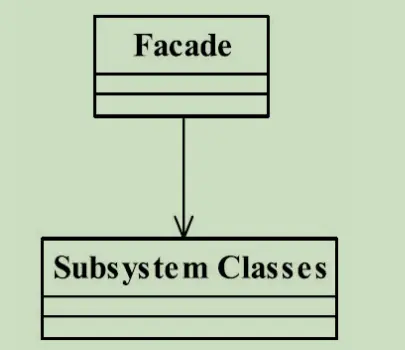

---

title: "设计模式之门面模式"
slug: "设计模式之门面模式"
description:
date: "2019-11-17"
lastmod: "2019-11-17"
image:
math:
license:
hidden: false
draft: false
categories: ["学习笔记"]
tags: ["设计模式"]

---
# 定义
Provide a unified interface to a set of interfaces in a subsystem.Facade defines a higher-level interface that makes the subsystem easier to use.（要求一个子系统的外部与其内部的通信必须通 过一个统一的对象进行。门面模式提供一个高层次的接口，使得子系统更易于使用。）
# UML类图

# 解释
门面模式的类图很简单，Subsystem Classes是子系统所有类的简称，它可能代表一个类，也可能代表几十个对象的集合，门面模式就是提供一个门面Facaed接口，封装所有子系统的类，要求与外部通信必须经过这个类进行。简化耦合关系，避免外部类直接与子系统的各个类进行耦合。这就是门面模式。

本文原载于[runningccode.github.io](https://runningccode.github.io)，遵循CC BY-NC-SA 4.0协议，复制请保留原文出处。