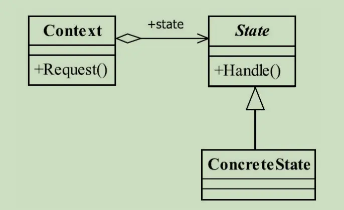

---

title: "设计模式之状态模式"
slug: "设计模式之状态模式"
description:
date: "2019-11-22"
lastmod: "2019-11-22"
image:
math:
license:
hidden: false
draft: false
categories: ["学习笔记"]
tags: ["设计模式"]

---
# 定义
> Allow an object to alter its behavior when its internal state changes.The object will appear to change its class.（当一个对象内在状态改变时允许其改变行为，这个对象看起来像改变了其类。）

# UML类图


# 角色解释
- Context,环境，封装各种状态的变化，并且向外部提供所有需要的接口，使得外部不用关注状态的变化，只需要关注抽象的行为，以及初始状态。
- State，状态，抽象所有状态的行为，并且依赖Context，提供setContext方法。
- ConcreateState,状态实现，总结下就是每个状态只关注自己的行为实现，针对不属于自己的行为可以进行抛错。

# 代码示例
已开门状态和关门状态举例：

Context类：
```
public class DoorContext {
    public static final DoorState OPEN_STATE = new OpenState();
    public static final DoorState CLOSE_STATE = new CloseState();
    /**
     * 当前状态
     */
    private DoorState currentState;

    /**
     * 获得当前状态
     */
    public DoorState getCurrentState() {
        return currentState;
    }

    public void setCurrentState(DoorState doorState) {
        doorState.setDoorContext(this);
        this.currentState = doorState;
    }

    public void close() {
        this.currentState.close();
    }

    public void open() {
        this.currentState.open();
    }

    public void enter() {
        this.currentState.enter();
    }

    public void out() {
        this.currentState.out();
    }

    public void knock() {
        this.currentState.knock();
    }
}
```

State抽象类：
```
public abstract class DoorState {
    protected DoorContext doorContext;

    public void setDoorContext(DoorContext _Door_context) {
        this.doorContext = _Door_context;
    }

    public abstract void open();

    public abstract void close();

    public abstract void enter();

    public abstract void out();

    public abstract void knock();

}
```

关门状态实现类：

```
   @Override
    public void open() {
        System.out.println("开门");
        //切换状态
        super.doorContext.setCurrentState(DoorContext.OPEN_STATE);
    }


    @Override
    public void close() {
        System.out.println("已关门");
    }


    @Override
    public void knock() {
        System.out.println("关着的门用力敲");
    }


    @Override
    public void enter() {
        throw new RuntimeException("门关了，进门失败");
    }

    @Override
    public void out() {
        throw new RuntimeException("门关了，出门失败");
    }
```

开门状态实现类：

```
public class OpenState extends DoorState {
    @Override
    public void enter() {
        System.out.println("进入");
    }

    @Override
    public void out() {
        System.out.println("出来");
    }

    @Override
    public void knock() {
        System.out.println("开着的门轻轻敲");
    }

    @Override
    public void open() {
        System.out.println("门已经开着了");
    }

    /**
     * 涉及到切换到其他状态
     */
    @Override
    public void close() {
        System.out.println("关门");
        super.doorContext.setCurrentState(DoorContext.CLOSE_STATE);
    }
}
```

场景类1：

```
 public static void main(String[] args) {
        DoorContext doorContext = new DoorContext();
        //给个初始状态
        doorContext.setCurrentState(DoorContext.CLOSE_STATE);
        //敲门
        doorContext.knock();
        //开门
        doorContext.open();
        //进门
        doorContext.enter();
        //关门
        doorContext.close();
        //进门
        doorContext.open();
        //出门
        doorContext.out();
        //关门
        doorContext.close();
    }
```

观察场景类可以知道，当场景类调用的时候，根本不需要在意状态，只需要关注需要实现的行为，而具体能不能实现行为，具体怎么实现这个行为，状态的流转，则被封装在了Context里。

# 应用场景
- 行为与状态有相互依赖的关系。
  也就是说，行为受状态影响（状态会改变行为），而状态也受行为影响（行为会改变状态），状态模式就是将每个状态抽出来，然后针对每个行为进行实现，遇到切换状态的行为的时候将当前场景Context里面的状态切换就行了。而对于Context来说，只需要将外部的调用转发个当前场景内部的状态去处理就行了。

# 优点
- 屏蔽了状态切换，并且又拥有良好的健壮性，没有忽视行为受状态的影响，只是封装在了状态内部去去处理了。
- 符合单一职责，如果不应用状态模式，那么状态和行为是耦合在一个类中，不符合单一职责原则。
- 符合开闭原则，高层模块不关注具体状态实现，如果需要扩展状态，只需要在底层添加一个状态实现类就是了。


本文原载于[runningccode.github.io](https://runningccode.github.io)，遵循CC BY-NC-SA 4.0协议，复制请保留原文出处。