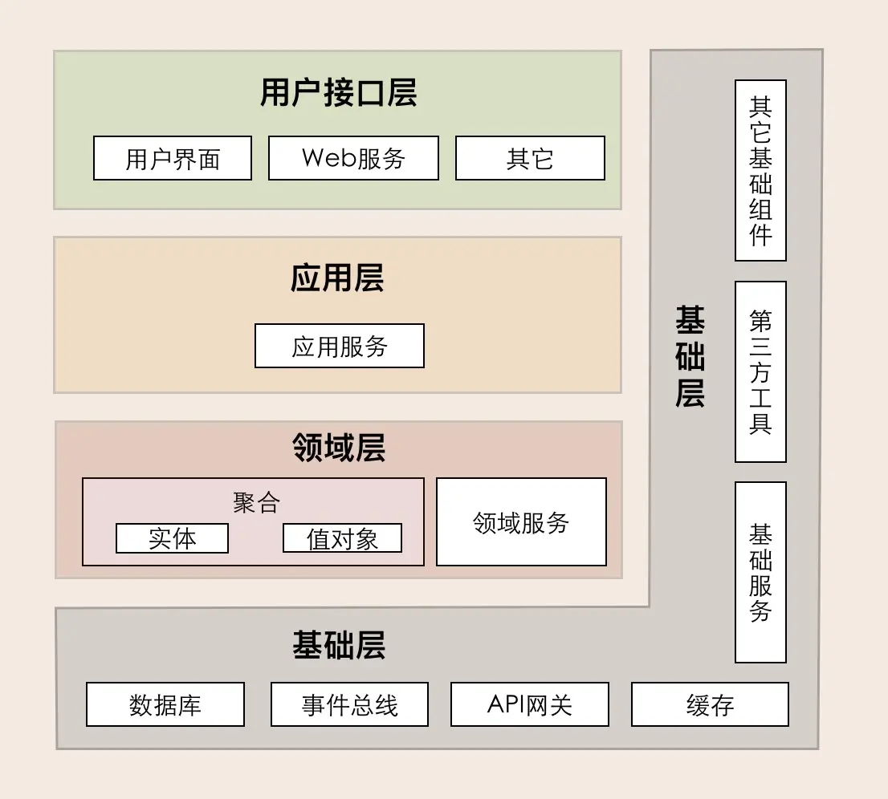
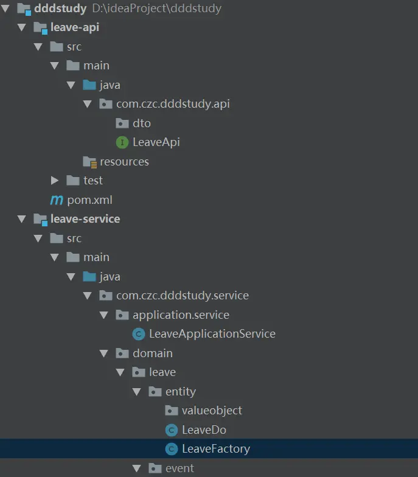
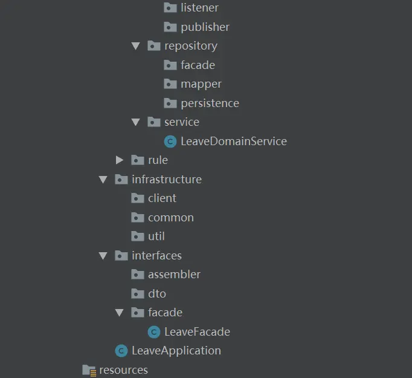
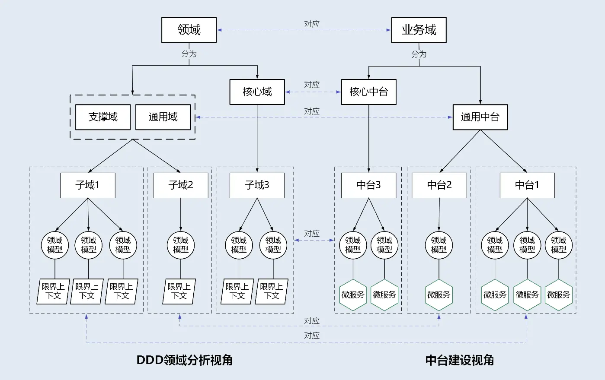
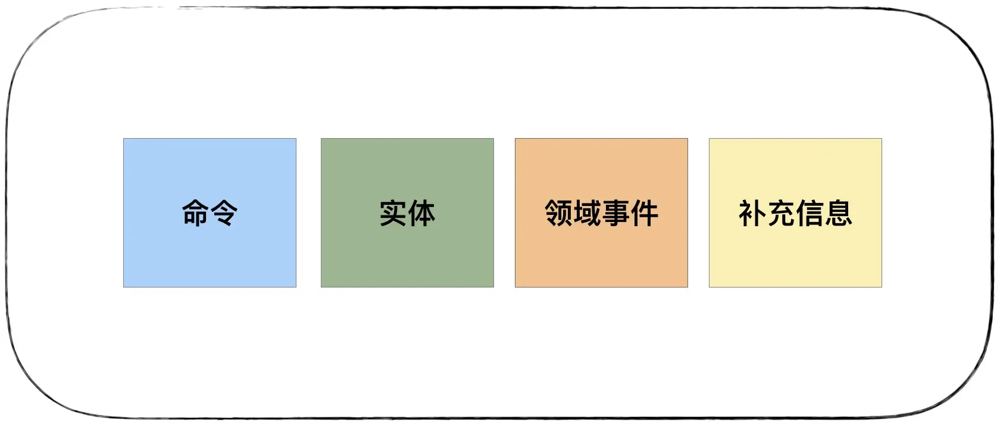
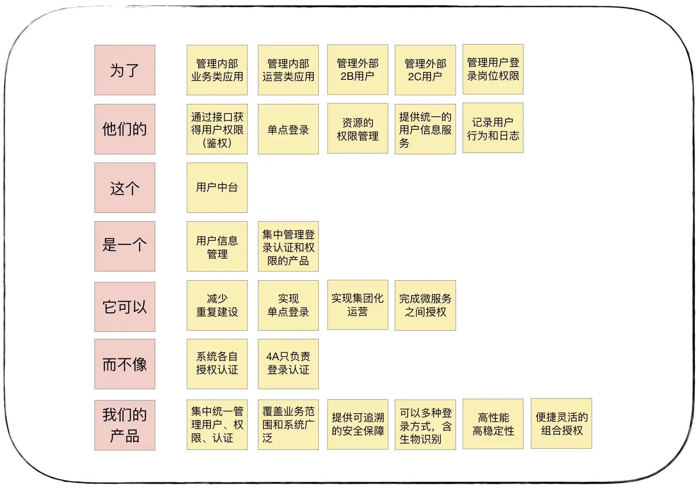
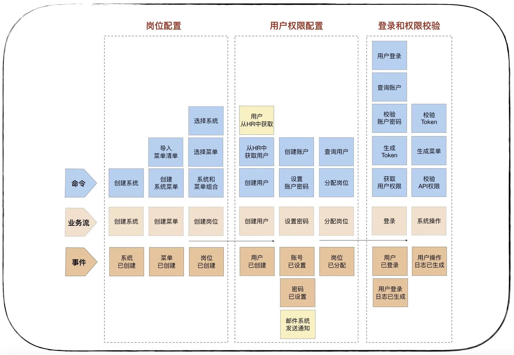
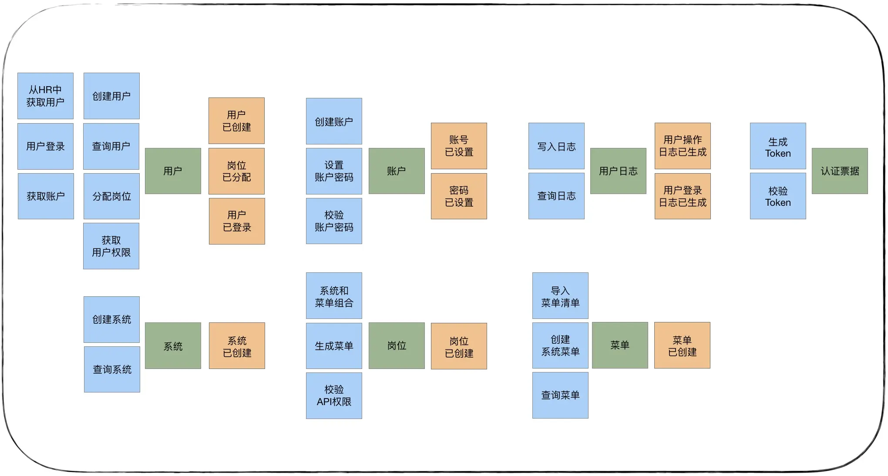
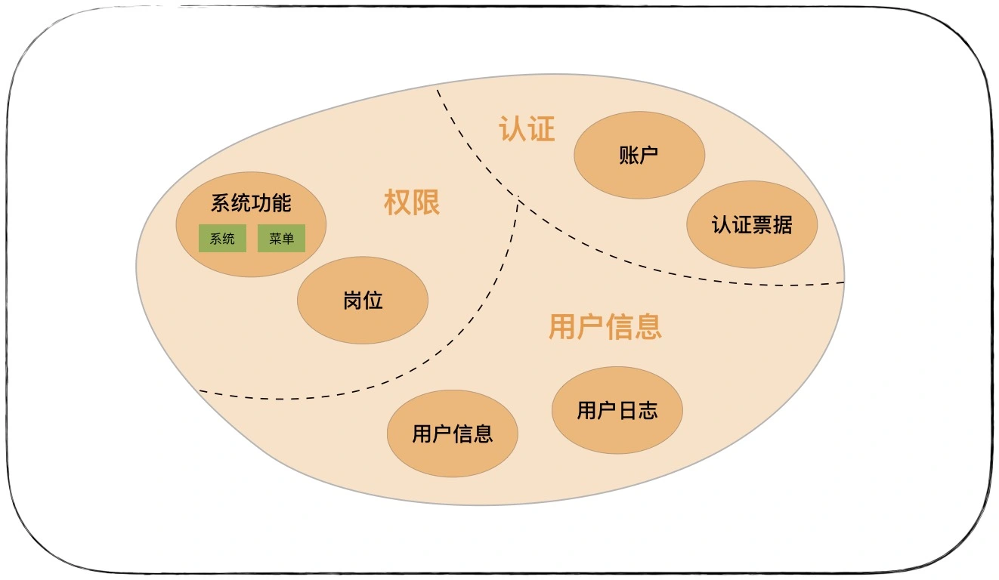
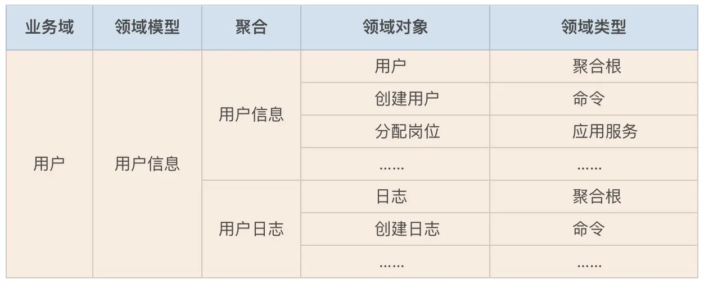

---

title: "DDD领域驱动设计思想——读《DDD实战课》归纳"
slug: "DDD领域驱动设计思想——读《DDD实战课》归纳"
description:
date: "2020-02-04"
lastmod: "2020-02-04"
image:
math:
license:
hidden: false
draft: false
categories: ["学习笔记"]
tags: ["DDD","领域驱动开发"]

---
本文是学习极客时间《DDD实战课》后结合自己思考所整理的归纳总结，课程链接在：

[DDD实战课 基于DDD的微服务拆分与设计](https://time.geekbang.org/column/intro/238 "DDD实战课 基于DDD的微服务拆分与设计")

# 一、DDD名词解释

## （一）域

对业务领域细分后对一定范围内的问题划定边界，这个范围内的问题组成了域，域是有层次的，一个域可以由多个‘子域’聚合。
子域的种类可以分为：

- 核心域 决定公司产品核心竞争力的子域
- 通用域 同时被多个子域使用的功能的子域
- 支撑域 既不包含决定产品和公司核心竞争力的功能，也不包含通用功能的子域，它就是支撑域，例如数据代码类的数据字典等系统。

子域还可根据需要进一步拆分为子子域，比如，支付子域可继续拆分为收款和付款子子域。拆到一定程度后，有些子子域的领域边界就可能变成限界上下文的边界了。

## （二）限界上下文

限界上下文定义领域模型的边界，每个领域模型都有自己的领域边界，在领域边界内即限界上下文。限界上下文内限制了统一的通用语言（在限界上下文当中在事件风暴过程中，通过团队交流达成共识的，能够简单、清晰、准确描述业务涵义和规则的语言就是通用语言），以及领域对象等。一般来说，在微服务架构中，不考虑其他因素的话（如技术异构、团队沟通等）可以按照限界上下文来定义微服务。

## （三）聚合、实体、值对象、聚合根

实体和值对象是聚合的基础单元，聚合是构成领域模型的基础单元。在事件风暴中，我们会根据一些业务操作和行为找出实体（Entity）或值对象（ValueObject），进而将业务关联紧密的实体和值对象进行组合，构成聚合，再根据业务语义将多个聚合划定到同一个限界上下文（Bounded Context）中并在限界上下文内完成领域建模。

- 聚合 聚合就是由业务和逻辑紧密关联的实体和值对象组合而成的
- 实体 用来描述业务操作和行为的基础载体，有唯一标识符。
- 值对象 实体有可能聚合了值对象，值对象相当于一个多个字段的数据载体，依赖于实体存在，不包含业务逻辑，没有唯一标识符，在业务中只涉及整体替换和数据初始化。在数据库建模中有两个方式，一个方式是将一个字段设计为大字段存放值对象的Json,一个方式是将值对象的所有字段都与实体的其他属性字段并列来创建新的字段。
- 聚合根 也被称为根实体，聚合之间的通信通过聚合根来管理，它以聚合根 ID 关联的方式接受外部任务和请求，也就是说，一个聚合内如果需要访问其它聚合的实体，就要先访问聚合根，再导航到聚合内部实体，外部对象不能直接访问聚合内实体。

## （四）领域事件

DDD提倡聚合之间产生的业务协同使用领域事件的方式来完成，领域事件就是将上游聚合处理完成这个动作通过事件的方式抽象，封装完成下游聚合所需的数据，通过消息队列中间件（跨微服务）或本地应用中的消息总线框架（同一个微服务跨聚合）来完成聚合之间业务的解耦。

# 二、DDD 分层架构以及实战中代码分层
## （一）四层架构

- 用户接口层 用于提供统一对外的接口，同样一个应用服务可能用于不同的端，入参和出参不太一样，所以在上游添加一个用户接口层对不同格式入参出参进行处理，提供对应用服务层的复用。

- 应用层 对各个领域服务或其他微服务的提供的接口进行编排，协作完成业务操作。应用服务粒度较粗，需要注意可复用性。应用服务还可以进行安全认证、权限校验、事务控制、发送或订阅领域事件等。另外，应用层代码较薄，不包含业务规则或逻辑，主要是控制业务流程走向，逻辑部分委托给领域层。

- 领域层 主要包含实体类、值对象类、事件类、领域服务。领域服务供应用层调用，实现业务的规则和逻辑，但对于只与单一实体自己相关的一些动作，这部分逻辑由实体类自己来实现。

- 基础层 基础层是贯穿所有层的，它的作用就是为其它各层提供通用的技术和基础服务，包括第三方工具、驱动、消息中间件、网关、文件、缓存以及数据库等。

## （二）代码分层参考

### 1、api （方便deploy,供同步调用）
主要包括:
- dto包，即数据传输对象，即内部接口之间的数据传输字段封装。包括 requestDTO 和 responseDTO 两部分。
- api接口，即api接口，供feignClient接口继承。
### 2、Interfaces（用户接口层）
二级目录包括：
- Assembler 实现 DTO 与领域对象之间的相互转换和数据交换。一般来说 Assembler 与 DTO 总是一同出现。
- Facade 提供较粗粒度的调用接口，将用户请求委派给一个或多个应用服务进行处理。
- dto 接口间数据传输的封装

### 3、Application（应用层）
二级目录有：

- Service（应用服务）：对多个领域服务或其他微服务应用服务进行封装、编排和组合，对外提供粗粒度的服务。可以将所有应用服务放在一个应用服务类里，也可以把一个应用服务设计为一个应用服务类，以防应用服务类代码量过大。

### 4、Domain（领域层）
由一个或多个聚合包构成，共同实现领域模型的核心业务逻辑。聚合包内的目录：

- entity（实体） 存放聚合根、实体、值对象以及工厂模式（处理DO到PO的初始化,DO到PO的初始化，指当聚合根被创建时，聚合内所有依赖的对象将会被同时创建，将所有依赖的DO对象一次性转换为PO对象）相关代码。
- event（事件） 存放事件实体以及与事件活动相关的业务逻辑代码，分为publish和subscribe目录，publish存放事件发布相关代码，listener存放事件订阅相关代码。
- service(领域服务) 存放领域服务代码。一个领域服务是多个实体组合出来的一段业务逻辑
- repository（仓储）仓储实现本应该属于基础层代码，但在微服务架构中的演进过程中会涉及到聚合的拆分，所以这里把仓储层放在这是为了与聚合进行整体迁移方便，其中包括facade、mapper、persistence包，facade为统一为其他层提供服务定义的接口，mapper是各个框架中需实现的mapper接口，persistence用于PO与查询结果和查询条件间的适配。

### 5、Infrastructure（基础层）
二级目录包括：

- config 主要存放配置相关代码。
- util 主要存放平台、开发框架、消息、数据库、缓存、文件、总线、网关、第三方类库、通用算法等基础代码
- client 存放feignClient。

# 三、中台建设与DDD
## （一）什么是中台
我对中台的粗浅的理解是中台首先是一种基础的理念架构，没有很固定的规范，核心思想就是构建一个个小基础服务，联通起来共同支撑上游的业务，最大的好处就是能力的复用。

## （二）用DDD思想完成中台建模
首先，用DDD去理解中台架构的话，对应关系可以如图示：

我们完成了DDD领域建模，也就完成了中台建模，那么具体如何做勒？
有两种策略：

- 自顶而下的策略,自顶而下逐级梳理领域，最后细分到领域，划定中台边界,适用于推倒重建，或新开发的情况。

- 自底向上的策略，先用事件风暴（后文会说）分别梳理原来各个系统的各个聚合，划分限界，构成领域模型（对应上图中的领域模型，一个领域模型对应一个中台服务，由多个聚合构成），然后对梳理的领域模型进行归类，对齐业务域（对应上图中的子域，，比领域模型更抽象，比如用户认证、权限共同属于用户业务域，划分业务域的意义在于划分不同的中台产品，不同产品的人力投资及其他可能不一样），然后对同一业务域中的领域模型的差异和共同点进行分析（粒度控制在聚合，尽量不要在聚合内部划分），将通用功能进行沉淀，重新定义限界上下文，划分领域模型，然后再来根据进行领域模型归类（通用中台，核心中台），然后这样重构后，原有系统中的聚合该合并的合并，该迁移的迁移。

# 四、事件风暴实践-构建领域模型的关键

## （一）事件风暴的核心

以产品愿景为核心，分析业务场景，集中关注业务场景中的事件、命令和实体等领域对象，找出实体、聚合根、划分聚合、构建限界上下文，拆分为微服务。

## （二）事件风暴的准备工作
### 1、事件风暴的参与者
可以包括：
- 领域专家，即对业务或问题域有深刻见解的主题专家，
- DDD 专家
- 架构师
- 产品经理
- 项目经理
- 开发人员
- 测试人员等
### 2、 准备材料
即时贴和水笔，用于“刷墙”，即将不同颜色的即时贴贴在墙上

### 3、场地
足够长的墙和足够大的空间。

## （三）事件风暴的过程

### 1、梳理产品愿景

由领域专家、业务需求方、产品经理、项目经理和开发经理参与，目的是对产品顶层价值进行设计，使产品目标用户、核心价值、差异化竞争点等信息达成一致，避免产品偏离方向。比如梳理成以下愿景墙，以设计一个用户中台产品为例，每个人对每一个点发表意见，贴在墙上：

### 2、业务场景分析
由领域专家、产品经理、需求分析人员、架构师、项目经理、开发经理和测试经理参与，从用户视角出发的，根据业务流程或用户旅程，采用用例和场景分析，探索领域中的典型场景，找出领域事件、实体和命令等领域对象，支撑领域建模。以设计用户中台为例，用户中台有这样三个典型的业务场景：第一个是系统和岗位设置，设置系统中岗位的菜单权限；第二个是用户权限配置，为用户建立账户和密码，设置用户岗位；第三个是用户登录系统和权限校验，生成用户登录和操作日志。一步一步搜寻用户业务流程中的关键领域事件，比如岗位已创建，用户已创建等事件。再找出什么行为会引起这些领域事件，这些行为可能是一个或若干个命令组合在一起产生的，比如创建用户时，第一个命令是从公司 HR 系统中获取用户信息，第二个命令是根据 HR 的员工信息在用户中台创建用户，创建完用户后就会产生用户已创建的领域事件。当然这个领域事件可能会触发下一步的操作，比如发布到邮件系统通知用户已创建，但也可能到此就结束了。梳理如图：

### 3、领域建模
由领域专家、产品经理、需求分析人员、架构师、项目经理、开发经理和测试经理参与，根据场景分析过程中产生的领域对象，比如命令、事件等之间关系，找出产生命令的实体，分析实体之间的依赖关系组成聚合，为聚合划定限界上下文，建立领域模型以及模型之间的依赖。

#### (1) 第一步-找出实体
从前面得到命令和事件中提取产生这些行为的实体，如图，对上面分析得到的命令和事件进行梳理得到对应的实体，用绿色贴纸表示：

#### （2）第二步-找出聚合根，划分聚合

根据聚合根的管理性质在前面的实体中找到聚合根，然后根据业务依赖和业务内聚原则，将聚合根以及它关联的实体和值对象组合为聚合。比如前面的系统和菜单实体可以组合为“系统功能”聚合，按此方方法，用户中台就有了系统功能、岗位、用户信息、用户日志、账户和认证票据六个聚合。。

#### （3）划定限界上下文，将聚合归类

我的理解是就是将前面的聚合根据业务进一步抽象归类，以便划分微服务。如图，将前面得到的聚合进行归类，分为了三个领域模型：

**另外：**

**由于领域建模的过程中产生的领域对象实在太多了，我们可以借助表格来记录，如图：**

#### 4、 划分微服务

理论上一个领域模型可以为一个微服务，但也不绝对，也有其他需要考虑的因素如技术异构，比如用户日志数据量巨大，大到需要采用大数据技术来实现，这时用户信息聚合与用户日志聚合就会有技术异构。这两个聚合就不适合放在一个微服务里面了。另外还有需要考虑比如将敏态与稳态业务的分离、非功能性需求（如弹性伸缩要求、安全性等要求）、团队组织和沟通效率、软件包大小以及技术异构（使用的技术环境不一样）等非业务因素。

本文原载于[runningccode.github.io](https://runningccode.github.io)，遵循CC BY-NC-SA 4.0协议，复制请保留原文出处。