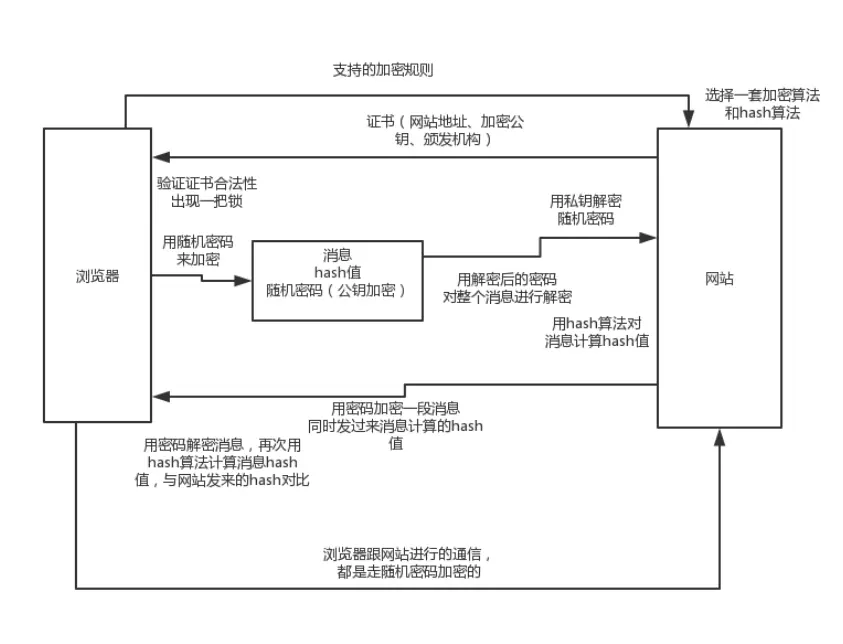

---

title: "非科班生网络通信必会知识点归纳"
slug: "非科班生网络通信必会知识点归纳"
description:
date: "2020-02-16"
lastmod: "2020-02-16"
image:
math:
license:
hidden: false
draft: false
categories: ["学习笔记"]
tags: ["网络"]

---
# 一、 网络模型
网络模型分两种，一种是OSI模型，一种是TCP/IP模型，后者应用更加广泛。这里也主要介绍TCP/IP模型。
## （一）TCP/IP模型
首先分为4层，从上到下依次是应用层、传输层、网络层、数据链路层。
OSI模型中将网络分为：应用层、表示层、会话层、传输层、网络层、数据链路层、物理层。
TCP/IP的应用层是OSI模型中应用层、表示层、会话层的集合，而物理层由于不是我们经常考虑的问题，所以TCP/IP模型没有把物理层算上。
### 1、数据链路层
数据链路层的核心是以太网协议。以太网协议规定一组电信号是一个数据包，叫一个振，每个帧（frame）分为标头（head）和数据（data），标头包含一些说明性东西，比如发送者，接收者，和数据类型之类的。例如一个电脑发个数据包出去，会广播给局域网(子网)内所有电脑设备的网卡，然后每台设备都从数据包获取接收者的mac地址与自己网卡的mac地址比对，如果一样就说明这是发给自己的数据包。
### 2、网络层
定义了一套IP协议，有IPV4和IPV6，以IPV4为例，由32个二进制数字组成，用4个10进制数字表示。

IP地址分为三类：

- A类：第一个字节为网络号，后三个字节为主机号。该类IP地址的最前面为“0”，所以地址的网络号取值于1~126之间。一般用于大型网络。
- B类：前两个字节为网络号，后两个字节为主机号。该类IP地址的最前面为“10”，所以地址的网络号取值于128~191之间。一般用于中等规模网络。
- C类：前三个字节为网络号，最后一个字节为主机号。该类IP地址的最前面为“110”，所以地址的网络号取值于192~223之间。一般用于小型网络。

这三类IP地址构成了三级网络，将网络划分为了三层，不同子网通过上层网关进行转发。

**ip之间的通信**

- 同一个子网的通信：

ip之间是如何通信的勒，这里有一个子网以及子网掩码的概念。比如192.168.56.1和192.168.56.2判断是否是一个子网，子网掩码是255.255.255.0，子网掩码用来与ip地址进行与运算，得到的一个值是否完全一样来判断是否是属于一个子网。192.168.56.1与255.255.255.0进行位与与192.168.56.2与255.255.255.0进行位与是一样的，都为192.168.56.0,即他们是同一个子网。同一个子网之间的Ip可以直接进行网络通信，因为子网内的所有设备会上传自己的ip地址和mac地址映射，设备会缓存同一子网其他设备的Ip地址以及mac地址映射，当拆开IP协议层数据包时可以迅速以目标IP查询ARP缓存，以这个mac地址构建数据链路层的数据包。

- 不同子网的通信

那么不同子网又是如何联通的勒？这里就是网关发挥作用的时候了，网关有多张网卡。以自己家里的路由器为例，也是一个网关，路由器有一张网卡与部的网关相连，也有一张网卡与内部设备进行相连。当然路由器与网关相连使用的是一个公网ip，这里有一个NAT转换的概念，路由器上装有NAT软件，可以将私有网络（也就是我们自己家连上这台路由器所有的网络设备）的私有ip转换为同一个公网ip，这样做主要是为了解决ip不足的问题，因为ipv4协议就那么几位，ip肯定是不够的。路由器在内网与公网之间中起着转发者的作用，当然路由器上面也有网关，当我们要访问某个Ip也不在路由器所有网卡位与的子网中时还需要进行多个网关的转发，这种转发路径由路由表决定。路由表的的生成方式可以是动态（协议共享）或者静态（手动配置）的，当匹配路由表都失败时使用缺省路由，路由到相连的其他网关。

### 3.传输层
传输层的协议有TCP协议或UDP协议，TCP协议是一套基于端口的点对点通信协议，规定包括如何连接，如何发送，读取消息。是有连接的，不允许丢数据。
UDP则不需要建立连接，传完数据也不需要确认，允许丢数据。
针对此层协议的操作，可使用SocketAPI进行编程，其函数create，listen，accept，connect，read和write等等抽象了TCP/IP协议的一些操作。

### 4.应用层
合并了OSI中的应用层会话层表示层，协议有比如常见的HTTP协议，邮件协议等等，定义的是通过TCP拿到数据之后怎么处理的协议。

# 二、常见问题

## （一）请求网址的整个过程
- 请求dns服务器，解析得到访问域名的ip
- 开始打包数据包经过应用层（按HTTP协议封装成HTTP的数据包），传输层（按TCP协议封装数据包-设置端口），网络层（按IP协议封装数据包），数据链路层（按以太网协议封装数据包）将数据包发送给网关。因为在网络层时通过子网掩码判断不在一个子网，所以会直接发送给网关。以太网包是有限制的，上述的数据包可能会被切为多个包。
- 网关收到数据包后，会进行路由表进行路由
- 经过多次路由后到达了目标IP所对应的服务器
- 对应的服务器依次层层解包，获取http请求报文，处理请求然后又层层封包返回响应

## （二）TCP协议的三次握手、四次挥手
首先解释下涉及到的TCP数据包关键头信息。

**标志位含义**
- SYN：同步，1和0表示是否是建立联机的数据包
- ACK：确认，1和0表示确认号是否有效
- FIN：终止，1和0表示是否要求释放资源，复位连接，即释放运输连接

**序号含义**
- seq 序号。TCP将一次连接中所有发送的字节都编上序号，seq表示本报文段的序号。
- ack 确认号,期待收到对方下一个报文段的序号。

注：通常情况下数据传输阶段返回的ack为上一个接收包的seq+len,但三次握手阶段和四次挥手则直接为seq+1。即三次握手四次挥手的序号计算方式忽略了报文长度。

**注意：ACK、SYN和FIN这些大写的单词表示标志位，其值要么是1，要么是0；ack、seq小写的单词表示序号。**

### 1、三次握手、
- 第一次握手 客户端发SYN，具体是SYN=1,seq = x(随机值)，然后客户端处于SYN_SENT状态（同步已发送）
- 第二次握手 服务器返回SYN+ACK,具体是SYN=1,ACK=1,seq=y(随机值),ack=x+1，然后服务端状态处于SYN_RECV状态（同步已收到）
- 第三次握手 客户端发送ACK。具体是ACK=1,seq=x+1,ack=y+1，当包发送完毕后，客户端和服务器进入ESTABLISHED（TCP连接成功）状态

**为什么是三次？为了让双方都知道彼此已准备好。设想一个场景，客户端很久之前的第一次握手到达服务器了，但是在这之前，后面重试的握手请求已经建立了连接发送了数据，那么在这个时候客户端是不认识服务器的响应的，所以当服务器返回响应的时候，客户端不会认识这个响应，无法建立连接。**
### 2、四次挥手

- 第一次挥手 客户端发FIN(FIN=1,seq=u)
- 第二次挥手 服务器ACK（ACK=1,ack=u+1,seq=v）
- 第三次挥手 服务器FIN(FIN=1,ack=u+1,seq=w)
- 第四次挥手 客户端ACK(ACK=1,seq=u+1,ack=w+1)

**为什么连接的时候是三次握手，关闭的时候却是四次握手？因为当Server端收到Client端的SYN连接请求报文后，可以直接发送SYN+ACK报文。其中ACK报文是用来应答的，SYN报文是用来同步的。但是关闭连接时，当Server端收到FIN报文时，很可能并不会立即关闭SOCKET，所以只能先回复一个ACK报文，告诉Client端，"你发的FIN报文我收到了"。只有等到我Server端所有的报文都发送完了，我才能发送FIN报文，因此不能一起发送。故需要四步握手。另外，第四次挥手后，客户端会等待一段时间在释放连接，确保不会再次收到服务器的第三次挥手（服务器如果没收到客户端的第四次挥手则会尝试重发第三次挥手）。**

## （三）HTTP协议

### 1、1.0,1.1,2.0的区别
- 1.0 一个请求建立关闭一次TCP连接,大量时间资源耗费在建立连接和关闭连接中
- 1.1 建立一次TCP连接之后不会马上关闭，过一段时间再关闭
- 2.0 多路复用，并行发送请求，而1.1是串行发送请求

### 2、HTTPS原理
也就是HTTP+SSL协议,具体流程如图：

问题：
- 客户端如何验证网站返回的证书？

通过本地权威证书的公钥解开发过来的证书，得到证书的信息摘要，对比证书内容。

- 为什么中间用了数字信封(即单钥加密消息，公私钥只用于加密单钥)？

因为单钥加解密比非对称加密效率高。非对称加密的核心效果只是用作签名（保证接收者接收的信息来自受信任的私钥密码拥有者或发送的消息只能被拥有私钥方解开）。

本文原载于[runningccode.github.io](https://runningccode.github.io)，遵循CC BY-NC-SA 4.0协议，复制请保留原文出处。