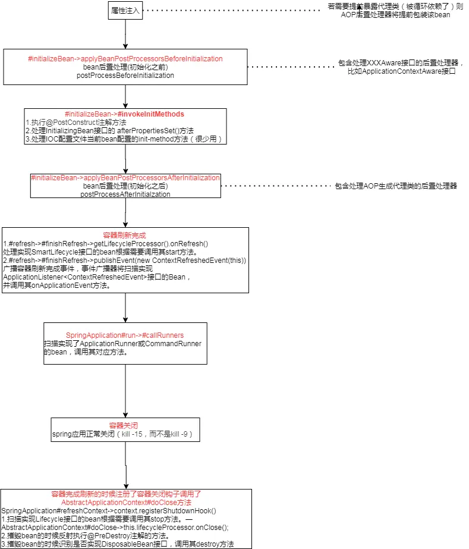

---

title: "应用启动初始化操作的各个方式及区别总结"
slug: "应用启动初始化操作的各个方式及区别总结"
description:
date: "2020-02-19"
lastmod: "2020-02-19"
image:
math:
license:
hidden: false
draft: false
categories: ["学习笔记"]
tags: ["SpringBoot"]

---
业务中经常会涉及到一些初始化操作如加载数据到内存，初始化成员变量等等一系列操作。现将各个方式总结一下。
# 一、 bean的生命周期
首先我们要明白一个springboot下Web环境里面bean的生命周期:

1. bean的实例化
2. 注入对象属性
3. 处理XXXXAware接口,包含EnvironmentAware、EmbeddedValueResolverAware、ResourceLoaderAware、ApplicationEventPublisherAware、MessageSourceAware、ApplicationContextAware，执行其特定的方法。
4. 扫描所有BeanPostProcessor接口。传入当前对象执行定义的所有postProcessBeforeInitialization(Object bean, String beanName)方法。
5. 执行@PostConstruct注解方法
6. 处理InitializingBean接口的 afterPropertiesSet()方法。
7. 处理IOC配置文件当前bean配置的init-method方法（很少用）。
8. 扫描所有的BeanPostProcessor接口。传入当前对象执行定义的所有postProcessAfterInitialization(Object bean, String beanName)方法。
   9 容器刷新完成扫描实现Lifecycle接口的bean根据需要调用其start方法。
10. 容器刷新完成事件广播扫描实现ApplicationListener<ContextRefreshedEvent>接口的Bean，并调用其onApplicationEvent方法。
11. 启动最后一步扫描实现了ApplicationRunner或CommandRunner的bean，调用其对应方法。
12. 容器close时扫描实现Lifecycle接口的bean根据需要调用其stop方法。
13. 当bean销毁时，一般是例如Spring上下文初始化失败时，或在Spring容器关闭时（正常关闭kill -15，而不是kill -9），会处理DisposableBean接口的destroy方法以及@PreDestroy注解的方法，其中@PreDestroy注解的方法较DisposableBean接口的destroy方法先执行。

    总结了下流程图：

  

# 二、给应用添加初始化操作的方式
常用的给应用添加初始化操作的方式，按执行顺序排列的话：
1. 实现XXXAware接口。
2. 实现InitializingBean接口。
3. 实现ApplicationListener<ContextRefreshedEvent>接口，注册容器刷新后的监听器。
4. 实现接口ApplicationRunner接口。
5. 实现SmartLifecycle接口。
   **注：其中1和2的区别是1有特定的用途，用于注入特定的对象，可以通过@DependOn注解标识依赖的beanName,控制bean之间的初始化顺序。3和4的区别是4是整个应用启动完成后执行，3是在启动过程中容器刷新完成的时候。5和3效果差不多，但是5比3早一点**

本文原载于[runningccode.github.io](https://runningccode.github.io)，遵循CC BY-NC-SA 4.0协议，复制请保留原文出处。