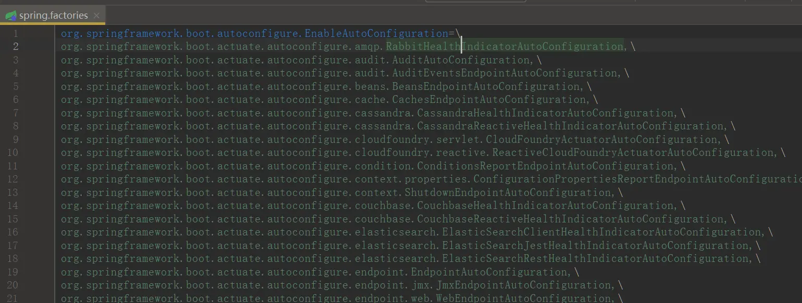

---

title: "Springboot浅析（一）——自动配置"
slug: "Springboot浅析（一）——自动配置"
description:
date: "2020-02-21"
lastmod: "2020-02-21"
image:
math:
license:
hidden: false
draft: false
categories: ["学习笔记"]
tags: ["SpringBoot"]

---
为什么学习Springboot勒，一方面主要实在是Springboot应用得太广泛了，加深对其的理解对自己的开发工作很有必要，因为如果遇到或业务场景需要进行一些稍微高级点的基于Springboot的扩展以及应用，可能就会不明白不理解。另一方面就是作为一个编码爱好者本身对springboot这么一个优秀的框架的好奇。文章基于SpringBoot2.1.9。


# 一、SpringBoot的手动装配

## （一） 手动装配的方式
主要包含以下几种方式：
- 使用模式注解 [@Component](https://my.oschina.net/u/3907912) 等（Spring2.5+）,常用，但无法装配jar包目录的组件，为此可以使用 @Configuration 与 [@Bean](https://my.oschina.net/bean)，手动装配组件
- 使用配置类 @Configuration 与 [@Bean](https://my.oschina.net/bean) （Spring3.0+）,注册过多，会导致编码成本高，维护不灵活等问题。
- 使用模块装配 @EnableXXX 与 @Import （Spring3.1+）,@Import用于装配指定的类，@EnableXXX用于启用指定的@Import

前面一两种都是在项目中经常会用到的，就不过多介绍了，这里主要介绍下使用模块装配，这也是Spring各种Starter得以被装配的主要方式。

## （二）@EnableXXX与@Import的使用
这里分四种场景，导入普通类、导入配置类、导入ImportSelector，导入ImportBeanDefinitionRegistrar。接下来用4个小demo来演示怎么使用。
### 1.导入普通类
我们的目标是导入一个TestService类，TestService是一个普通的类。
#### 步骤
##### （1）新建一个注解EnableTest
```
@Documented
@Retention(RetentionPolicy.RUNTIME)
@Target(ElementType.TYPE)
@Import(TestService.class)
public @interface EnableTest {
}
```
##### （2）在能被扫描的配置类或启动类标注 @EnableTest
```
@SpringBootApplication
@EnableTest
public class SpringbootexampleApplication {

  public static void main(String[] args) {
    SpringApplication.run(SpringbootexampleApplication.class, args);
  }
}
```
### 2.导入配置类
没有位与启动类下的@Configuration注解默认情况是不会被扫描的，这个时候要装配@Configuration标注的类以及其下面注册的bean，可以通过这种方式手动装配。
#### 步骤
##### （1）新建一个配置类
```
@Configuration
public class TestRegistrarConfiguration {
    @Bean
    public Test2Service yellow() {
        return new Test2Service();
    }
}
```
##### (2)修改EnableTest，添加该配置类的引入
```
@Documented
@Retention(RetentionPolicy.RUNTIME)
@Target(ElementType.TYPE)
@Import({TestService.class,TestRegistrarConfiguration.class})
public @interface EnableTest {
}
```


这样启动时也间接装配了TestRegistrarConfiguration配置类下面的所有bean。

### 3.导入ImportSelector
ImportSelector接口规定了`String[]  selectImports(AnnotationMetadata importingClassMetadata)`方法,这个方法的返回值String数组，表示要装配的bean的className数组。SpringBoot的自动装配，实际上就是用的这种方式。
#### 步骤
##### (1) 新建一个ImportSelector
```
public class TestImportSelector implements ImportSelector {
    @Override
    public String[] selectImports(AnnotationMetadata importingClassMetadata) {
        // 返回类.getName()。
        return new String[]{Test3Service.class.getName()};
    }
}
```
注：参数importingClassMetadata，代表的是被 @Import 标记的类的信息。（不算注解），这里就是@EnableTest修饰的配置类即SpringbootexampleApplication。

#### （2）修改EnableTest,添加该导入选择器的引入
```
@Documented
@Retention(RetentionPolicy.RUNTIME)
@Target(ElementType.TYPE)
@Import({TestService.class, TestRegistrarConfiguration.class, TestImportSelector.class})
public @interface EnableTest {
}
```

### 4. 导入ImportBeanDefinitionRegistrar
ImportBeanDefinitionRegistrar接口规定了` void registerBeanDefinitions(AnnotationMetadata importingClassMetadata, BeanDefinitionRegistry registry)`方法，
这里有两个参数AnnotationMetadata跟前面ImportSelector接口方法参数一样，registry是用于注册BeanDefinition的注册者，BeanDefinition是整个Bean信息的封装，容器刷新时可以根据容器类的BeanDefinition创建实例。

#### 步骤
##### (1)新建一个ImportBeanDefinitionRegistrar
```
public class TestImportBeanDefinitionRegistrar implements ImportBeanDefinitionRegistrar {
    @Override
    public void registerBeanDefinitions(AnnotationMetadata importingClassMetadata, BeanDefinitionRegistry registry) {
        registry.registerBeanDefinition("Test4Service", new RootBeanDefinition(Test4Service.class));
    }
}
```
#### （2）修改EnableTest,添加该导入bean定义的注册器的引入
```
@Documented
@Retention(RetentionPolicy.RUNTIME)
@Target(ElementType.TYPE)
@Import({TestService.class, TestRegistrarConfiguration.class, TestImportSelector.class, TestImportBeanDefinitionRegistrar.class})
public @interface EnableTest {
}
```

# 二、SpringBoot的自动配置
自动配置其实就是Spring框架应用了手动装配的原理，装配了自己的默认组件，也提供了一些扩展点，可以让应用扩展我们自己的组件。当然，SpringBoot对于应用basePackage下面扩展的组件通过组件扫描@ComponentScan也能完成配置类的装配。
## （一）简单看下@ComponentScan
我们知道@SpringBootApplication是一个组合注解，包含@SpringBootConfiguration、@EnableAutoConfiguration、@ComponentScan。如下：
```
@SpringBootConfiguration  
@EnableAutoConfiguration  
@ComponentScan(excludeFilters = { @Filter(type = FilterType.CUSTOM, classes = TypeExcludeFilter.class),
  @Filter(type = FilterType.CUSTOM, classes = AutoConfigurationExcludeFilter.class) })
public @interface SpringBootApplication
```
这里@ComponentScan中默认定义了两个过滤器，TypeExcludeFilter与AutoConfigurationExcludeFilter，其中TypeExcludeFilter的核心代码如下：
```
public boolean match(MetadataReader metadataReader, MetadataReaderFactory metadataReaderFactory)
        throws IOException {
    if (this.beanFactory instanceof ListableBeanFactory && getClass() == TypeExcludeFilter.class) {
        //获取容器内实现了TypeExcludeFilter的所有bean
        Collection<TypeExcludeFilter> delegates = ((ListableBeanFactory) this.beanFactory)
                .getBeansOfType(TypeExcludeFilter.class).values();
        for (TypeExcludeFilter delegate : delegates) {
 		//遍历获取的TypeExcludeFilter的bean，如果满足，则通过
            if (delegate.match(metadataReader, metadataReaderFactory)) {
                return true;
            }
        }
    }
    return false;
}
```
主要提供一个扩展点，获取容器内的所有TypeExcludeFilter类型的bean，执行一下match方法，返回true的话，则进行过滤。其中两个参数metadataReader用于读取扫描得到的类型信息。metadataReaderFactory用于获取其他类型的metadataReader。比如如果不想扫描某个类，则注册一个TypeExcludeFilter的子类bean，其match方法的逻辑是从metadataReader获取ClassName，然后判断若和xxxClass相等则返回true进行过滤就行了。

AutoConfigurationExcludeFilter的作用则是排除是否是自动装配的Configuration，如果是则进行扫描过滤，其核心代码如下：
```
@Override  
public boolean match(MetadataReader metadataReader, MetadataReaderFactory metadataReaderFactory)  
  throws IOException {  
  return isConfiguration(metadataReader) && isAutoConfiguration(metadataReader);  
}  
  
private boolean isConfiguration(MetadataReader metadataReader) {  
  return metadataReader.getAnnotationMetadata().isAnnotated(Configuration.class.getName());  
}  
  
private boolean isAutoConfiguration(MetadataReader metadataReader) {  
  return getAutoConfigurations().contains(metadataReader.getClassMetadata().getClassName());  
}  
  
protected List<String\> getAutoConfigurations() {  
  if (this.autoConfigurations == null) {  
  this.autoConfigurations = SpringFactoriesLoader.loadFactoryNames(EnableAutoConfiguration.class,  
 this.beanClassLoader);  
  }  
  return this.autoConfigurations;  
}
```
isConfiguration(metadataReader) 判断是否带有@Configuration注解， isAutoConfiguration(metadataReader)判断是否是自动装配类（后面仔细介绍这里的自动装配方式），所以通过这我们知道@Component组件扫描和自动装配机制并不冲突。

## 二、自动配置原理
核心注解是@EnableAutoConfiguration。其内容如下：
```
@Target(ElementType.TYPE)
@Retention(RetentionPolicy.RUNTIME)
@Documented
@Inherited
@AutoConfigurationPackage
@Import(AutoConfigurationImportSelector.class)
public @interface EnableAutoConfiguration
```

### （一）AutoConfigurationPackage的作用
其中，@AutoConfigurationPackage的内容如下：
```
@Target(ElementType.TYPE)
@Retention(RetentionPolicy.RUNTIME)
@Documented
@Inherited
@Import(AutoConfigurationPackages.Registrar.class)
public @interface AutoConfigurationPackage
```
这里引入了一个AutoConfigurationPackages的内部类：Registrar,来看看内容：
```
/**
	 * {@link ImportBeanDefinitionRegistrar} to store the base package from the importing
	 * configuration.
	* （用于保存导入的配置类所在的根包。）
	 */
static class Registrar implements ImportBeanDefinitionRegistrar, DeterminableImports {

    @Override
    public void registerBeanDefinitions(AnnotationMetadata metadata, BeanDefinitionRegistry registry) {
        register(registry, new PackageImport(metadata).getPackageName());
    }

    @Override
    public Set<Object> determineImports(AnnotationMetadata metadata) {
        return Collections.singleton(new PackageImport(metadata));
    }

}
```
register(registry, new PackageImport(metadata).getPackageName())掉用了外部类AutoConfigurationPackages的register方法，因为metadata这里实际上就是启动类的元数据，所以new PackageImport(metadata).getPackageName()返回的就是启动类的包路径。再看看AutoConfigurationPackages的register方法：
```
public static void register(BeanDefinitionRegistry registry, String... packageNames) {  
 private static final String BEAN = AutoConfigurationPackages.class.getName();

public static void register(BeanDefinitionRegistry registry, String... packageNames) {
    // 判断 BeanFactory 中是否包含名为AutoConfigurationPackages.class.getName()的beanDefinition
    if (registry.containsBeanDefinition(BEAN)) {
        BeanDefinition beanDefinition = registry.getBeanDefinition(BEAN);
        ConstructorArgumentValues constructorArguments = beanDefinition.getConstructorArgumentValues();
        // addBasePackages：merge当前的packageNames参数（根包）到原来的构造器参数里面
        constructorArguments.addIndexedArgumentValue(0, addBasePackages(constructorArguments, packageNames));
    }
    else {
	   //构造一个BasePackages的BD，设置构造器参数为当前的packageNames参数
        GenericBeanDefinition beanDefinition = new GenericBeanDefinition();
        beanDefinition.setBeanClass(BasePackages.class);
        beanDefinition.getConstructorArgumentValues().addIndexedArgumentValue(0, packageNames);
        beanDefinition.setRole(BeanDefinition.ROLE_INFRASTRUCTURE);
        registry.registerBeanDefinition(BEAN, beanDefinition);
    }
}
}
```
综上，AutoConfigurationPackage的作用就是注册一个BasePackage的BeanDefinition，其构造函数包含EnableAutoConfiguration标识的类的包路径。

### （二）@Import(AutoConfigurationImportSelector.class)的作用
看一下AutoConfigurationImportSelector：
```
@Override
public String[] selectImports(AnnotationMetadata annotationMetadata) {
    if (!isEnabled(annotationMetadata)) {
        return NO_IMPORTS;
    }
    AutoConfigurationMetadata autoConfigurationMetadata = AutoConfigurationMetadataLoader
            .loadMetadata(this.beanClassLoader);
    // 加载自动配置类
    AutoConfigurationEntry autoConfigurationEntry = getAutoConfigurationEntry(autoConfigurationMetadata, 
            annotationMetadata);
    return StringUtils.toStringArray(autoConfigurationEntry.getConfigurations());
}
```
返回值是StringUtils.toStringArray(autoConfigurationEntry.getConfigurations())，重点看看autoConfigurationEntry里面的Configurations怎么生成的，进入getAutoConfigurationEntry方法：

```
protected Class<?> getSpringFactoriesLoaderFactoryClass() {
    return EnableAutoConfiguration.class;
}

protected List<String> getCandidateConfigurations(AnnotationMetadata metadata, AnnotationAttributes attributes) {
    List<String> configurations = SpringFactoriesLoader.loadFactoryNames(getSpringFactoriesLoaderFactoryClass(),
             getBeanClassLoader());
    Assert.notEmpty(configurations, "No auto configuration classes found in META-INF/spring.factories. If you "
             + "are using a custom packaging, make sure that file is correct.");
    return configurations;
}
```
这里的关键是 SpringFactoriesLoader.loadFactoryNames(getSpringFactoriesLoaderFactoryClass(),getBeanClassLoader());前面一个参数是EnableAutoConfiguration.class，后面是一个类加载器。 SpringFactoriesLoader.loadFactoryNames(getSpringFactoriesLoaderFactoryClass(),getBeanClassLoader());这个方法在Springboot源码中是非常非常常见的，比如容器启动获取初始化器ApplicationContextInitializer实例等等，接下来看看这里做了什么：
```
blic static final String FACTORIES_RESOURCE_LOCATION = "META-INF/spring.factories";

public static List<String> loadFactoryNames(Class<?> factoryClass, @Nullable ClassLoader classLoader) {
    String factoryClassName = factoryClass.getName();
	//通过factoryClassName的className从一个map里面取相应的className集合
    return loadSpringFactories(classLoader).getOrDefault(factoryClassName, Collections.emptyList());
}

private static Map<String, List<String>> loadSpringFactories(@Nullable ClassLoader classLoader) {
   //如果有，这从缓存里面拿，否则去生成
    MultiValueMap<String, String> result = cache.get(classLoader);
    if (result != null) {
        return result;
    }
	//使用 classLoader 去加载了指定常量路径下的资源： FACTORIES_RESOURCE_LOCATION ，而这个常量指定的路径实际是：META-INF/spring.factories 。
    try {
        Enumeration<URL> urls = (classLoader != null ?
                 classLoader.getResources(FACTORIES_RESOURCE_LOCATION) :
                 ClassLoader.getSystemResources(FACTORIES_RESOURCE_LOCATION));
        result = new LinkedMultiValueMap<>();
        while (urls.hasMoreElements()) {
            URL url = urls.nextElement();
            UrlResource resource = new UrlResource(url);
			//以 Properties 的形式加载
            Properties properties = PropertiesLoaderUtils.loadProperties(resource);
            for (Map.Entry<?, ?> entry : properties.entrySet()) {
                String factoryClassName = ((String) entry.getKey()).trim();
                for (String factoryName : StringUtils.commaDelimitedListToStringArray((String) entry.getValue())) {
					//键为Properties文件的键，值为properties文件的值用逗号分隔
                    result.add(factoryClassName, factoryName.trim());
                }
            }
        }
        cache.put(classLoader, result);
        return result;
    }
    catch (IOException ex) {
        throw new IllegalArgumentException("Unable to load factories from location [" +
                                       FACTORIES_RESOURCE_LOCATION + "]", ex);
    }
}
```

spring.factories可以在任意工程的meta-inf目录，例如我们可以在 spring-boot-autoconfiguration 包下找到spring.factories文件如图：



综上@Import(AutoConfigurationImportSelector.class)的作用就是加载spring.factories文件下标识的以EnableAutoConfiguration的className为键的classNames集合，然后把这些对应的class的BeanDefinition注册到容器。如果有对JDK的SPI机制有了解的朋友会感觉很熟悉，这里的这个机制有点类似JDK原生的SPI机制，
都是从配置文件获取相应的className并实例化，jdk的SPI指的是扩展者针对某接口自己定义实现类，做法也是在meta-inf/service目录下对对应接口的配置文件内容进行编辑，标识实现类的className。但是个人认为还是与SpringFactoryLoader这里有些区别。JDK的SPI是将加载的类抽象为策略（策略模式），通过抽象类加载配置文件配置的实现。Spring更像是将加载的类抽象为产品（工厂模式），通过给定工厂的类全限定名加载配置文件配置的类全限定名，从而可以以此加载配置的类。

## （三）小结
自动配置的核心注解@EnableAutoConfiguration主要做了两件事：
1. 装配AutoConfigurationPackages.Registrar，注册者注册了一个类为BasePackages的BeanDefinition，并且在这个BD的构造器参数上添加了启动类路径。
2. 装配AutoConfigurationImportSelector，选择器扫描了META-INF目录下spring.factories文件中键为EnableAutoConfiguration.class.getName的所有类。将其BeanDefinition注册进入了容器。

# 三、总结
今天主要介绍了手动装配与自动配置，了解了Springboot自动配置的原理。通过此我们在平时也可以开发一些自己针对其他框架的封装，或者自己开发一套组件，然后其他项目引入jar包自动进行配置，不用再自己进行一次配置，是很方便的。


本文原载于[runningccode.github.io](https://runningccode.github.io)，遵循CC BY-NC-SA 4.0协议，复制请保留原文出处。