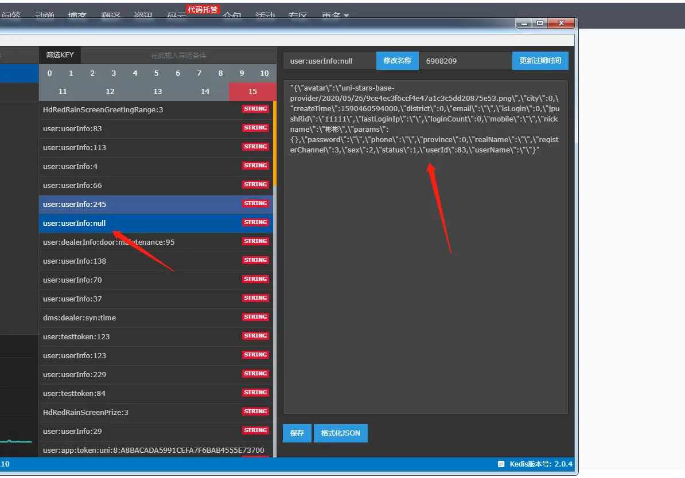

---

title: "动态获取方法参数的坑"
slug: "动态获取方法参数的坑"
description:
date: "2020-05-07"
lastmod: "2020-05-07"
image:
math:
license:
hidden: false
draft: false
categories: ["踩坑记录"]
tags: ["springEl"]

---
# 问题
问题的背景：
由于springcache并不是很好用，并不针对细粒度的过期时间控制。所以我司基于spel表达式写了一个缓存切面实现类似的功能。
但近期发现在使用过程中有产生缓存的时候key为null的情况。

问题的表现主要是发现有redis中有时候用户的redis缓存里面居然存在key后缀为null的缓存数据，但是值却有用户信息:

# 原因
经偶然间，发现突然复现了这个问题，于是开始深入debug，发现原来spring自带的ParameterNameDiscoverer（用于获取方法参数名的工具）解析方法参数名的时候是用ASM（一个字节码操作框架，Cglib就是用的这个）解析的class文件获取的参数名。在ParameterNameDiscoverer内部的方法中，发现解析的class输入流居然为null，为什么勒，于是猜测磁盘文件的class不存在了。于是重启项目，发现能够顺利获取参数名，执行mvn clean命令后就获取不到了。又由于在解析参数名的时候每次都new了LocalVariableTableParameterNameDiscoverer对象获取的，所以没有应用到其自带的缓存机制，导致该问题较频繁的出现。

在思考线上测试环境的问题，原来线上jenkens执行的脚本是先复制文件在kill进程。

# 解决方案
- 调整redis缓存切面，若spel表达式无法顺利获取到值则不进行缓存。
- 调整spel工具，不用每次都new一个LocalVariableTableParameterNameDiscoverer，而使用单例，应用其自身的缓存机制，不然每次都产生磁盘io效率太低。
- 调整jenkens执行脚本，先kill进程再重启项目。

本文原载于[runningccode.github.io](https://runningccode.github.io)，遵循CC BY-NC-SA 4.0协议，复制请保留原文出处。