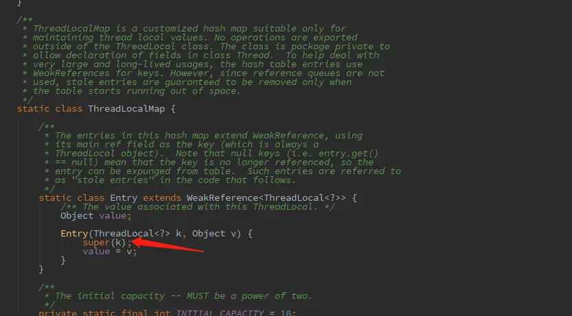

---

title: "浅谈ThreadLocal的内存泄露问题"
slug: "浅谈ThreadLocal的内存泄露问题"
description:
date: "2020-06-06"
lastmod: "2020-06-06"
image:
math:
license:
hidden: false
draft: false
categories: ["技术杂谈"]
tags: ["ThreadLocal","并发"]

---
# 写在前面
因为有个交流群里突然有个小伙伴问为什么jdk建议threadLocal用private static修饰，于是小研究了下。这里就记录一下吧。
# ThreadLocal的原理
源码细节就不贴了，简单描述下原理吧：
- 当调用threadLocal对象的set方法的时候，实际上是在当前线程对象的threadLocals成员变量（类型是ThreadLocal的的内部类：ThreadLocalMap,可以暂时理解为就是一个Map，但比较简单，数据结构就是一个entry数组，只不过内部寻址是通过hash寻址）里面注册了一个entry，key为threadLocal对象，value为threadLocal包装的值。
- 当调用threadLocal对象的get方法的时候，实际上就是threadLocal对象这个key从线程对象的threadLocals成员变量这个map里面取对应的值。

这里面还需要注意的有个细节，get,set方法也针对内存泄露问题做了优化，在get或set方法时针对部分entry判断是否key=null，如果key=null则进行清除，等会会将为什么key=null，但entry却还在。
# 易导致内存泄露的原因
看下ThreadLocal类的这部分：

Thread类成员变量ThreadLocals的Entry构造方法中调用了WeakReference的构造方法，注册key即ThreadLocal实例为弱引用。弱引用是什么勒？

这里总结下对象的引用类型,不同的引用类型jvm的回收策略不同：

- 强引用 对象被生命周期类的变量所引用。
- 软引用 SoftReference包装的对象是软引用,软引用在回收之后还是内存还是不够的情况下会被回收。
- 弱引用 WeakReference包装的对象是弱引用,下一次gc时会被回收。
- 虚引用 PhantomReference包装的对象是虚引用，无法通过虚引用访问对象的任何属性或函数，下一次gc时会被回收。

在回过头来看Entry这里，这就挺危险了，如果不用static修饰对象的成员变量，那么当对象被回收的时候，threadLocal丢失强引用（如果是static就是存放在永久代，不会被回收），就只被threadLocals的entry弱引用，但是因为是弱引用，所以也会被回收，但是这里的回收就有问题了，ThreadLocals的entry是threadLocals的强引用，entry并不会整个回收，只是这里的key被回收了，value还被entry强引用着，这意味着只要线程对象一直存在，那么threadLocal包装的value就有可能一直不会被回收，这种情况还是挺多的，因为现在的web容器都是线程池，线程执行完后可能被复用，并不会回收线程对象。这也是threadLocal的get.set方法有扫描部分entry判断是否key=null然后进行清除的原因。

# 实践
那么在实践中如何使用threadLocal勒。有几个注意的点：

- 一般必须用static修饰threadLocal对象,避免entry丢失key的引用。
- 注意现在的web容器都是线程池，在线程的逻辑业务结束之后一定要手动remove。
- 若threadLocal包装的对象需要提供给外部使用，最好不直接暴露threadLocal，可以建立一个XXXWrapper类，比如仅提供get方法，remove逻辑自己写在拦截器或过滤器中。

本文原载于[runningccode.github.io](https://runningccode.github.io)，遵循CC BY-NC-SA 4.0协议，复制请保留原文出处。