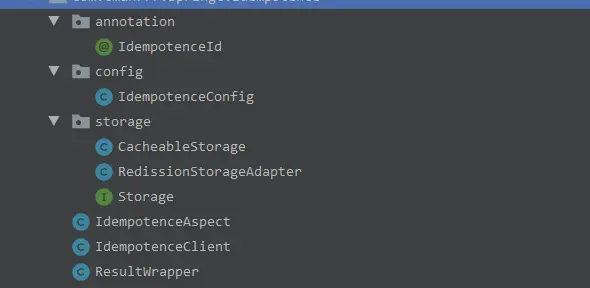

---

title: "手写一个幂等组件分享"
slug: "手写一个幂等组件分享"
description:
date: "2020-09-17"
lastmod: "2020-09-17"
image:
math:
license:
hidden: false
draft: false
categories: ["技术杂谈"]
tags: ["幂等"]

---
# 前言
最近学了极客时间王争的《设计模式之美》，感觉以前对设计模式理解的太浅显了。文章上有一篇设计幂等框架的练习，作者给了简单的思路和实现，但是没有给出切面控制，理由是幂等跟业务是高耦合的，我在看之后结合经验，觉得有必要实现一下功能更强大的功能所以手写了个小组件。

代码地址：[我的个人组件仓库](https://gitee.com/runningccode/springc.git "我的个人组件仓库") 其中的idempotence模块。

# 实现功能
-  基于切面实现注解控制需要实现幂等的接口，幂等号根据方法参数与注解上的spel表达式得到，由业务控制。
- 判断幂等号相等后，判断为幂等，注解可以指定两种策略，抛出一个固定的异常或者根据上次执行结果返回执行结果或返回上次执行时产生的异常。
- 注解可以业务发生异常的时候，哪些异常是不需要删除幂等号记录的，默认不删除幂等号记录即下一次请求可以正常通过。
- 如果想在业务中实现幂等，可以应用IdempotenceClient提供的常用的方法。

# 组件扩展性
- Storge为幂等号的存储对象，根据需要自由选择不同的存储实现，比如基于redisson，mogodb什么的。
- 提供CacheableStorage，可以注入两个storge,一个为缓存用的，一个为持久化用的。

# 代码
代码结构：



### IdempotenceClient 幂等组件，相关方法的统一入口
```
package com.cman777.springc.idempotence;

import com.cman777.springc.idempotence.storage.Storage;
import org.springframework.beans.factory.annotation.Autowired;

import java.io.Serializable;
import java.util.function.Supplier;

/**
 * @author chenzhicong
 * @time 2020/9/15 10:29
 */
public class IdempotenceClient {
    private Storage storage;
    @Autowired
    public IdempotenceClient(Storage cache) {
        this.storage = cache;
    }
    public  boolean saveIfAbsent(String idempotenceId, Supplier<ResultWrapper> supplier) {
        return storage.setIfAbsent(idempotenceId,supplier);
    }
    public <T extends Serializable> ResultWrapper<T>  getResult(String idempotenceId){
        return storage.getResult(idempotenceId);
    }


    public boolean delete(String idempotenceId) {
        return   storage.delete(idempotenceId);
    }


    public boolean exists(String idempotenceId){
        return  storage.exists(idempotenceId);
    }


}

```

### Storage 提供存储幂等标识职责
```
package com.cman777.springc.idempotence.storage;

import com.cman777.springc.idempotence.ResultWrapper;

import java.io.Serializable;
import java.util.function.Supplier;

/**
 * @author chenzhicong
 * @time 2020/9/15 10:30
 */
public interface Storage {
    /**
     * supplier不一定会执行  保证原子性
     */
    boolean setIfAbsent(String key, Supplier<ResultWrapper> supplier);

    /**
     * 得保证幂等性
     */
    boolean setIfAbsent(String key, ResultWrapper value);

    boolean delete(String idempotenceId);


    <T extends Serializable> ResultWrapper<T> getResult(String idempotenceId);


    boolean exists(String key);


}
package com.cman777.springc.idempotence;

import lombok.Getter;
import lombok.Setter;

import java.io.Serializable;

/**
 * @author chenzhicong
 * @time 2020/9/15 18:14
 */
@Getter
@Setter
public class ResultWrapper<T extends Serializable> implements Serializable {
    private Throwable exception;
    private T result;
    private boolean hasException;
}


package com.cman777.springc.idempotence.storage;

import com.cman777.springc.idempotence.ResultWrapper;
import com.cman777.springc.redis.annotation.RedisLock;
import lombok.extern.log4j.Log4j2;

import java.io.Serializable;
import java.util.function.Supplier;

/**
 * @author chenzhicong
 * @time 2020/9/15 10:41
 */
@Log4j2
public class CacheableStorage implements Storage {
    private Storage cacheStorage;
    private Storage persistenceStorage;

    public CacheableStorage(Storage cacheStorage, Storage persistenceStorage) {
        this.cacheStorage = cacheStorage;
        this.persistenceStorage = persistenceStorage;
    }

    @Override
    @RedisLock(fixedPrefix = "Idempoment_CacheableStorage_setIfAbsent",salt = "#key")
    public boolean setIfAbsent(String key, Supplier<ResultWrapper> supplier){
        if(this.exists(key)){
            return false;
        }else{
            return this.setIfAbsent(key,supplier.get());
        }
    }

    @Override
    public boolean setIfAbsent(String key, ResultWrapper resultWrapper) {
        boolean cacheHave = !cacheStorage.setIfAbsent(key,resultWrapper);
        if (cacheHave) {
            log.info("缓存中已存在幂等键={}", key);
            return false;
        } else {
            boolean success = persistenceStorage.setIfAbsent(key,resultWrapper);
            if (!success) {
                log.info("持久层中已存在幂等键={}", key);
            }
            return success;
        }
    }


    @Override
    public boolean delete(String idempotenceId) {
        try {
            cacheStorage.delete(idempotenceId);
            persistenceStorage.delete(idempotenceId);
            return true;
        } catch (Exception e) {
            log.info("删除幂等键异常");
            log.error(e.getMessage(), e);
            return false;
        }

    }

    @Override
    public <T extends Serializable> ResultWrapper<T> getResult(String idempotenceId) {
        ResultWrapper result = cacheStorage.getResult(idempotenceId);
        if(result == null){
            result =  persistenceStorage.getResult(idempotenceId);
            cacheStorage.setIfAbsent(idempotenceId,result);
        }
        return  result;
    }

    @Override
    public boolean exists(String key) {
        boolean isExists = cacheStorage.exists(key);
        if(!isExists){
            isExists = persistenceStorage.exists(key);
        }
        return isExists;
    }
}
package com.cman777.springc.idempotence.storage;

import com.cman777.springc.idempotence.ResultWrapper;
import lombok.extern.log4j.Log4j2;
import org.apache.commons.codec.binary.Base64;
import org.apache.commons.lang3.StringUtils;
import org.redisson.api.RBucket;
import org.redisson.api.RedissonClient;

import java.io.*;
import java.util.concurrent.TimeUnit;
import java.util.function.Supplier;

/**
 * @author chenzhicong
 * @time 2020/9/15 10:55
 */
@Log4j2
public class RedissionStorageAdapter implements Storage {
    private Long cacheTime;
    private RedissonClient redissonClient;

    public RedissionStorageAdapter(RedissonClient redissonClient, Long cacheTime) {
        this.redissonClient = redissonClient;
        this.cacheTime = cacheTime;
    }

    @Override
    public boolean setIfAbsent(String key, Supplier<ResultWrapper> supplier) {
        if (this.exists(key)) {
            return false;
        } else {
            return this.setIfAbsent(key, supplier.get());
        }
    }

    @Override
    public boolean setIfAbsent(String key, ResultWrapper value) {
        String valueStr = null;
        try {
            ByteArrayOutputStream byteArrayOutputStream = new ByteArrayOutputStream();
            ObjectOutputStream out = new ObjectOutputStream(byteArrayOutputStream);
            out.writeObject(value);
            byte[] exceptionBytes = byteArrayOutputStream.toByteArray();
            valueStr = Base64.encodeBase64String(exceptionBytes);
            log.info(valueStr.length());
        } catch (Exception ex) {
            log.error("序列化错误", ex);
            return false;
        }
        if (cacheTime == null) {
            return redissonClient.getBucket(key).trySet(valueStr);
        } else {
            return redissonClient.getBucket(key).trySet(valueStr, cacheTime, TimeUnit.SECONDS);
        }

    }

    @Override
    public boolean delete(String idempotenceId) {
        return redissonClient.getBucket(idempotenceId).delete();
    }

    @Override
    public <T extends Serializable> ResultWrapper<T> getResult(String idempotenceId) {
        ResultWrapper<T> resultWrapper = null;
        try {
            String value = String.valueOf(redissonClient.getBucket(idempotenceId).get());
            if(StringUtils.isBlank(value)){
                return null;
            }
            log.info(value.length());
            ObjectInputStream ois = new ObjectInputStream(new ByteArrayInputStream(Base64.decodeBase64(value)));
            resultWrapper = (ResultWrapper<T>) ois.readObject();
        } catch (Exception e) {
            log.error("反序列化错误", e);
        }
        return resultWrapper;
    }

    @Override
    public boolean exists(String key) {
        return redissonClient.getBucket(key).isExists();
    }
}

```
- RedisLock注解是另外实现了的分布式锁切面可以在项目中其他模块看到。
- 使用的序列化方式是jdk的序列化，然后base64成字符串，这里待优化，效率低并且没法扩展，实际可以将序列化反序列化抽象为接口。

### IdempotenceId 注解与IdempotenceAspect，基于注解实现接口幂等
```
package com.cman777.springc.idempotence.annotation;

import java.lang.annotation.ElementType;
import java.lang.annotation.Retention;
import java.lang.annotation.RetentionPolicy;
import java.lang.annotation.Target;

/**
 * @author chenzhicong
 * @time 2020/9/15 11:32
 */
@Retention(RetentionPolicy.RUNTIME)
@Target({ElementType.METHOD})
public @interface IdempotenceId {
    /**
     * 与salt共同决定IdempotenceId
     */
    String prefix() default "";
    /**
     * spel表达式
     */
    String salt();
    /**
     * 默认发生异常则删除幂等键，但有些情况不删除则填入这里，比如有些异常携带了业务含义
     * 就算重试了100次还是同样的结果，则添加异常类在这里
     */
    Class<? extends Exception>[] notDeleteForException() default {};

    /**
     * 触发幂等的策略
     * THROW_EXCEPTION： 抛出一个固定的异常
     * RETURN_RESULT： 抛出原来的异常（添加到notDeleteForException的异常），或原来的返回结果
     */
    Strategy strategy() default Strategy.RETURN_RESULT;

    enum Strategy{

        THROW_EXCEPTION("THROW_EXCEPTION","抛异常"),

        RETURN_RESULT("RETURN_RESULT","返回结果或抛出原异常");
        private String code;
        private String msg;
        Strategy(String code,String msg){
            this.code=code;
            this.msg = msg;
        }

    }
}
```
### IdempotenceConfig 用于在上层注册好IdempotenceClient后自动注入切面到容器
```
package com.cman777.springc.idempotence.config;

import com.cman777.springc.idempotence.IdempotenceClient;
import com.cman777.springc.idempotence.IdempotenceAspect;
import com.cman777.springc.redis.config.RedisConfig;
import org.springframework.boot.autoconfigure.AutoConfigureAfter;
import org.springframework.boot.autoconfigure.condition.ConditionalOnBean;
import org.springframework.context.annotation.Bean;
import org.springframework.context.annotation.Configuration;

/**
 * @author chenzhicong
 * @time 2020/9/15 11:31
 */
@Configuration
@AutoConfigureAfter(RedisConfig.class)
public class IdempotenceConfig {


    @Bean
    @ConditionalOnBean(IdempotenceClient.class)
    @SuppressWarnings("all")
    public IdempotenceAspect idempotenceAspect(IdempotenceClient idempotenceClient){
        return new IdempotenceAspect(idempotenceClient);
    }

}
```

以上就是组件包的所有代码，没有提供持久层存储的Storge实现，需要上层业务端自己实现，然后注册IdempotenceClient才会生效。

## 业务端引用
### MybatisPlusStorageAdapter：mybatisPlus的存储实现
```
package com.cman777.springc.sample.config.idempotence;
import com.cman777.springc.idempotence.ResultWrapper;
import com.cman777.springc.idempotence.storage.Storage;
import com.cman777.springc.redis.annotation.RedisLock;
import com.cman777.springc.sample.bean.po.Idempotence;
import com.cman777.springc.sample.service.IdempotenceService;
import lombok.extern.log4j.Log4j2;
import org.apache.commons.codec.binary.Base64;
import org.springframework.beans.factory.annotation.Autowired;
import org.springframework.stereotype.Component;
import org.springframework.transaction.annotation.Propagation;
import org.springframework.transaction.annotation.Transactional;

import java.io.*;
import java.util.function.Supplier;

/**
 * @author chenzhicong
 * @time 2020/9/15 14:16
 */
@Component
@Log4j2
public class MybatisPlusStorageAdapter implements Storage {
    @Autowired
    private IdempotenceService idempotenceService;


    @Override
    @Transactional(propagation = Propagation.REQUIRES_NEW,rollbackFor = Exception.class)
    @RedisLock(entity = Idempotence.class,salt = "#key")
    public boolean setIfAbsent(String key, Supplier<ResultWrapper> supplier) {
        if(this.exists(key)){
            return false;
        }else{
            return this.setIfAbsent(key,supplier.get());
        }
    }

    @Override
    @RedisLock(entity = Idempotence.class,salt = "#key")
    @Transactional(propagation = Propagation.REQUIRES_NEW,rollbackFor = Exception.class)
    public boolean setIfAbsent(String key, ResultWrapper value) {
        Idempotence idempotence = idempotenceService.selectByIdempotentceId(key);
        if (idempotence != null) {
            return false;
        } else {
            String valueStr = null;
            try {
                ByteArrayOutputStream byteArrayOutputStream = new ByteArrayOutputStream();
                ObjectOutputStream out = new ObjectOutputStream(byteArrayOutputStream);
                out.writeObject(value);
                byte[] exceptionBytes = byteArrayOutputStream.toByteArray();
                valueStr = Base64.encodeBase64String(exceptionBytes);
            } catch (Exception ex) {
                log.error("序列化错误", ex);
                return false;
            }
            Idempotence idempotenceNew = new Idempotence();
            idempotenceNew.setIdempotenceId(key);
            idempotenceNew.setValue(valueStr);
            idempotenceService.save(idempotenceNew);
            return true;
        }
    }

    @Override
    @Transactional(propagation = Propagation.NOT_SUPPORTED)
    public boolean delete(String idempotenceId) {
        idempotenceService.deleteByIdempotentceId(idempotenceId);
        return true;
    }

    @Override
    public <T extends Serializable> ResultWrapper<T> getResult(String idempotenceId) {
        Idempotence idempotence = idempotenceService.selectByIdempotentceId(idempotenceId);
        ResultWrapper<T> resultWrapper = null;
        try {
            String value = idempotence.getValue();
            ObjectInputStream ois = new ObjectInputStream(new ByteArrayInputStream(Base64.decodeBase64(value)));
            resultWrapper = (ResultWrapper<T>) ois.readObject();
        } catch (Exception e) {
            log.error("反序列化错误", e);
        }
        return resultWrapper;
    }


    @Override
    @Transactional(propagation = Propagation.REQUIRES_NEW,rollbackFor = Exception.class)
    public boolean exists(String key) {
        Idempotence idempotence = idempotenceService.selectByIdempotentceId(key);
        if (idempotence != null) {
            return true;
        } else {
            return false;
        }
    }
}

```
### IdempotenceConfig 注册IdempotenceClient与CacheableStorage
```
package com.cman777.springc.sample.config.idempotence;

import com.cman777.springc.idempotence.IdempotenceClient;
import com.cman777.springc.idempotence.storage.CacheableStorage;
import com.cman777.springc.idempotence.storage.RedissionStorageAdapter;

import org.redisson.api.RedissonClient;
import org.springframework.context.annotation.Bean;
import org.springframework.context.annotation.Configuration;

/**
 * @author chenzhicong
 * @time 2020/9/15 14:14
 */
@Configuration
public class IdempotenceConfig {

    private Long cacheSeconds = 60L;

    @Bean
    public CacheableStorage cacheableStorage(RedissonClient redissonClient, MybatisPlusStorageAdapter mybatisPlusStorageAdapter){
        return new CacheableStorage(new RedissionStorageAdapter(redissonClient,cacheSeconds),mybatisPlusStorageAdapter);
    }
    @Bean
    public IdempotenceClient idempotenceClient(CacheableStorage cacheableStorage){
        return new IdempotenceClient(cacheableStorage);
    }
}
```
为什么要单独注册cacheableStorage是因为需要应用cacheableStorage的分布式锁切面，为了让springboot自己生成代理类。


本文原载于[runningccode.github.io](https://runningccode.github.io)，遵循CC BY-NC-SA 4.0协议，复制请保留原文出处。