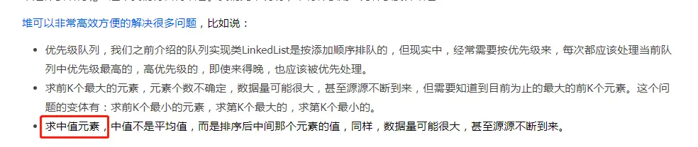
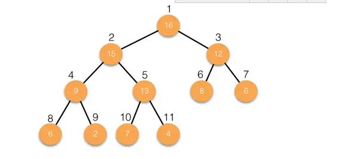

---

title: "PriorityQueue取中位数-实现一个能够动态取中位数的容器"
slug: "PriorityQueue取中位数-实现一个能够动态取中位数的容器"
description:
date: "2022-02-16"
lastmod: "2022-02-16"
image:
math:
license:
hidden: false
draft: false
categories: ["学习笔记"]
tags: ["中位数"]

---
> 闲来无事，复习一遍以前学习《Java编程的逻辑》的笔记，巩固一下基础。里面提到了通过堆这个数据结构取中值的应用场景，但没给出具体解法，这里查阅了相关资料后自己写了一个求中值的容器。
> 


##### 堆的概念
- 堆就是完全二叉树，要求最后一层不一定是满的，但要求最后一层几点从左到右是连续的，不能间隔。形如：



- 堆的种类 分为最大堆（根节点的值最大）,最小堆（根节点的值最小）

- 堆的存储结构 可以用数组存储，因为堆是完全二叉树，所以每个节点的位置可以对应数组的下标。

- 堆的实现 jdk里面基于堆的逻辑结构的实现类是PriorityQueue（优先级队列，单端队列）。

##### 代码部分

PriorityQueue应用场景可以为：
- 求中间值 一个最大堆 一个最小堆
- 实时求最大或最小值
- 构建优先级任务队列

个人对求中间值不是很理解，所以根据网上资料自己尝试写了实时求中间值的容器，因为关注点在于理解怎么求中间值，所以没有实现jdk容器接口，只实现实时求中间值。

下面贴出代码：

容器代码部分：

```
package com.cman777.springc.common.helper;

import com.cman777.springc.common.bean.exception.BusinessException;
import java.util.Collections;
import java.util.Comparator;
import java.util.PriorityQueue;
import java.util.function.BiFunction;

/**
 * @author chenzhicong
 * @time 2022/2/16 14:29
 * 可以动态获取中值的容器
 */
public class MiddleContainer<T> {
    private PriorityQueue<T> maxP = null;
    private PriorityQueue<T> minP = null;
    private Comparator<T> comparator = null;
    private int count = 0;
    private T middle = null;
    /**
     * 容器为偶数个的时候中值怎么求的函数
     */
    private BiFunction<T, T, T> mergeFunction = null;

    public MiddleContainer(Class<T> tClass, BiFunction<T, T, T> mergeFunction) {
        ValidateUtil.isTrue(Comparable.class.isAssignableFrom(tClass), "class参数必须实现Comparable接口");
        maxP = new PriorityQueue(Collections.reverseOrder());
        minP = new PriorityQueue();
        this.mergeFunction = mergeFunction;
    }

    public MiddleContainer(Comparator<T> tComparator, BiFunction<T, T, T> mergeFunction) {
        maxP = new PriorityQueue<>(tComparator.reversed());
        minP = new PriorityQueue<>(tComparator);
        this.mergeFunction = mergeFunction;
    }

    /**
     * 效果：确保最小堆是大于或等于中间值的数
     * 最大堆是小于或等于中间值的数
     * 并且 最大堆最小堆之间的size相差不小于1
     * 则中间值就是最大/最小堆的peek值或两者peek的平均数
     */
    public T add(T t) {
        if (count == 0) {
            maxP.offer(t);
            middle = t;
            count++;
            return t;
        }
        //如果当前添加值小于中间值 添加到最大堆
        int compareResult = compare(t, middle);
        if (compareResult > 0) {
            //大于中间值 添加到最小堆
            minP.offer(t);
        } else if (compareResult < 0) {
            //小于中间值 添加到最大堆
            maxP.offer(t);
        } else {
            //与中间值相等 添加到任意一个堆
            maxP.offer(t);
        }

        //校验当前最大堆和最小堆size相差不超过1
        if (maxP.size() - minP.size() >= 2) {
            //从最大堆poll一个值到最小堆
            T tempVal = maxP.poll();
            minP.offer(tempVal);
        } else if (minP.size() - maxP.size() >= 2) {
            //从最小堆poll一个值到最大堆
            T tempVal = minP.poll();
            maxP.offer(tempVal);
        }
        count++;
        //返回中间值
        middle = getMiddle();
        return middle;
    }

    public int size() {
        return count;
    }

    public T getMiddle() {
        if (count <= 1) {
            return maxP.peek();
        }
        if (maxP.size() == minP.size()) {
            return mergeFunction.apply(maxP.peek(), minP.peek());
        }
        if (maxP.size() - minP.size() == 1) {
            return maxP.peek();
        }
        if (minP.size() - maxP.size() == 1) {
            return minP.peek();
        }
        throw new BusinessException("数据错误");
    }

    public int compare(T t1, T t2) {
        if (comparator == null) {
            return ((Comparable<T>) t1).compareTo(t2);
        } else {
            return comparator.compare(t1, t2);
        }

    }
}

```

测试类代码：

```
package com.cman777.springc.sample.test;

import com.cman777.springc.common.helper.MiddleContainer;

/**
 * @author chenzhicong
 * @time 2021/10/19 9:52
 */
public class TestMain {
    private static int[] array = {1, 2, 3, 3, 3, 4, 4, 5, 6};

    public static void main(String[] args) {
        MiddleContainer<Double> middleContainer = new MiddleContainer<>(Double.class, (a, b) -> (a + b) / 2);
        for (int i = 0; i < array.length; i++) {
            middleContainer.add((double) array[i]);
        }
        System.out.println(middleContainer.getMiddle());
    }
}

```


本文原载于[runningccode.github.io](https://runningccode.github.io)，遵循CC BY-NC-SA 4.0协议，复制请保留原文出处。