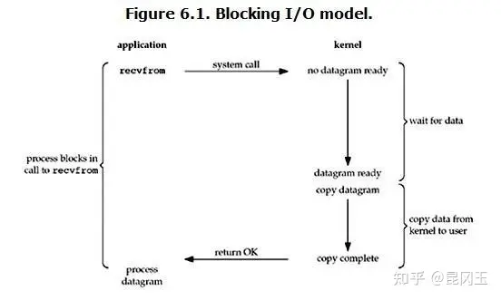
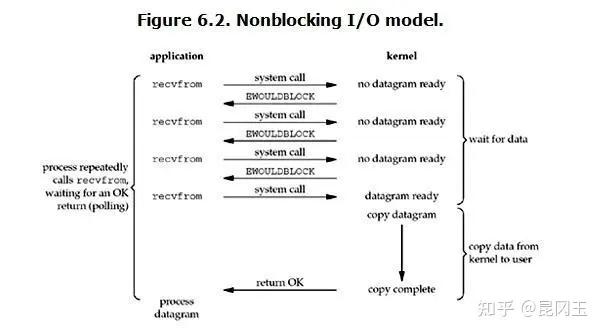
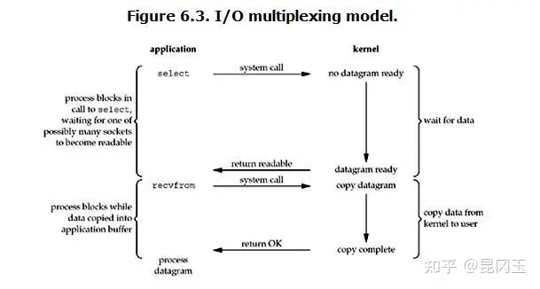
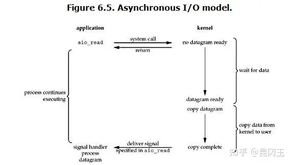
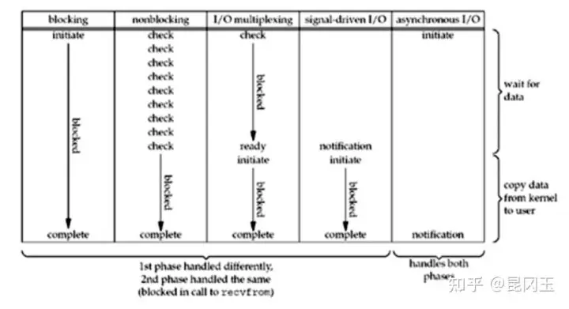
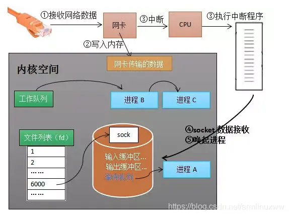

---

title: " BIO/NIO 同步/异步 阻塞/非阻塞 select/poll/epoll 知识点整理"
slug: " BIO/NIO 同步/异步 阻塞/非阻塞 select/poll/epoll 知识点整理"
description:
date: "2022-02-18"
lastmod: "2022-02-18"
image:
math:
license:
hidden: false
draft: false
categories: ["学习笔记"]
tags: ["网络通信"]

---
本文主要源于阅读以下文章整理所得：
> [似水流年——一篇文章读懂阻塞，非阻塞，同步，异步](https://www.jianshu.com/p/b8203d46895c)

> [似水流年——IO多路复用的三种机制Select，Poll，Epoll](https://www.jianshu.com/p/397449cadc9a)

> [罗培羽——epoll 的本质是什么？](https://my.oschina.net/oscpyaqxylk/blog/3052308)

#### 理解IO模型

《Unix网络编程》将IO模型分为：

- Blocking IO - 阻塞IO
- NoneBlocking IO - 非阻塞IO
- IO multiplexing - IO多路复用
- ignal driven IO - 信号驱动IO
- asynchronous IO - 异步IO

在理解IO模型之前需要了解数据从网络传输再到应用程序接受到数据的过程，这个过程可以分为两个阶段：

- 第一阶段：系统内核准备数据阶段 数据从网卡写入内核 dma
- 第二阶段：copy阶段 数据从内核copy到用户进程

##### 阻塞IO



指应用调用recvfrom是必须阻塞等待两个阶段都完成才会return

##### 非阻塞IO



应用调用recvfrom 若第一阶段未完成会返回 no datagram ready,等第一阶段完成之后应用程序调用recvfrom才会返回数据。

#####  IO多路复用



应用有一个线程处理监听第一阶段数据到没有（可以同时监听多个socket不像Bio一样只能监听一个socket），多路复用就是指的所有的socket都用一个线程来监听第一阶段数据就绪没有。另外，虽然select仍然是阻塞的，但只有在所有channel都没就绪的时候才会阻塞。

linux中的监听机制：

- select
- poll
- epoll

后面再剖析这三者的区别。


##### 异步IO



应用程序 通过aio_read 调用内核，这里的含义是通知内核进行读取操作并将数据拷贝至进程中，完事后通知进程整个操作全部完成（绑定一个回调函数处理数据）。读取操作会立刻返回，程序可以进行其它的操作，所有的读取、拷贝工作都由内核去做，做完以后通知进程，进程调用绑定的回调函数来处理数据。

##### 对比：


#### 理解同步/异步，阻塞/非阻塞
这是linux比较权威划分的IO模型，但是JAVA面试时经常问到的是BIO,NIO,AIO,Netty。然后说BIO是同步阻塞，NIO是同步非阻塞，AIO是异步非阻塞。怎么理解这些关系了？

##### 同步/异步
**同步**指的是用户进程使用数据，需要同步等待。
**异步**指的是用户进程使用数据的时候传入回调，内核会通知并唤醒回调方法。

##### 阻塞/非阻塞
阻塞/非阻塞是针对上述第一阶段来说的。
**阻塞**指的是应用需要阻塞等待第一阶段数据就绪，然后就绪之后才copy到用户空间。。
**非阻塞**指的是应用在数据没就绪的情况，立马可以得到返回，或者通过IO多路复用，得到就绪的Channel


所以NIO,BIO都是同步的，因为在读数据的时候，应用程序都是阻塞的。而不像AIO一样提供一个缓冲区给OS，OS直接就把数据copy到缓冲区了，然后回调应用程序。比如下面AIO的JAVA代码：

```
package com.cman777.springc.sample.test;

import lombok.SneakyThrows;

import java.io.IOException;
import java.net.InetSocketAddress;
import java.nio.ByteBuffer;
import java.nio.channels.AsynchronousServerSocketChannel;
import java.nio.channels.AsynchronousSocketChannel;
import java.nio.channels.CompletionHandler;


/**
 * @author chenzhicong
 * @time 2022/2/17 14:36
 */
public class Aio {

    public static class AIOEchoServer {

        public final static int PORT = 8001;
        public final static String IP = "127.0.0.1";


        private AsynchronousServerSocketChannel server = null;

        public AIOEchoServer() {
            try {
                //同样是利用工厂方法产生一个通道，异步通道 AsynchronousServerSocketChannel
                server = AsynchronousServerSocketChannel.open().bind(new InetSocketAddress(IP, PORT));
            } catch (IOException e) {
                e.printStackTrace();
            }
        }

        //使用这个通道(server)来进行客户端的接收和处理
        public void start() {
            System.out.println("Server listen on " + PORT);

            //注册事件和事件完成后的处理器，这个CompletionHandler就是事件完成后的处理器
            server.accept(null, new CompletionHandler<AsynchronousSocketChannel, Object>() {

                @Override
                @SneakyThrows
                public void completed(AsynchronousSocketChannel result, Object attachment) {
                    //连接完成之后的回调
                    System.out.println("completed1");
                    final ByteBuffer buffer = ByteBuffer.allocate(1024);
                    System.out.println(Thread.currentThread().getName());
                    result.read(buffer, null, new CompletionHandler<Integer, Object>() {
                        @SneakyThrows
                        @Override
                        public void completed(Integer resultRead,
                                              Object attachment) {
                            //读取数据完成之后的回调
                            //将数据写回客户端
                            System.out.println("completed2");
                            System.out.println("In server: " + new String(buffer.array()));
                            buffer.flip();
                            result.write(buffer).get();
                            result.close();
                            System.out.println("completed2finish");
                        }

                        @Override
                        public void failed(Throwable exc, Object attachment) {
                        }
                    });
                    //连接成功再接受一个连接
                    server.accept(null,this);
                    System.out.println("completed1finish");
                }

                @Override
                public void failed(Throwable exc, Object attachment) {
                    System.out.println("failed:" + exc);
                }

            });
        }

        public static void main(String[] args) {
            new AIOEchoServer().start();
            while (true) {
                try {
                    Thread.sleep(1000);
                } catch (InterruptedException e) {
                    e.printStackTrace();
                }
            }
        }

    }


    public static class AIOClient {

        public static void main(String[] args) throws IOException {

            final AsynchronousSocketChannel client = AsynchronousSocketChannel.open();

            InetSocketAddress serverAddress = new InetSocketAddress("127.0.0.1", 8001);

            CompletionHandler<Void, ? super Object> handler = new CompletionHandler<Void, Object>() {

                @Override
                public void completed(Void result, Object attachment) {
                    //建立连接成功的回调
                    System.out.println("completed1");
                    client.write(ByteBuffer.wrap("Hello".getBytes()), null,
                            new CompletionHandler<Integer, Object>() {
                                @Override
                                public void completed(Integer result,
                                                      Object attachment) {
                                    //写数据完成之后的回调
                                    System.out.println("completed2");
                                    final ByteBuffer buffer = ByteBuffer.allocate(1024);
                                    client.read(buffer, null, new CompletionHandler<Integer, ByteBuffer>() {

                                        @SneakyThrows
                                        @Override
                                        public void completed(Integer result,
                                                              ByteBuffer attachment) {
                                            //读数据成功之后的回调
                                            System.out.println("completed3");
                                            buffer.flip();
                                            System.out.println(new String(buffer.array()));
                                            client.close();
                                            System.out.println("completed3finish");
                                        }

                                        @Override
                                        public void failed(Throwable exc,
                                                           ByteBuffer attachment) {
                                        }

                                    });
                                    System.out.println("completed2finish");
                                }

                                @Override
                                public void failed(Throwable exc, Object attachment) {
                                }

                            });
                    System.out.println("completed1finish");
                }

                @Override
                public void failed(Throwable exc, Object attachment) {
                }

            };

            client.connect(serverAddress, null, handler);
            try {
                Thread.sleep(10000000);
            } catch (InterruptedException e) {
                e.printStackTrace();
            }
        }

    }
}

```


再附一个NIO的JAVA代码,可作对比：

```
package com.cman777.springc.sample.test;

import java.io.IOException;
import java.io.OutputStreamWriter;
import java.io.PrintWriter;
import java.net.InetSocketAddress;
import java.net.Socket;
import java.nio.ByteBuffer;
import java.nio.channels.SelectionKey;
import java.nio.channels.Selector;
import java.nio.channels.ServerSocketChannel;
import java.nio.channels.SocketChannel;
import java.nio.charset.Charset;
import java.util.Iterator;
import java.util.Set;

/**
 * @author chenzhicong
 * @time 2022/2/17 10:53
 */
public class Nio {


    public static void main(String[] args) throws IOException {
        Selector serverSelector = Selector.open();
        Selector clientSelector = Selector.open();

        new Thread(() -> {
            try {
                // 对应IO编程中服务端启动
                ServerSocketChannel listenerChannel = ServerSocketChannel.open();
                listenerChannel.socket().bind(new InetSocketAddress(8000));
                listenerChannel.configureBlocking(false);
                listenerChannel.register(serverSelector, SelectionKey.OP_ACCEPT);

                while (true) {
                    // 监测是否有新的连接，这里的1指的是阻塞的时间为 1ms
                    if (serverSelector.select(1) > 0) {
                        Set<SelectionKey> set = serverSelector.selectedKeys();
                        Iterator<SelectionKey> keyIterator = set.iterator();

                        while (keyIterator.hasNext()) {
                            SelectionKey key = keyIterator.next();

                            if (key.isAcceptable()) {
                                try {
                                    // (1) 每来一个新连接，不需要创建一个线程，而是直接注册到clientSelector
                                    SocketChannel clientChannel = ((ServerSocketChannel) key.channel()).accept();
                                    clientChannel.configureBlocking(false);
                                    clientChannel.register(clientSelector, SelectionKey.OP_READ);
                                } finally {
                                    keyIterator.remove();
                                }
                            }

                        }
                    }
                }
            } catch (IOException ignored) {
            }

        }).start();


        new Thread(() -> {
            try {
                while (true) {
                    // (批量轮询是否有哪些连接有数据可读，这里的1指的是阻塞的时间为 1ms
                    if (clientSelector.select(1) > 0) {
                        Set<SelectionKey> set = clientSelector.selectedKeys();
                        Iterator<SelectionKey> keyIterator = set.iterator();

                        while (keyIterator.hasNext()) {
                            SelectionKey key = keyIterator.next();
                            if (key.isReadable()) {
                                try {
                                    SocketChannel clientChannel = (SocketChannel) key.channel();
                                    //面向byteBuffer
                                    ByteBuffer byteBuffer = ByteBuffer.allocate(1024);
                                    int readByteNum = clientChannel.read(byteBuffer);
                                    if(readByteNum == -1){
                                        clientChannel.close();
                                        continue;
                                    }
                                    byteBuffer.flip();
                                    System.out.println(Charset.defaultCharset().newDecoder().decode(byteBuffer)
                                            .toString());
                                } finally {
                                    if(key.isValid()){
                                        keyIterator.remove();
                                        key.interestOps(SelectionKey.OP_READ);
                                    }
                                }
                            }

                        }
                    }
                }
            } catch (IOException ignored) {
            }
        }).start();


        new Thread(() -> {
            try {
                while (true){
                    Thread.sleep(3000);
                    Socket socket = new Socket("127.0.0.1",8000);
                    PrintWriter printWriter = new PrintWriter(socket.getOutputStream());
                    printWriter.print("你好");
                    printWriter.close();
                    socket.close();
                }


            } catch (IOException ignored) {
            } catch (InterruptedException e) {
                e.printStackTrace();
            }
        }).start();

    }

}

```

#### select/poll/epoll理解
##### 基础知识

需了解：

- socket结构
- 内核接收网络数据过程


socket结构 分为发送缓冲区，接受缓冲区，等待队列（等待被唤醒的进程（阻塞状态））。

内核接收网络数据全过程：



计算机收到了对端传送的数据(步骤 ①)
数据经由网卡传送到内存(步骤 ②)
然后网卡通过中断信号通知 CPU 有数据到达，CPU 执行中断程序(步骤 ③)。

此处的中断程序主要有两项功能，先将网络数据写入到对应 Socket 的接收缓冲区里面(步骤 ④)，再唤醒进程 A(步骤 ⑤)，重新将进程 A 放入工作队列中。


#### 
##### select
传入文件描述符集合 线程加入所有socket的等待队列 等待任意一个socket数据从王卡写入内核完毕 完毕之后 将唤醒线程 select将返回就绪socket数量

应用程序接着在遍历检查是哪个socket有数据 再接受数据

##### poll
跟select差不多，但select对文件描述符集合有限制。poll无限制，效率没有提升。

##### epoll
提供3个函数：
- epoll_create
- epoll_ctl
- epoll_wait

epoll_create 作用是让内核创建eventpoll 对象。eventpoll 对象包括的数据有需要监听的socket_fd监听符（红黑树结构），就绪列表（rdList,就绪状态的socket信息，双向链表） ，等待队列（把调用epollwait函数的进程放到这里面去）。

epoll_ctl 作用是删减监听的socket。

epoll_wait 作用是检查就绪列表，返回就绪socket数量，
同时把就绪socket信息copy到传入的数组指针里面的数组上
所以与select不同的是不需要遍历检查socket，而只是直接去查询数组就知道那些socket就绪。

##### epoll流程：

epoll_create 函数添加socket监视，内核会把eventpoll添加到socket的等待队列当中。数据从socket写入内核空间完毕后,传送中断信号给cpu，cpu执行中断程序，中断程序将socket的等待队列中的eventpoll中的就绪列表添加socket引用，然后唤醒eventpoll中等待队列中的进程。


本文原载于[runningccode.github.io](https://runningccode.github.io)，遵循CC BY-NC-SA 4.0协议，复制请保留原文出处。