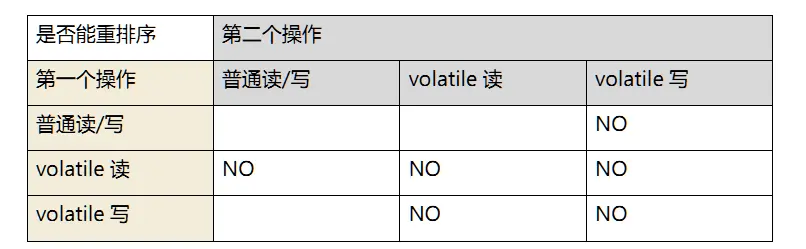
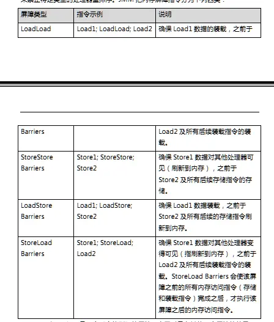
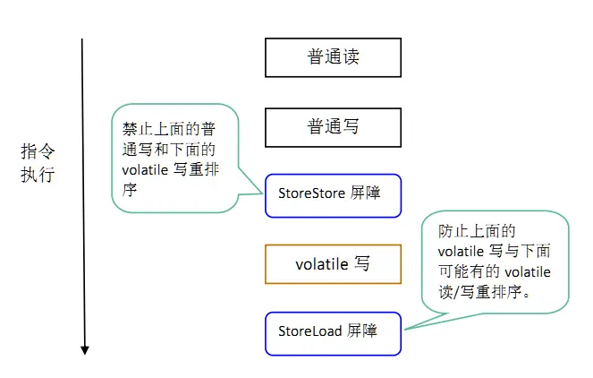
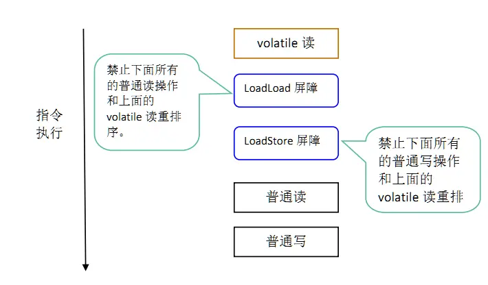

---

title: "JMM（java-memory-model,java内存模型）规范"
slug: "JMM（java-memory-model,java内存模型）规范"
description:
date: "2022-03-04"
lastmod: "2022-03-04"
image:
math:
license:
hidden: false
draft: false
categories: ["学习笔记"]
tags: ["JMM"]

---
> 来源于《深入理解JAVA内存模型》——程晓明加上个人理解，因为有些知识点查了很多还是不确定是什么意思，有个人理解在里面，仅供参考

#### 一、 JMM是什么
JAVA的并发编程模型，屏蔽硬件层，是一种高层次的抽象，把内存区域划分为主内存和本地内存（逻辑划分，不用对应某一块真实的区域），屏蔽硬件层，对多线程编程可能导致的有序性，内存可见性问题，提出的解决模型。

JMM把内存抽象为主内存和本地内存，图示：

注意:

- 这里线程间共享变量，主要指堆以及元空间，栈中的信息不会在线程之间共享，不会有内存可见性问题，也不受JMM影响。
- 这里的主内存与本地内存的区分，主要是受缓存，写缓冲区，寄存器，以及其他硬件和编译器优化影响产生的区分，导致线程的本地内存和主内存存在差异。

#### 二、  前置知识
##### 数据依赖性
两个操作访问一个变量，其中一个操作为写，则两个操作有数据依赖性，比如写后读，写后写，读后写。
##### 控制依赖性
A和B操作存在控制依赖性，指的是B操作是否执行依赖于A的结果，编译器和处理器可能用猜测执行的方式对A操作和B操作进行重排，比如提前执行B操作获取B操作的结果存在一个临时变量里，当A有结果的时候再把这个临时变量赋值给应该被赋值的变量。

单线程中，这样是没问题的，但多线程中，可能会改变程序的执行结果。
##### 重排序

java中的重排序，主要有以下几个原因：
- JIT编译重排序 JIT编译的时候会基于效率优化指令执行顺序。JIT指Java即时编译，针对热点代码 进行深层的机器码编译,够加快代码执行速度，因为一次访问一次解释执行的速度比不上直接执行编译后的机器码速度
- 指令重排序 cpu执行指令也可能不是按顺序执行的，会基于效率去优化执行顺序。
- 内存重排序 由于硬件写缓冲区 和 无效队列的存在，写没有完成写入到主存就执行下面的代码了，其他cpu对前面的指令执行无法感知，也是一种顺序错乱。（有些人说有缓存一致性协议，为什么还会产生内存重排序，其原因是MESI没有完全解决问题，因为后来硬件上又优化了写缓冲区和无效队列，这就只能使用内存屏障的汇编指令在编码层面进行控制了）。

后面两种指令重排序和内存重排序可以合并看为**CPU重排序**。

注：**任何重排序都会考虑数据依赖性，不会改变存在数据依赖性的两个操作的执行顺序，仅仅指单个线程或单个处理器中执行的操作的数据依赖性，不同处理器或不同线程之间产生的逻辑上的数据依赖性不被编译器和处理器考虑。**

重排序的结果：  
可能导致多线程程序出现**内存可见性**问题，上面的重排序虽然单线程/单处理器下不会出现问题，但没有考虑在多线程情况下，若两个线程有数据依赖性，则应该使用同步机制来避免。

#### 三、 JMM核心概念
##### happens-before原则
JSR-133（JMM规范提案）提出的概念，用以阐述操作之间的内存可见性，提供一个简单易懂的规则给程序员，用以判断两个操作之间的内存可见性情况，使得程序员不用关心内存可见性之下的原因，这些原因可能涉及复杂的重排序规则和这些规则的具体实现。内容包括：

- 程序顺序规则：一个线程中的每个操作,happen-before与该线程中的任意后续操作（个人理解，就是代码书写下的程序顺序）。
- volatile 变量规则，对于 volatile 修饰的变量的写的操作， 一定 happens-before 后续对于 volatile 变量的读操作;
- 监视器锁规则：对一个监视器的解锁，happens-before于随后对这个监视器的加锁（监视器锁，指的synchronized）
- 传递性：如果A happens-before B，且B happens-before C，那么A happens-before C。

###### happen-before含义:
操作A happens-before 操作B 的意义是指 操作A的结果对操作B可见。意义只是操作A的结果对操作B可见。  
并不要求A一定先于B执行 当B不需要A的执行结果可见的时候（不存在数据依赖性），A和B还是可以被重排序，这样的重排序并不是非法的。

##### as-if-serial语义
是一个语义，编译器，runtime,处理器都会遵守。指不管怎么重排序，程序的执行结果不能被改变。个人理解，产生数据依赖性的操作，顺序不能变，但没有数据依赖性的操作，顺序可能变。

##### 顺序一致性内存模型
是一个理论模型，JMM并不是顺序一致性模型，指**一个线程的所有操作必须按程序的顺序来执行**，所有线程都只能看到一个单一的操作执行顺序。在顺序一致性内存模型中，每个操作都必须原子执行且立刻对所有线程可见。  
JMM与其的区别：
- 不保证单线程的操作按照程序顺序执行
- 不保证所有线程看到一致的执行顺序
- 不保证64位变量写的原子性（32位系统）

但是JMM做了一个保证:  如果程序是正确同步的，程序的执行将具有顺序一致性-即程序的执行结果与该程序在顺序一致性模型中的执行结果相同。但JMM允许在不改变正确同步程序结果的情况下还是可以让编译器和cpu优化比如synchoronized保证临界区内编码的原子性不允许其内部的指令逸出临界区外，但可以在临界区内被重排序。

#### 四、JMM中保证正确同步的实现方式

**注：** 以下是个人理解的比较懵的地方，网上也没有找到统一答案，这里权当作个记录，仅供参考。

主要指volatile，synchoronized等java提供的同步机制。他们使用到了内存屏障（注，这里的内存屏障和硬件层的内存屏障语义不一样，这里的内存屏障指的是JMM抽象的内存屏障）。这里主要介绍下volatile关键字，synchoronized留着后面在单独总结下吧。

volatile特性是保证内存可见性，保证单个变量读写的原子性。  
其中内存层面的语义是：**读volatile**将本地内存变量置为失效，从主内存读。**写volatile**把把本地内存共享变量同步至主内存。

主要如何实现这个内存语义勒。我的理解是：
##### 写volatile的时候：
1. v写的时候当前线程正常程序流的读写都已经完成，这样才能确保所有应该写入主内存的刷入主内存，其他线程如果读v，也能按顺序一致性模型来分析当前线程。
2. 确保写完成的时候同步到主内存。
##### 读volatile的时候：
1. v读的时候正常程序流下后面所有的读都没有执行，这样才能确保v读之后读的数据都是主内存的。
2. 同时应该避免v读之后的写重排到v读之前，确保当其他线程执行v写的时候不应该写入主内存的就还没有被写入。

前面已经说了重排序分为编译器重排和CPU重排。下面说说JMM是怎么解决这两个重排的。

##### 编译器重排
主要是基于重排序规则如下图：

注：第一个操作 第二个操作并不是指相邻的两个操作，而是指单线程前后的两个操作。

从图中可以看到：

- 当第二个操作是volatile写的时候，不管第一个操作是什么，都不能重排到volatile写之后。
- 当第一个操作是volatile读的时候，不管第二个操作是什么，都不能重排到volaite读之前。
- 当第一个操作是volatile写，第二个操作是volatile读的时候，不能重排序。

个人理解：

- 使得当构成线程通信的时候（A线程volatile写，B线程volatile读），这个时机的触发，可以按照顺序一致性内存模型分析A线程，即B线程可以理解A线程volatile写之前的指令已经执行完毕，A线程可以理解B线程volatile读之后的命令还没有执行。
- 这里保证了编译器重排序不会影响可见性（默认变量的任意读写在各个线程的本地内存是没有差异的），因为引起各个线程本地内存差异的原因是cpu重排序，所以要解决这个问题还得在cpu重排序的层面引入内存屏障解决cpu重排序。

##### CPU重排序

主要是引入了内存屏障，内存屏障是java在编译生成字节码的时候插入的，并没有具体到硬件层面，他是属于JMM中抽象概念，不同处理器，实现可能略有不同，有四种：

-  LoadLoad屏障

顺序控制语义： 前面的Load和后面的Load不能乱序。

-  StoreStore屏障

顺序控制语义： 前面的Store和后面的Store不能乱序。
刷新主存控制语义：前面的Store在后面的Store之前也会把线程本地内存刷新到主内存。

-  LoadStore屏障

顺序控制语义：  前面的Load和后面的Store不能乱序。
刷新主存控制语义： 确保后一个Store刷新主存之前执行Load。

-  StoreLoad屏障

顺序控制语义：前面的Store和后面的Load不能乱序。
刷新主存控制语义： Store完成后会把线程本地内存刷新到主内存。

以上是个人理解含有的语义，可能会有偏差，下面贴出书中的概念：

另外，个人觉得前后的Load,Store,应该是以多个线程而不是单个线程内来说的把。比如StoreLoad之后，Load不光指本线程的Load，也指其他线程的Load把，如果不是这样，感觉解释不通。

###### volaite读写插入的内存屏障

其实这部分，为什么这么插入，自己也不是理解得很透彻，有些疑问，所以就大概按照书中的介绍写把，不作过多介绍。

**volatile写：**

在每个volatile写操作前插入StoreStore屏障，在写操作后插入StoreLoad屏障；

疑问：为什么在前面不加LoadStore屏障？（编译器重排序规则明明写了普通读和volatile写不能重排）

**volatile读：**

在每个volatile读操作后插入LoadLoad屏障，以及LoadStore屏障；

**注：** 上面的内存屏障过于保守，在操作系统差异，还有某些不必要的情况下比如屏障重复，编译器会根据情况作优化，省略屏障。

**最后**：感觉自己还是太菜了，看了这个概念纠结了一星期左右，还是不太明白，但还是做个记录把。

本文原载于[runningccode.github.io](https://runningccode.github.io)，遵循CC BY-NC-SA 4.0协议，复制请保留原文出处。