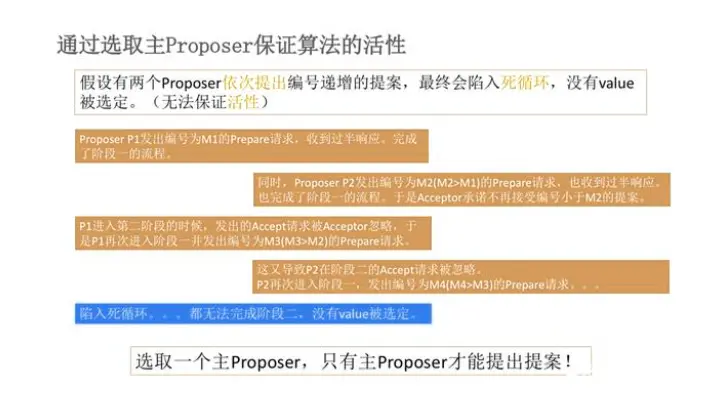

---

title: "一致性协议-Paxos,ZAB,Raft 总结"
slug: "一致性协议-Paxos,ZAB,Raft 总结"
description:
date: "2022-04-27"
lastmod: "2022-04-27"
image:
math:
license:
hidden: false
draft: false
categories: ["学习笔记"]
tags: ["一致性"]

---
参考资料：
> [分布式一致性算法——Paxos原理与推导过程](https://baijiahao.baidu.com/s?id=1714967081113840653&wfr=spider&for=pc "分布式一致性算法——Paxos原理与推导过程")

> [ 百度开源 / braft](https://gitee.com/baidu/braft/blob/master/docs/cn/zab_protocol.md#fast-leader-election " 百度开源 / braft")

> [Raft 一致性协议完整解析](https://zhuanlan.zhihu.com/p/404786050 "Raft 一致性协议完整解析")

> [Paxos，Raft，ZAB的差异对比](https://blog.csdn.net/weixin_43705457/article/details/113840487 "Paxos，Raft，ZAB的差异对比")

# 前言
用于在多数据备份的分布式系统中，因机器宕机或网络异常（包括消息的延迟、丢失、重复、乱序，还有网络分区）等情况产生各个节点中的数据不一致。为了各个备份数据在最终都能与集群保持同步，拥有统一共识，所需遵守的一套协议。

# 一、Paxos协议
Paxos协议相对基础，也是其他协议的基础，他的条件限制没有ZAB和RAFT那么多，仅仅想要保证的是通过Paxos协议，就算发生了数据分歧，也只有一个值被选定，即对于节点来说如果选定了某个数据，不存在其他节点选定另一个数据，只有尚未选定和选定同一个值的情况，可以保证分布式系统中数据的最终一致性。

### 角色
- 提出者(Proposer) 提出提案 想要选定某一提案的角色 对于proposer来说，当收到一半的acceptor接受提案，即认为提案被选定。
- 接受者(Acceptor) 接受提案 判断是否接收提案的角色，当接受某提案之后，认为提案被选定。
- 学习者(Learners)  学习提案 提案若被选定，学习者即可以学习到提案。收到acceptor选定某提案请求学习之后，认为提案被选定。

注：上面三种角色是逻辑上的概念，并没有规定说不能是同一进程，只是拥有不同的角色。

### 提案的提出过程
#### 第一步：提出者向过半接受者发prepare请求
提出者为该数据的提案指定一个编号N ，编号N需要保证是该数据维度全局唯一并且自增的，发送给接受者。
#### 第二步：接受者忽略/拒绝prepare请求或响应prepare请求
接受者判断是否接受过比N大的提案，如果有，则接受者会忽略或拒绝此次prepare,拒绝更好，可以让提案发起者更早知道自己的提案不会被该接受者接受。
如果没有接受过比N大的提案，但接受过比N小的提案，则将接受过的最大提案号和值(M,V)返回给提出者，如果从没接受过提案,则需要承诺不再接受任何编号比N小的提案。
#### 第三步：提出者收到过半接受者的响应，然后向过半接受者发出Accept请求
接受者收到各种响应，如果有针对该数据的提案已经被某些接受者接受，那么从中选出一个提案号最大的，作为此次accept请求的值发送给接受者，如果没有则提出者可以自行选定值然后发accept请求。
#### 第四步：学习者学习被选定的value
acceptor接受了某个值之后，将接受的值转发给学习者，学习者将学习到该提案。

### 活锁问题

借用一张图，上面图示就是活锁问题，当两个proposer并行的想要提交某一提案的时候，可能进入无限循环。

### 优化
Multi-Paxos 是Basic-Paxos的优化版本。区别是：

######  1.改变第一阶段
- 发起提议只有一个leader，leader选举用Basic Paxos协议产生，产生leader后接下来的提案提交只需要进行第二阶段accept请求,不用每次提议都经过第一阶段。
- 当多个自认为leader的节点（网络分区的情况）同时发起提议退化为Basic Paxos协议

###### 2.解决活锁问题
因为杜绝了多个proposer同时提交提案。

# 二、ZAB协议
ZAB是Zookeeper的分布式一致性协议，zookeeper通过ZAB，进行消息广播和崩溃恢复，保证各节点数据的最终一致性。

在zookeeper中，写请求由leader处理，读请求可以由follower处理。

注：因为是最终一致性，所以zookeeper读请求存在不能及时读到最新数据的情况，但也保证读写一致性，客户端能保证自己写的数据，自己能看到（通过转发读请求进行处理）。

思考：为什么说Zookeeper为CP?
是相对而言来说的，比如euraka是AP，并不是说euraka并没有实现一致性，只是euraka实现的一致性比zookeeper更弱而已，euraka集群也是实现最终一致性的。而zookeeper更强，保证了客户端提交的请求，都顺序的被整个集群处理。其中重要的区别是zookeeper基于ZAB协议若处于故障恢复阶段（比如网络分区，leader宕机，网络中断），此时会重新选举leader并进行数据同步，集群服务将不可用，而Euraka没有Leader概念，整个集群数据一致性是比较数据的时间戳，点对点复制，所以可用性更高。

## 进程状态
- looking 领导者还没诞生的情况
- Following 跟随者的状态
- Leading 领导者的状态

## 名词解释
- epoch 标明leader的版本，每次leader变更都会进行提升
-  Zxid 事务id，高三十二位为epoch编号，低三十二位是客户端事务的简单递增数，每次一个新leader当选，会从新leader中取出最新的Zxid然后读出epoch值，然后加1，低三十二位则重新计数。

## 每个节点持久化的数据
- history：当前节点接收到事务提议的 log
- acceptedEpoch：follower 已经接受的 leader 更改epoch的 NEWEPOCH 提议。
- currentEpoch：当前所处的epoch
- lastZxid：history 中最近接收到的提议的 zxid （最大的）

## 协议流程
### 1.领导选举（Leader election）
协议并没有规定详细的选举算法，但在实现中使用的 Fast Leader Election(FLE) 选lastZxid最大的。
### 2.发现（discovery）
- 由上一步得到一个准leader，准leader与其他节点建立连接，发送自己的epoch和lastZxid
- 其他节点回复currentEpoch(cepoch),以及提议集合。（思考，为什么不是lastZxid而是提议集合，这里存疑？）
- 准leader得到所有回复中的epoch，包括自己，然后比对所有的epoch，用最大的epoch+1通知其他节点更新currentEpoch。
### 3.同步（sync）
上面准leader在发现的时候收到了其他节点的提议集合，可以判断最新的提议集合，准leader将用最新的提议集合和其他节点进行同步，当过半节点都同步完成的时候，准leader才正式成为leader，follower 只会接收 zxid 比自己的 lastZxid 大的提议。
### 4.广播(Broadcast)
leader将client发过来的请求生成一个事务proposal，然后发送给Follower，多数Follower应答之后，Leader再发送Commit给全部的Follower让其进行提交。

## 协议实现（与协议流程相区别）
### 1.Fast Leader Election 快速选举阶段
标准：
- 选epoch最大的
- epoch相等，选 zxid 最大的
- epoch和zxid都相等，选择server id最大的（就是我们配置zoo.cfg中的myid）

先投票给自己，当接收其他节点的选票时，会根据上面的标准更改自己的选票并重新发送选票给其他节点，当有一个节点的得票超过半数，该节点会设置自己的状态为 leading，其他节点会设置自己的状态为 following。

### 2.Recovery Phase 数据恢复阶段
相当于合并了协议流程中的发现和同步，因为经过FLE之后选举出来的准leader就是拥有最新提议历史（lastZxid最大）的节点。
fllower发送自己的lastZxid给leader，leader根据自己的lastZxid发送三种命令给fllower，使得fllower与leader的lastZxid保持一致
三种策略：
- SNAP 快照同步 fllower的lastZxid太老了，直接进行全量快照同步
- DIFF 提案同步 不是很老，把fllower的lastZxid到leader的lastZxid之间的提案重新发给fllower进行同步
- TRUNC 同步 超过了leader的lastZxid，发送指令让fllower lastZxid 到 leader lastZxid 之间的提案进行删除

fllower同步完成后发送ACK-LD给leader，leader才会将该fllower加入可用fllower列表。

### 3.Broadcast Phase 广播阶段
leader将client发过来的请求生成一个事务proposal，然后发送给Follower，多数Follower应答之后，Leader再发送Commit给全部的Follower让其进行提交。

# 三、Raft协议

## 角色
- 领导者
- 跟随者
- 候选人

## 每个节点持久化的数据
- currentTerm 类似zab的currentEpoch
- term 类似zab的epoch

## 名词解释
- 复制状态机 不展开 raft协议的前提就是将所有的节点看做复制状态机模型
- 日志  由logEntry组成，包含term_number，command，任期号和指令。

## 选举
当没有收到leader心跳一段时间（随机时间），节点切换身份为候选人节点，开始发起选举，向其他节点并行请求其他节点给自己投票,请求数据包括term，和日志索引，同时把自己的选票投给自己，其他节点收到请求后，比对收到的请求数据中的term和日志索引是否与本地日志相比，哪一个更新，如果请求节点的更新，则返回响应将票投给该leader。

上一步如何比较更新了？
优先比较任期编号，其次比较日志索引

若一段时间（随机时间）后没有收到大部分选票，则选举失败，反之成功。

若在这段选举时间内收到其他leader发送的数据包，将比对数据包中的term，如果比自己大，则停止选举，切换为跟随者身份，反之继续选举。

选举的结果：一定包含了所有已提交的日志, 从而避免那些没有含有所有已提交日志的结点成为候选人。

## 约束
### 1.日志约束
- 领导者的日志只能增添而不能删除
- 日志数据的流向只能从领导人到其它结点,
- 不允许对日志项做删除或变更位置(改变索引)操作
- 任期+索引 能够确定一个唯一的logEntry
- 当领导人与跟随者的日志不相同时, 跟随者会用领导人的日志覆盖自身的

### 2. 安全性约束(Safety)
不允许领导人直接提交当前任期之前的日志，
而必须是先尝试提交当前任期的日志，即把当前任期的日志先尝试复制到其他大多数节点（这个过程不只是当前任期当前索引的日志会被复制，前面任期前面索引的日志都会复制到跟随者，并可能产生覆盖，反正一切以领导者日志为准），
等到了提交这一步，判断当前任期日志之前的日志是否已经提交（节点会维护一个 commitIndex, 标志当前最新的已提交的日志项的索引),如果没有提交，则进行提交。
为什么这么做，假设可以提交，在直接提交当前任期之前的日志（这里称为preLog）之后，leader突然宕机，导致不含有preLog的节点，但最新日志中的任期号比较大的节点当选领导者（因为其他节点中的日志都没他新），他最新日志的索引可能和preLog相同，当要求日志同步的时候，则可能覆盖preLog，这是严重的错误，将导致已提交的日志被覆盖，所以限制了在提交preLog的时候，要求满足一个条件,即就算自己宕机，下一个领导者因为含有当前任期的日志所以会获得多数派节点的承认当选领导者，间接也会拥有preLog，保证preLog能够同步给其他节点。

简而言之，一条非当期任期的logEntry就算已经拷贝到了大多数结点上也不会提交，除非在当前任期Term内也提交了一条日志，上一条日志才会被顺带提交。

## 日志数据同步
领导者维护一个nextIndex列表，表示每个节点需要接受的下一个日志项的索引。在刚刚当选领导者的时候，所有节点的nextIndex为领导者最大的index+1。领导者给跟随者发送该节点nextIndex标识的日志项的时候也会携带上一个日志项的preTerm,preIndex，跟随者比对是否含有preTertm,preIndex的日志项，若没有将拒绝此次日志项同步，领导者则将nextIndex列表中，该节点的nextIndex-1,然后继续发送日志项，直到跟随者不拒绝为止。若此次日志项本节点已经有了，则该日志项将被覆盖，以领导者发过来的日志项为准。当集群中的大多数结点都获得了某一日志项副本之后, 领导人才会提交该日志，才能进行下一日志项的提交。

## 日志压缩
通过快照的方式压缩日志
快照中的日志项必须是已提交过的, 集群中的各个结点自主生成已提交的日志项的快照, 领导人每隔一段时间也会将自己的快照广播发送给集群中的所有其它结点, 其它结点收到快照后会根据快照中说明的索引检查自己是否已含有此快照中的全部信息, 如果没有, 则删除自己全部的日志项, 然后应用这个快照, 若快照的最大索引小于自身的, 则结点简单地将快照对应的索引之前的所有日志项删除, 并应用这个快照, 而自身原有的在此索引之后的日志项仍然保留, 这样以来, 即便是新加入集群的结点, 也可以使用快照快速达到与领导人的同步。

# 四、三者对比
## 选举触发
- raft 跟随者没有没有收到leader心跳超时
- zab 跟随者 领导者 都可以发起选举 领导者在没有收到过半跟随者心跳超时时触发 跟随者在心跳到不了领导者超时的时候触发
- Paxos 与具体实现有关 basic-Paxos中并没有领导者
## 如何处理上一轮未提交的日志（幽灵复现）
- raft 先复制本轮日志到大部分节点，再提交上一轮日志
- zab 采取激进的策略，对于所有过半还是未过半的日志都判定为提交，都将其应用到状态机中
- Paxos 没有深入讨论
## 脑裂问题
raft 不会,就算网络分区产生脑裂，但也只有一个leader能提供服务，因为需要过半支持，而在重新选举的时候，服务不可用。
zab 不会,就算网络分区产生脑裂，但也只有一个leader能提供服务，因为需要过半支持，而在重新选举的时候，服务不可用。
Paxos 允许 多主 所以可能出现
## 请求的连续性
- raft 不可能先commit后面的日志，在commit前面的日志。
- zab 也是连续的 通过锁和队列依次提交写请求的命令
- Paxos 不连续 连leader都没有，每个节点都是平等的，如果要就某数据分歧达成一致都要走一次paxos
## 日志同步
- raft leader维护各个节点的nextIndex和前一条日志preIndex,preTerm，各个节点比对是否有前一条相同任期，相同索引的日志，若没有则拒绝追加日志，leader则更新nextIndex-1,然后接着发，直到不拒绝为止。因为日志连续，所以能保证。
- zab 在选举为准领导者的时候，直接进行recovery,以leader日志为准，不管提没提交，直接进行同步
- Paxos 没有细讲，同步一次就是一次paxos协议

本文原载于[runningccode.github.io](https://runningccode.github.io)，遵循CC BY-NC-SA 4.0协议，复制请保留原文出处。