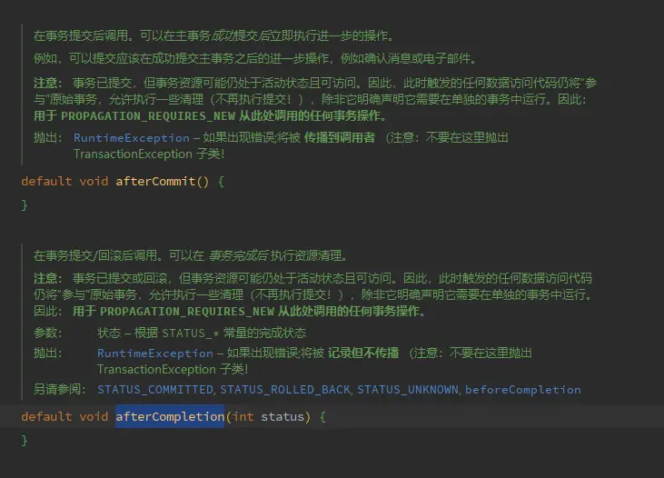

---

title: "TransactionSynchronizationManager#registerSynchronization方法 afterCommit afterCompletion 坑记录"
slug: "TransactionSynchronizationManager#registerSynchronization方法 afterCommit afterCompletion 坑记录"
description:
date: "2023-10-26"
lastmod: "2023-10-26"
image:
math:
license:
hidden: false
draft: false
categories: ["踩坑记录"]
tags: ["SpringBoot","事务"]

---
#### 坑场景

#### 1. 事务 A 里面注册事务成功回调 B，B 为一个加了 @Transactional 注解的方法。但结果会导致 B 里面的事务失效。

#### 坑场景

#### 1.事务A里面注册事务成功回调B，B为一个加了@Transactional注解的方法。但结果会导致B里面的事务失效。

参考jdk注解：



注意描述：不再执行提交，除非它明确声明它需要在单独的事务中运行。

#### 2.事务A里面注册回调B，回调B里面注册回调C，回调C不会执行。

原因跟1里面一样，因为回调B就算加了@Transactional注解，由于没有自定义传播行为，则相当于没有添加事务（这里得注意，通过TransactionSynchronizationManager#isSynchronizationActive判断，事务仍是活动状态，但实际回调B里面相当于没有事务）所以回调C不会执行。

#### 解决

```text
public class TransactionUtil {
    private static volatile TransactionHelper TRANSACTION_HELPER;


    public static void doSomethingIfCommittedOrNow(Runnable runnable){
        if( TransactionSynchronizationManager.isSynchronizationActive()){
            TransactionSynchronizationManager.registerSynchronization( new TransactionSynchronizationAdapter() {
                @Override
                public void afterCommit() {
                    transactionHelper().doRequiredNewTransaction(()->{
                        runnable.run();
                    });

                }
            });
        }else{
            runnable.run();
        }

    }
    public static void doSomethingIfCompletionOrNow(Consumer<Integer> consumer){
        if( TransactionSynchronizationManager.isSynchronizationActive()){
            TransactionSynchronizationManager.registerSynchronization( new TransactionSynchronizationAdapter() {
                @Override
                public void afterCompletion(int status) {
                    transactionHelper().doRequiredNewTransaction(()->{
                        consumer.accept(status);
                    });
                }
            });
        }else{
            consumer.accept(null);
        }

    }

    public static TransactionHelper transactionHelper(){
        if(TRANSACTION_HELPER == null){
            TRANSACTION_HELPER = SpringUtil.getBean(TransactionHelper.class);
            return TRANSACTION_HELPER;
        }else{
            return TRANSACTION_HELPER;
        }
    }
}

@Component
public class TransactionHelper {


    @Transactional
    public <T> T doRequiredTransaction(Supplier<T> supplier) {
        return supplier.get();
    }

    @Transactional
    public void doRequiredTransaction(Runnable  runnable) {
         runnable.run();
    }


    @Transactional(propagation = Propagation.REQUIRES_NEW)
    public <T> T doRequiredNewTransaction(Supplier<T> supplier) {
        return supplier.get();
    }

    @Transactional(propagation = Propagation.REQUIRES_NEW)
    public void doRequiredNewTransaction(Runnable  runnable) {
         runnable.run();
    }


    @Transactional(propagation = Propagation.NESTED)
    public <T> T doNestedTransaction(Supplier<T> supplier) {
        return supplier.get();
    }

    @Transactional(propagation = Propagation.NESTED)
    public void doNestedTransaction(Runnable  runnable) {
        runnable.run();
    }
}
```

只需要每次回调的时候在新事务里面就行了（原先的工具类没有添加新事务）。

参考 jdk 注解：


#### 2. 事务 A 里面注册回调 B，回调 B 里面注册回调 C，回调 C 不会执行。

原因跟 1 里面一样，因为回调 B 就算加了 @Transactional 注解，由于没有自定义传播行为，则相当于没有添加事务（这里得注意，通过 TransactionSynchronizationManager#isSynchronizationActive 判断，事务仍是活动状态，但实际回调 B 里面相当于没有事务）所以回调 C 不会执行。

#### 解决

public class TransactionUtil {

    private static volatile TransactionHelper TRANSACTION_HELPER;

    public static void doSomethingIfCommittedOrNow(Runnable runnable){

      if( TransactionSynchronizationManager.isSynchronizationActive()){

        TransactionSynchronizationManager.registerSynchronization( new TransactionSynchronizationAdapter() {

          @Override

          public void afterCommit() {

            transactionHelper().doRequiredNewTransaction(()->{

              runnable.run();

            });

          }

        });

      }else{

        runnable.run();

      }

    }

    public static void doSomethingIfCompletionOrNow(Consumer<Integer> consumer){

      if( TransactionSynchronizationManager.isSynchronizationActive()){

        TransactionSynchronizationManager.registerSynchronization( new TransactionSynchronizationAdapter() {

          @Override

          public void afterCompletion(int status) {

            transactionHelper().doRequiredNewTransaction(()->{

              consumer.accept(status);

            });

          }

        });

      }else{

        consumer.accept(null);

      }

    }

    public static TransactionHelper transactionHelper(){

      if(TRANSACTION_HELPER == null){

        TRANSACTION_HELPER = SpringUtil.getBean(TransactionHelper.class);

        return TRANSACTION_HELPER;

      }else{

        return TRANSACTION_HELPER;

      }

    }

}

@Component

public class TransactionHelper {

    @Transactional

    public <T> T doRequiredTransaction(Supplier<T> supplier) {

      return supplier.get();

    }

    @Transactional

    public void doRequiredTransaction(Runnable  runnable) {

      runnable.run();

    }

    @Transactional(propagation = Propagation.REQUIRES_NEW)

    public <T> T doRequiredNewTransaction(Supplier<T> supplier) {

      return supplier.get();

    }

    @Transactional(propagation = Propagation.REQUIRES_NEW)

    public void doRequiredNewTransaction(Runnable  runnable) {

      runnable.run();

    }

    @Transactional(propagation = Propagation.NESTED)

    public <T> T doNestedTransaction(Supplier<T> supplier) {

      return supplier.get();

    }

    @Transactional(propagation = Propagation.NESTED)

    public void doNestedTransaction(Runnable  runnable) {

      runnable.run();

    }

}

只需要每次回调的时候在新事务里面就行了（原先的工具类没有添加新事务）。

注意描述：不再执行提交，除非它明确声明它需要在单独的事务中运行。


本文原载于[runningccode.github.io](https://runningccode.github.io)，遵循CC BY-NC-SA 4.0协议，复制请保留原文出处。