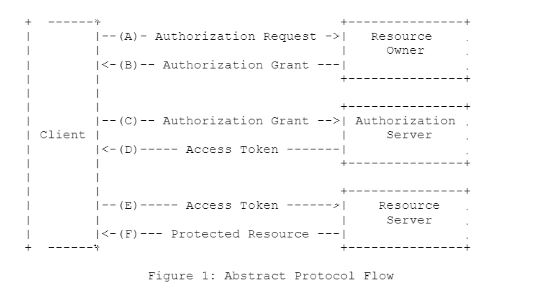

---

title: "1106 授权与认证之OAuth"
slug: "1106 授权与认证之OAuth"
description:
date: "2023-11-06T14:15:25+08:00"
lastmod: "2023-11-06T14:15:25+08:00"
math:
license:
hidden: false
draft: false
categories: ["学习笔记"]
tags: ["OAuth","授权"]

---
# 前言
## 关于授权
`即根据用户身份授予他访问特定资源的权限。`
如果你的角色是一个服务提供商，可能会涉及到需要给第三方授权使用自己系统的资源。
如果你的角色是一个客户端应用程序或客户端的后台服务，可能会涉及到需要访问第三方服务上存在的资源。
你需要参考业界关于授权的主流协议：OAuth,OIDC,PKCE。
## 关于认证
`即确认该用户的身份是他所声明的那个人`
如果你的角色是一个单点登录系统下的某个客户端后台服务,需要考虑如何认证用户是否可以访问自己系统的资源。
你需要参考业界关于认证主流协议：OIDC,CAS
## 关于本文
本文主要介绍OAuth。后面持续了解其他协议再补充。
# 协议介绍
## OAuth协议
我们聊的OAuth，一般指OAuth2.0,因为2.0出来之后1.0就废弃了。

### 角色
- 资源所有者 能够授权对受保护资源进行访问的实体，一般是用户
- 资源服务器 托管受保护资源，能够响应受保护资源的请求
- 客户端 代表资源所有者发出请求到资源服务器，请求资源访问的程序。oauth并不局限其为一个本地客户端还是一个后台服务。
- 授权服务器 验证资源所有者身份，并颁发令牌给客户端

以上，资源服务器和授权服务器是相互信任的，可以是一个实体也可以是两个实体，以下我称之为服务提供商。

### 问题
传统的客户端-服务端认证模型，客户端直接通过使用资源所有者的凭据（账号密码）访问资源服务器获取受限访问的资源，但如果我们需要给第三方程序提供受限资源的访问，
这可能会带来某些问题。
- 资源所有者需要与第三方程序共享资源服务器的凭据
- 资源服务器需要支持第三方程序使用凭据验证获取资源的方式
- 做不到更细粒度的权限控制，第三方可能会获取资源所有者更广泛的权限。
- 做不到授权行为的细粒度控制，即只撤销某个第三方的权限而不影响其他第三方
- 凭据容易被泄露

### OAuth 解决的问题
- 隔离客户端角色和资源所有者角色,他们使用不同的凭据。
- 服务商可以通过控制客户端角色的凭据，控制其生命周期，访问范围的。

### OAuth 协议流程

以上协议流程可以看到，OAuth本质上只描述了客户端请求资源所有者进行授权拿到Authorization Grant(代表资源所有者已授权的凭证)， 
拿到资源所有者的授权之后请求认证服务器颁发AccessToken， 然后通过AccessToken请求资源服务器的资源。

### 四种实现

对于客户端获取Authorization Grant,以及使用Authorization Grant换取AccessToken的过程,
OAuth协议中定义了4种类型(但没否定其他类型的扩展机制)。

接下来具体介绍这四种模式及应用场景。
#### Authorization Code——授权码模式
- 应用场景: 客户端有后台，AccessToken可以得到有效保护。
客户端获取Authorization Grant的过程，是通过将用户重定向到授权服务器，授权服务器对资源所有者进行身份验证，
然后再由授权服务器携带Authorization Code参数重定向到客户端，这里的Authorization Grant就是Authorization Code-授权码。
然后客户端使用Authorization Code请求认证服务器，认证服务器对客户端进行身份验证，然后返回客户端AccessToken。
这种方式避免了客户端与资源所有者共享资源所有者用于向认证服务器进行身份验证的凭证。保护了授权服务器对资源所有者进行认证的能力。
#### Implicit——隐式授权模式
- 应用场景：客户端就是个纯前端应用，只能将AccessToken暴露到前端
- 相比授权码模式，隐式授权的是将放回Authorization Code的步骤省略掉，而直接返回AccessToken。
比如客户端重定向到授权服务器，用户输入凭证进行授权后，权授权服务器携带AccessToken参数重定向到客户端。
但是其弊端在于,因为是直接返回AccessToken返回给客户端，省略了客户端的身份验证，AccessToken可能暴露给资源所有者
或有权访问资源所有者的用户代理程序。
#### Resource Owner Password Credentials——密码模式
- 使用场景：在隐式授权的基础上，资源所有者如果能完全信任客户端
- 资源所有者直接将自己的密码凭证提供给客户端，客户端再使用这个凭证请求向授权服务器请求AccessToken或RefreshToken。
其与传统的直接使用密码凭证向资源服务器请求资源相比，就是多了个AccessToken或RefreshToken的机制，可以让客户端不
保存密码凭证，但其适用场景仅仅在于资源所有者和客户端的关系高度密切，存在高度信任，比如客户端就是操作系统，
且其他授权认证类型不可用时使用。
#### Client Credentials——客户端模式
- 应用场景： 授权资源范围完全属于客户端控制下的资源可用。这句话比较难以理解，我的理解为，认证服务器压根不需要验证资源所有者身份，
他认证了客户端的凭证，就相当于认证了资源所有者。
- 客户端给授权服务器的凭证已经可以当做资源所有者的Authorization Grant，比密码模式还夸张，意思就是用户不使用自己的密码，
而是客户端只要证明自己是客户端，授权服务器就可以给客户端颁发用于访问资源所有者资源的AccessToken。

### 参考文献

[单点登录协议有哪些？CAS、OAuth、OIDC、SAML有何异同？](https://www.cloudentify.com/archives/834)
[RFC 6749 - The OAuth 2.0 Authorization Framework](https://datatracker.ietf.org/doc/html/rfc6749)
[OAuth2.0授权协议+4种认证模式了解](https://blog.csdn.net/weixin_45559449/article/details/129258158)

### 版权信息

本文原载于[runningccode.github.io](https://runningccode.github.io)，遵循CC BY-NC-SA 4.0协议，复制请保留原文出处。