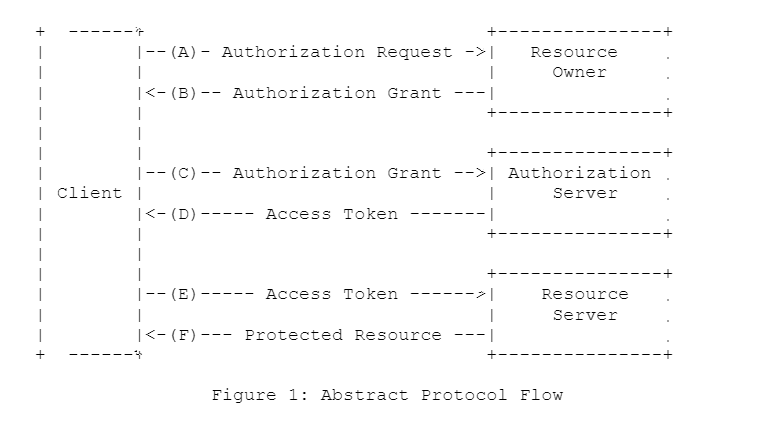

# 前言
## 关于授权
`即根据用户身份授予他访问特定资源的权限。`
如果你的角色是一个服务提供商，可能会涉及到需要给第三方授权使用自己系统的资源。
如果你的角色是一个客户端应用程序或客户端的后台服务，可能会涉及到需要访问第三方服务上存在的资源。
你需要参考业界关于授权的主流协议：OAuth,OIDC,PKCE。
## 关于认证
`即确认该用户的身份是他所声明的那个人`
如果你的角色是一个单点登录系统下的某个客户端后台服务,需要考虑如何认证用户是否可以访问自己系统的资源。
你需要参考业界关于认证主流协议：OIDC,CAS
## 关于本文
本文主要介绍授权，参考了OAuth2.0和OAuth2.1(草案阶段)。后面持续了解其他协议再补充。
# 协议介绍
## OAuth协议
我们聊的OAuth，一般指OAuth2.0,因为2.0出来之后1.0就废弃了。

### 角色
- 资源所有者 能够授权对受保护资源进行访问的实体，一般是用户
- 资源服务器 托管受保护资源，能够响应受保护资源的请求
- 客户端 代表资源所有者发出请求到资源服务器，请求资源访问的程序。oauth并不局限其为一个本地客户端还是一个后台服务。
- 授权服务器 验证资源所有者身份，并颁发令牌给客户端

以上，资源服务器和授权服务器是相互信任的，可以是一个实体也可以是两个实体，以下我称之为服务提供商。

### 问题
传统的客户端-服务端认证模型，客户端直接通过使用资源所有者的凭据（账号密码）访问资源服务器获取受限访问的资源，但如果我们需要给第三方程序提供受限资源的访问，
这可能会带来某些问题。
- 资源所有者需要与第三方程序共享资源服务器的凭据
- 资源服务器需要支持第三方程序使用凭据验证获取资源的方式
- 做不到更细粒度的权限控制，第三方可能会获取资源所有者更广泛的权限。
- 做不到授权行为的细粒度控制，即只撤销某个第三方的权限而不影响其他第三方
- 凭据容易被泄露

### OAuth 解决的问题
- 隔离客户端角色和资源所有者角色,他们使用不同的凭据。
- 服务商可以通过控制客户端角色的凭据，控制其生命周期，访问范围的。

### OAuth 协议流程

以上协议流程可以看到，OAuth本质上只描述了客户端请求资源所有者进行授权拿到Authorization Grant(代表资源所有者已授权的凭证)， 
拿到资源所有者的授权之后请求认证服务器颁发AccessToken， 然后通过AccessToken请求资源服务器的资源。

### 四种实现

对于客户端获取Authorization Grant,以及使用Authorization Grant换取AccessToken的过程,
OAuth协议中定义了4种类型(但没否定其他类型的扩展机制)。

接下来具体介绍这四种模式及应用场景。
#### Authorization Code——授权码模式

客户端获取Authorization Grant的过程，是通过将用户重定向到授权服务器，授权服务器对资源所有者进行身份验证，
然后再由授权服务器携带Authorization Code参数重定向到客户端，这里的Authorization Grant就是Authorization Code-授权码。
然后客户端使用Authorization Code请求认证服务器，认证服务器对客户端进行身份验证，然后返回客户端AccessToken和RefreshToken。
这种方式避免了客户端与资源所有者共享资源所有者用于向认证服务器进行身份验证的凭证。保护了授权服务器对资源所有者进行认证的能力。
##### 应用场景
- 基于重定向，所以资源所有者的用户代理通常是浏览器。
- 客户端必须能够与资源所有者的用户代理交互，所以客户端通常是后端服务器，要不就是前端页面脚本。

#### Implicit——隐式授权模式

相比授权码模式，隐式授权的是将放回Authorization Code的步骤省略掉，而直接返回AccessToken。
比如客户端重定向到授权服务器，用户输入凭证进行授权后，授权服务器携带AccessToken参数重定向到客户端。
但是其弊端在于,因为是直接返回AccessToken返回给客户端，省略了客户端的身份验证，AccessToken可能暴露给资源所有者或
有权访问资源所有者的用户代理的其他程序。
##### 应用场景
- 因为客户端本身是纯前端或本地易抓包应用， 无法安全保管AccessToken或客户端凭证,所以索性省略客户端的身份验证。简化验证流程。
- 基于重定向，所以资源所有者的用户代理通常是浏览器。
- 客户端必须能够与资源所有者的用户代理交互,所以一般是前端页面脚本，为什么不是后端服务器，因为如果是就能使用授权码更安全一点了。
- OAUTH2.1中已移除，就算客户端本身是纯前端无后端服务，也可以使用PKCE+授权码模式加强安全性，防止恶意的攻击。

#### Resource Owner Password Credentials——密码模式

资源所有者直接将自己的密码凭证提供给客户端，客户端再使用这个凭证请求向授权服务器请求AccessToken或RefreshToken。
其与传统的直接使用密码凭证向资源服务器请求资源相比，就是多了个AccessToken或RefreshToken的机制，可以让客户端不
保存密码凭证，但其适用场景仅仅在于资源所有者和客户端的关系高度密切，存在高度信任，比如客户端就是操作系统，
且其他授权认证类型不可用时使用。

##### 应用场景
- 以上模式不可用的时候才用
- 资源所有者如果能完全信任客户端，比如客户端是操作系统或其他高权限应用

#### Client Credentials——客户端模式

他认证了客户端的凭证，就相当于认证了资源所有者。 客户端给授权服务器的凭证已经可以当做资源所有者的Authorization Grant，
比密码模式还夸张，意思就是用户不使用自己的密码，
而是客户端只要证明自己是客户端，授权服务器就可以给客户端颁发用于访问资源所有者资源的AccessToken。
##### 应用场景
- 认证服务器认为能安全的授权资源给客户端使用。
- 认证服务器认为授权资源的范围能够给客户端使用。
- 比如客户端是机密的客户端。意味着客户端不可能是前端应用， 而只能是尽量安全的应用比如后台服务。

## OAuth2.1
RFC中该协议处于草案阶段
####变化
#### 引入PKCE(Proof Key for Code Exchange)，最佳实践变成了Authorization Code + PKCE
##### PKCE解决的问题

如图在一个授权码标准流程中，在步骤（1）中，运行在终端设备（如智能手机）上的本机应用程序通过浏览器/操作系统发出OAuth 2.0授权请求。
在这种情况下，重定向端点URI通常使用自定义URI协议。步骤（1）通过无法被拦截的安全API发生，
尽管它可能会在高级攻击场景中被窥探。 步骤（2）中，请求被转发到OAuth 2.0授权服务器。
由于OAuth需要使用TLS，因此此通信受TLS保护，无法被拦截。
授权服务器在步骤（3）中返回授权码。 在步骤（4）中，授权码通过步骤（1）中提供的重定向端点URI返回给请求者。
请注意，除了合法的OAuth 2.0应用程序之外。 恶意应用程序还可能将自己注册为自定义URL Scheme的处理程序。
一旦这样做，恶意应用程序现在就能够在步骤（4）中拦截授权码。这允许攻击者分别在步骤（5）和（6）中请求和获取访问令牌

PKCE主要是针对使用授权码授权流程的OAuth 2.0客户端应用，特别是那些运行在移动设备或其他不可信环境中的客户端应用。
在这些场景下，应用可能会面临授权码劫持攻击。攻击者通过恶意应用程序窃取并使用授权码，企图伪装成合法的客户端以获取对用户资源的访问权限。

这里重要的前提有：
- 恶意应用可以获取到ClientId和Secret,。在非后台服务的应用中预配的密钥不能被视为绝对安全，所以攻击还是可能发生。
- 恶意应用注册了相同的自定义URI协议，这会导致本来跳转到服务提供商提供的用户代理程序变为恶意应用，导致请求被劫持
##### 流程

#### 使用精确字符串匹配来比较重定向 URI
在OAuth 2.0中，对重定向URI的匹配有时允许部分匹配或者模糊匹配，
这可能导致攻击者提供类似的重定向URI来试图截获授权码。在OAuth 2.1中，
比较重定向URI的过程被限制为只允许精确字符串匹配，这增加了安全性，
降低了攻击者使用伪造或类似重定向URI进行中间人攻击的风险。
#### 移除了隐式授权模式
OAuth 2.0的隐式授权模式是设计用于单页面应用（SPA）的，目的是便捷地为SPA提供访问令牌。
在隐式模式中，访问令牌直接通过URL从授权服务器返回给客户端。
然而，这种模式存在安全问题，例如令牌可能被记录在浏览器的历史记录中或被泄漏给第三方。OAuth 2.1移除了隐式授权模式，而是推荐使用更安全的授权码模式结合PKCE（Proof Key for Code Exchange），这为前端应用提供了更高的安全性。
#### 移除了密码模式
不安全：密码模式需要用户直接向客户端应用程序提供用户名和密码，如果客户端应用不能被完全信任（也就是除非它是资源所有者自己的应用），有可能造成密码泄露的风险。另一个问题是，一旦授权给了客户端，它就可能无限期地访问用户的资源，直到用户更改密码。

体验不佳：密码模式需要用户直接在客户端应用中输入用户名和密码，这对用户而言是一种不佳的体验，特别是在涉及多因素认证或其他复杂身份验证方法时。

缺乏灵活性：密码模式不支持用户对应用访问资源的精细划分控制。用户无法限制应用的访问权限，例如只读或特定的资源。
#### 移除了在url中使用token的方式
在OAuth 2.0中，访问令牌可能被通过URL片段进行传递。这可能导致安全问题，因为URL片段可能会暴露给第三方或被记录在服务器日志中。
在OAuth 2.1中，规范删除了在URL中使用token的方式， 要求访问令牌在HTTP请求头中以Authorization头字段的形式传递，以此增加访问令牌的传递安全性。
#### 刷新令牌必须进行身份验证或只能一次性使用
在OAuth 2.0中，刷新令牌可以多次使用，直到达到设定的过期时间。这可能为攻击者提供了窃取刷新令牌的机会，从而恶意获取新的访问令牌。在OAuth 2.1中，
要求刷新令牌在使用后立即失效，并生成一个新的刷新令牌，或者要求客户端在使用刷新令牌时进行身份验证，以此增加安全性。
#### 授权码模式中请求AccessToken时不再包含redirect_uri参数 
因为提出了PKCE,原有的redirect_uri参数功能被PCKE模式替代了。

### 最佳实践

1. 网页应用授权

使用授权码模式+PKCE，任何情况下都废弃隐式授权

2. 原生应用授权

与单页应用程序一样，移动应用程序也无法维护客户端机密的保密性。因此，移动应用程序还必须使用不需要客户端机密的OAuth流。
当前的最佳做法是将授权码模式与PKCE一起使用，同时启动外部浏览器，以确保本机应用程序无法修改浏览器窗口或检查内容。

3. 没有浏览器或没有输入设备的设备，比如在智能电视、媒体控制台、相框、打印机或硬件视频编码器等设备

使用设备授权授予模式-rfc8628：

- （A）客户端从授权服务器请求访问，并在请求中包括其客户端标识符。
- （B）授权服务器发出设备代码和终端用户代码，并提供最终用户验证URI。
- （C）客户端指示终端用户使用另一个设备上的用户代理，并访问提供的终端用户验证URI。客户端向用户提供终端用户代码以供输入
，以便审查授权请求。
- （d）授权服务器对终端用户进行身份验证（通过用户代理），并提示用户输入设备客户端提供的用户代码。
授权服务器验证用户提供的用户代码，并提示用户接受或拒绝请求。
- （e）在终端用户审查客户端的请求的同时（步骤D），客户端重复轮询授权服务器，以查明用户是否完成了用户授权步骤。
客户端包括设备代码及其客户端标识符。
- （f）授权服务器验证客户端提供的设备代码，并且如果授予客户端访问权限，则以访问令牌响应，如果拒绝访问，则以错误响应，
或者以指示客户端应继续轮询。

### 参考文献

[单点登录协议有哪些？CAS、OAuth、OIDC、SAML有何异同？](https://www.cloudentify.com/archives/834)

[OAuth 2.0 — OAuth](https://oauth.net/2/)

[RFC 6749 - The OAuth 2.0 Authorization Framework](https://datatracker.ietf.org/doc/html/rfc6749)

[RFC 6750 - The OAuth 2.0 Authorization Framework: Bearer Token Usage](https://datatracker.ietf.org/doc/html/rfc6750)

[OAuth2.0授权协议+4种认证模式了解](https://blog.csdn.net/weixin_45559449/article/details/129258158)

[OAuth 2 和 OAuth 2.1 之间的差异](https://blog.csdn.net/ChaITSimpleLove/article/details/128199813)

[draft-ietf-oauth-v2-1-09](https://datatracker.ietf.org/doc/html/draft-ietf-oauth-v2-1-09)

[Proof Key for Code Exchange by OAuth Public Clients](https://datatracker.ietf.org/doc/html/rfc7636)

[RFC 8628 - OAuth 2.0 Device Authorization Grant](https://datatracker.ietf.org/doc/html/rfc8628)

### 版权信息

本文原载于[runningccode.github.io](https://runningccode.github.io)，遵循CC BY-NC-SA 4.0协议，复制请保留原文出处。