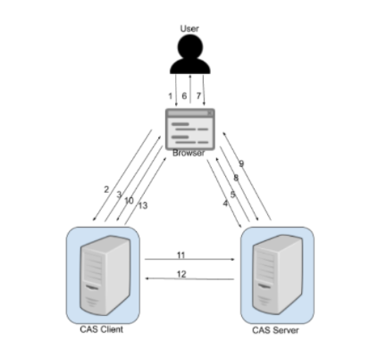
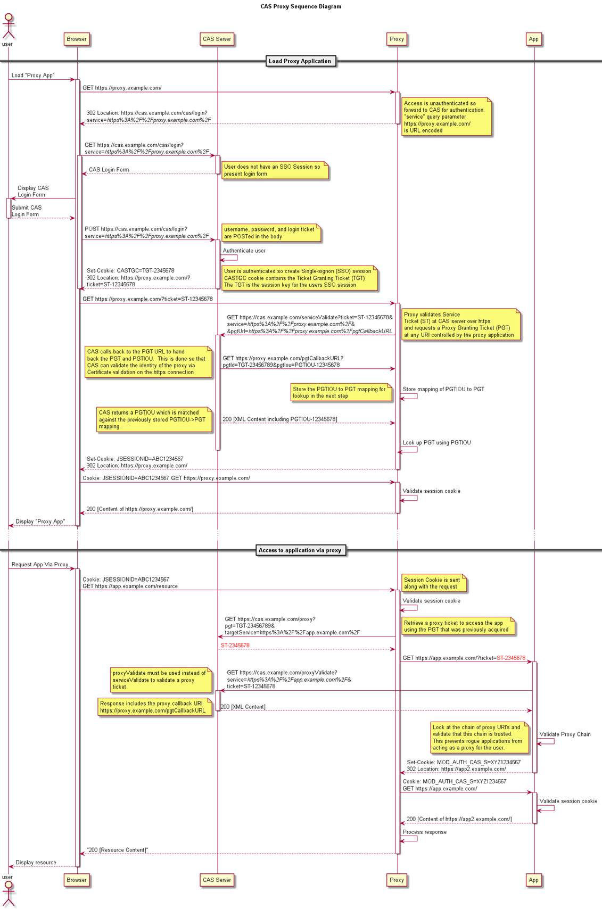
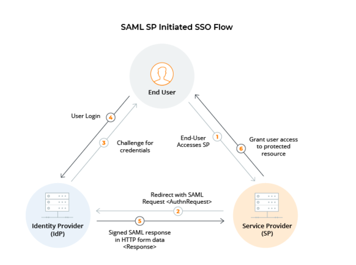

# 常见SSO协议
常见的SSO协议包括OIDC,CAS,SAML。接下来依次学习。
## OIDC-OpenID Connect
OIDC-OpenID Connect,是基于OAuth的扩展协议。
### 解决的问题
OAuth2.0只是描述授权的协议，并不关心客户端是否能验证用户是谁，而只关心获取用户数据的权利。
但OIDC提出了一个ID令牌的概念，这个ID令牌就是JSON Web Token（JWT）,携带OP(对应OAUTH中的认证服务器)认证用户之后获取的用户身份相关信息。
当RP(对应OAuth的客户端)收到这个ID令牌后,就知道了用户是谁，不光能解决授权问题，也能解决用户认证问题，常用于SSO单点登录场景。
### OIDC中的角色
- OP OpenID Provider,OpenId提供商,对应OAUTH中的认证服务器
- RP Relying Party,依赖方，对应OAuth中的客户端
### 三种模式
对应的，OIDC中也规定了三种获取OpenId的流程
#### authorization code flow 授权码流
最常用的流程，主要用在web应用以及原生app场景。id token主要依靠后端而不是前端比如javascript和OP进行交互来获取。
##### 流程
1. 客户端准备一个包含所需请求参数的身份验证请求。
2. 客户端将请求发送到授权服务器。
3. 授权服务器对终端用户进行身份验证。
4. 授权服务器获得终端用户的同意/授权。
5. 授权服务器使用授权代码将终端用户重定向回客户端。
6. 客户端使用令牌端点的授权码请求响应。
7. 客户端接收响应，该响应在响应正文中包含ID Token和Access Token。
8. 客户端验证ID令牌并检索终端用户的唯一标识符。
#### implicit flow 隐式流
对于基于浏览器（javascript）的应用，它们往往没有后端，id token是直接从OP的重定向里面得到的（依靠前端代码）。
##### 流程
Client prepares an Authentication Request containing the desired request parameters.
1. 客户端准备一个包含所需请求参数的身份验证请求。
2. 客户端将请求发送到授权服务器。
3. 授权服务器对终端用户进行身份验证。
4. 授权服务器获得终端用户的同意/授权。
5. 授权服务器将终端用户发送回一个ID令牌，如果请求，还有一个访问令牌。
6. 客户端验证ID令牌并检索终端用户的唯一标识符。
#### hybrid flow 混合流
上面两种方式的综合，前后端独立获取id token，这种方式很少使用
##### 流程
1. 客户端准备一个包含所需请求参数的身份验证请求。
2. 客户端将请求发送到授权服务器。
3. 授权服务器对终端用户进行身份验证。
4. 授权服务器获得终端用户的同意/授权。
5. 授权服务器将终端用户发送回客户端，其中包含授权代码和一个或多个附加参数（取决于response_type）。
6. 客户端使用授权码请求授权服务器的令牌接口。
7. 客户端接收响应，该响应在响应正文中包含ID Token和Access Token。
8. 客户端验证ID令牌并检索终端用户的主题标识符。
### 总结
OIDC的授权码流和隐式流分别对应OAuth中的授权码模式和隐式模式授权模式,只不过多返回了个IDToken。而混合流则是隐式授权模式+授权码模式
在授权服务器响应授权码code和请求AccessToken时都可以响应ID_TOKEN和AccessToken。
## CAS
CAS是一种仅用于Authentication的服务，它和OAuth/OIDC协议不一样，并不能作为一种Authorization的协议。
当前CAS协议包括CAS 1.0、CAS2.0、CAS3.0版本，这三个版本的认证流程基本类似。
### 角色
- Client: 通常为使用浏览器的用户

- CAS Client: 实现CAS协议的Web应用

- CAS Server: 作为统一认证的CAS服务器

### Ticket
- TGT：Ticket Grangting Ticket

为用户签发的登录票据，其中封装了Cookie的值（Cookie值中包含用户信息），用户CAS认证通过后，
CAS Server生成TGT存储在缓存中，并生成TGC（Ticket Grangting Cookie）理解为sessionId，写入浏览器。
HTTP请求到达时，会验证是否包含TGC，包含则以此为key在缓存中查找TGT，如果有说明用户登录过并且未过期，如果没有需要重新登录。

- TGC：Ticket Grangting Cookie 

上面提到的TGT存入缓存中，而TGC即为缓存标识，通过TGC寻找到TGT。

- ST：Service Ticket

用户访问某一Service的票据。当用户调用CAS Client某一Service时，会验证用户是否含有ST，如果没有，则要求用户到CAS Server获取ST， 如果用户请求中包含TGC，
则CAS会以此查找缓存中的TGT，如果存在TGT，则用此TGT签发ST，返回给用户。
用户凭借ST再次访问该Service，Service携带ST到CAS Server进行验证，验证通过后允许用户访问资源。
了保证安全，ST是随机生成的，另外，CAS规定，CAS只能存活一定的时间，并且规定ST只能使用一次，无论ST是否验证成功，CAS Server都会清除服务端缓存中的该Ticket，保证同一个ST不能被使用两次。

- PGT: Proxy Granting Ticket
  
Proxy Service的代理凭据。用户通过CAS成功登录某一Proxy Service后，CAS生成一个PGT对象，
缓存在CAS本地，同时将PGT的值（一个UUID字符串）回传给Proxy Service， 并保存在Proxy Service里。
Proxy Service拿到PGT后，就可以为Target Service（back-end service）做代理，为其申请PT。

- PGTIOU（Proxy Granting Ticket I Owe You）

PGTIOU是CAS协议中定义的一种附加票据，它增强了传输、获取PGT的安全性。
PGT的传输与获取的过程：Proxy Service调用CAS的serviceValidate接口验证ST成功后，CAS首先会访问pgtUrl指向的https url，
将生成的 PGT及PGTIOU传输给proxy service，proxy service会以PGTIOU为key，PGT为value，
将其存储在Map中；然后CAS会生成验证ST成功的xml消息，返回给Proxy Service，
xml消息中含有PGTIOU，proxy service收到Xml消息后，会从中解析出PGTIOU的值，
然后以其为key，在map中找出PGT的值，赋值给代表用户信息的Assertion对象的pgtId，同时在map中将其删除。

- PT（Proxy Ticket）

PT是用户访问Target Service（back-end service）的票据。如果用户访问的是一个Web应用，则Web应用会要求浏览器提供ST，
浏览器就会用cookie去CAS获取一个ST，然后就可以访问这个Web应用了。
如果用户访问的不是一个Web应用，而是一个C/S结构的应用，
因为C/S结构的应用得不到cookie，所以用户不能自己去CAS获取ST，而是通过访问proxy service的接口，
凭借proxy service的PGT去获取一个PT，然后才能访问到此应用。

### 流程

第一步：

1、用户请求客户端，客户端验证本地Session没有该用户信息。

2、客户端检测到此次请求中没有ST。

3、客户端返回给用户Redirect响应，到CAS Server，携带service参数，例如：

302 Location : https://cas.example.com/cas/login?service=http0%3A8081%2F

第二步：

1、CAS Server检测到该次请求中不包含TGC，跳转到登录页。

2、用户输入用户名密码进行登录认证，成功后CAS Server生成TGT（集成用户信息及ST），并随机生成TGC，将TGC写入Cookie。

3、CAS Server返回给用户Redirect响应，到service中的地址，携带ST参数及包含TGC的Cookie，例如：

Set-Cookie : CASTGC=TGT-2345678

302 Location : http://baidu.com/web1?ticket=ST-5-Sx6eyvj7cPPCfn0pMZ

第三步：

1、用户携带ticket(ST)再次请求CAS Client，客户端Authentication Filter检测到请求中带有ticket参数，会跳过，由Ticket Validation Filter处理。

2、Ticket Validation Filter 携带ticket(ST)及service访问CAS Server的/serviceValidate接口，希望CAS Server验证ST有效性。

3、CAS Server验证成功，将用户信息通过xml方式返回给Ticket Validation Filter，当该Filter接收到验证成功的响应时，把用户信息存入缓存。至此，SSO会话成功建立。

第四步：

1、Client将用户信息存入缓存，并生成SessionId写入cookie，返回给用户Redirect响应，到用户请求的服务地址。 例如：

Set-Cookie : JSESSIONID=ABC123456

302 Location : http://baidu.com/web1

2、用户接下来的访问只需要验证SessionId即可，无需再向CAS Server请求验证。

当用户访问同一个CAS Server但是不同的CAS Client时：

1、同样CAS Client2检测缓存中没有该次请求的用户信息，没有ST，Client2返回给用户Redirect响应，携带service参数，到CAS Server。

2、这是用户第二次访问CAS Server，此时Request的Cookie中会携带第一次签发的TGC，CAS Server根据TGC查找缓存中是否有对应的TGT，例如：

Set-Cookie : CASTGC=TGT-2345678

302 Location : https://cas.example.com/cas/login?service=http://app.com/web

3、如果有，说明用户登录过且未过期，用户不必再次登陆，CAS Server会直接找到TGT签发ST，返回给客户端Redirect响应，到service中的地址，例如：

Set-Cookie : CASTGC=TGT-2345678

302 Location : http://app.com/web?ticket=ST-8-SoIdlj7cPPCfn0pMZ

4、用户携带ticket(ST)再次请求CAS Client，客户端Authentication Filter检测到请求中带有ticket参数，会跳过，由Ticket Validation Filter处理。

5、Ticket Validation Filter 携带ticket(ST)及service访问CAS Server的/serviceValidate接口，希望CAS Server验证ST有效性。

6、CAS Server验证成功，将用户信息通过xml方式返回给Ticket Validation Filter，当该Filter接收到验证成功的响应时，把用户信息存入缓存。至此，SSO会话成功建立。

7、Client将用户信息存入缓存，并生成SessionId写入cookie，返回给用户Redirect响应，到用户请求的服务地址。例如：

Set-Cookie : JSESSIONID=ABC123456

302 Location : http://app.com/web

8、用户接下来的访问只需要验证SessionId即可，无需再向CAS Server请求验证。

### 代理模式
CAS2.0后，引入代理模式，CAS服务能够充当另一个CAS服务的代理，传输用户身份。

#### 使用场景
当浏览器用户访问代理应用A，代理应用A中调用了被代理应用B的授权性资源，代理应用A想代表用户去访问被代理应用B，
因此代理应用A需要告诉被代理应用B当前用户是谁，以便被代理应用B对当前的用户请求进行授权。

代理的前提是需要 CAS Client 拥有用户的身份信息 ( 类似凭据 ) 。
之前我们提到的 TGC 是用户持有对自己身份信息的一种凭据，这里的 PGT 就是 CAS Client 端持有的对用户身份信息的一种凭据。
凭借TGC，User 可以免去输入密码以获取访问其它服务的 Service Ticket 。
所以，这里凭借 PGT ， Web应用可以代理用户去实现后端的认证，而 无需前端用户的参与 。

#### 流程图

与CAS1.0的区别在于，在客户端使用ST找CAS验证有效性的时候携带一个回调url，让CAS回传,CAS回调的时候会携带PGT和PGTIOU,
之后如果要向被代理服务请求资源的时候，将用PGT去CAS换取ST以请求被代理服务。

### CAS 3.0
CAS又引入了基于SAML对Service Ticket进行校验。

### 总结
CAS是较老的协议，解决的场景比较单一，更适用于企业内部系统，尤其是对于已经部署了CAS的环境，在安全性较高，开放性较高的场景下，
更建议使用OIDC+PKCE来实现单点登录。

## SAML
### 角色
- IdP: 身份提供者
- SP: 服务提供者

### 流程

1. 用户访问服务提供者（SP）：
- 用户试图访问某个受保护的服务，如Web应用或资源。
2. 服务提供者（SP）重定向至身份提供者（IdP）：
- 由于用户尚未被认证，服务提供者将用户重定向至指定的身份提供者（IdP）。
3. 身份提供者认证用户：
- 用户在身份提供者进行身份验证。这通常包括提供用户名和密码等凭据。
4. 生成SAML响应：
- 一旦用户被身份提供者成功认证，身份提供者将生成SAML响应。
- SAML响应包括身份断言（Assertion），其中包含用户的身份信息，以及可能的其他信息，如授权信息、过期时间等。
5. SAML断言传递给用户：
- SAML断言被签名加密被传递回服务提供者。这通常是通过浏览器重定向(base64附加到参数)进行传递。
6. 服务提供者验证SAML断言：
- 服务提供者接收到SAML断言后，会验证断言的签名和信任相关的身份提供者。
- 如果验证成功，服务提供者将信任该用户并允许其访问受保护的资源或应用。
7. 用户获得访问权限：
- 用户成功被认证，服务提供者向用户提供所需的服务或资源。

# 总结
推荐排序：

- OIDC + PKCE: 提供全面的身份验证和授权解决方案，特别适用于现代Web和移动应用。

- SAML: 适用于企业级场景，特别是需要集成不同组织间的身份验证和授权。

- CAS: 对于小型组织或者轻量级的需求，提供基本的单点登录功能。

### 参考文献

[Final: OpenID Connect Core 1.0 incorporating errata set 1](https://openid.net/specs/openid-connect-core-1_0.html#StandardClaims)

[单点登录协议有哪些？CAS、OAuth、OIDC、SAML有何异同？](https://www.cloudentify.com/archives/834)

[CAS - CAS Protocol](https://apereo.github.io/cas/6.6.x/protocol/CAS-Protocol.html)

[CAS协议简单介绍_君君的小叮当的博客-CSDN博客](https://blog.csdn.net/CSDN1187178055/article/details/122067694)

[【精选】CAS单点登录开源框架解读（十一）--CAS单点登录代理模式之概述_cas 委托与代理-CSDN博客](https://blog.csdn.net/joeljx/article/details/89350385)

### 版权信息

本文原载于[runningccode.github.io](https://runningccode.github.io)，遵循CC BY-NC-SA 4.0协议，复制请保留原文出处。