# 前言
本文需要一定的DDD基础，主要概括学习到实践DDD之后的心得，对于一些概念可能不会着重强调。
笔者的工作过程中有尝试使用DDD，但用的不是很标准（实际上也缺乏标准，DDD代码模型，不同的人心目中也有不同的想法和观点）,
属于不成熟的尝试套用，所以也与笔者认为的DDD实战落地有一定的区别， 另外在设计过程，也缺乏一套标准的基于DDD理念的战略设计过程。
本文主要记录笔者学习DDD过程与一些实践过程中得到的一些心得，会梳理笔者心目中认为的最佳实践。

# 战略设计
## 流程
1. 事件风暴
- 目的：识别业务中会发生的事件，通过类似头脑风暴的过程，确保事件不遗漏

阶段成果：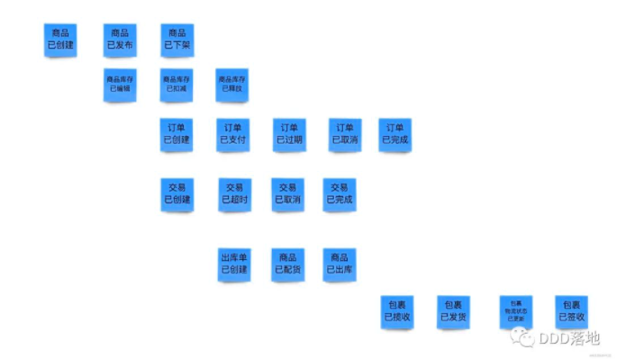

2. 命令风暴
- 目的：识别事件的触发原因以及约束（策略、规则） ，识别事件与事件之间因果的关系强/弱一致性
- 过程：分析事件的角色，命令，添加因果关系连线 区分强一致或弱一致（强一致用实线-代表必须在一个事务完成，若一致用虚线-代表可以用事件/消息进行驱动）

阶段成果：
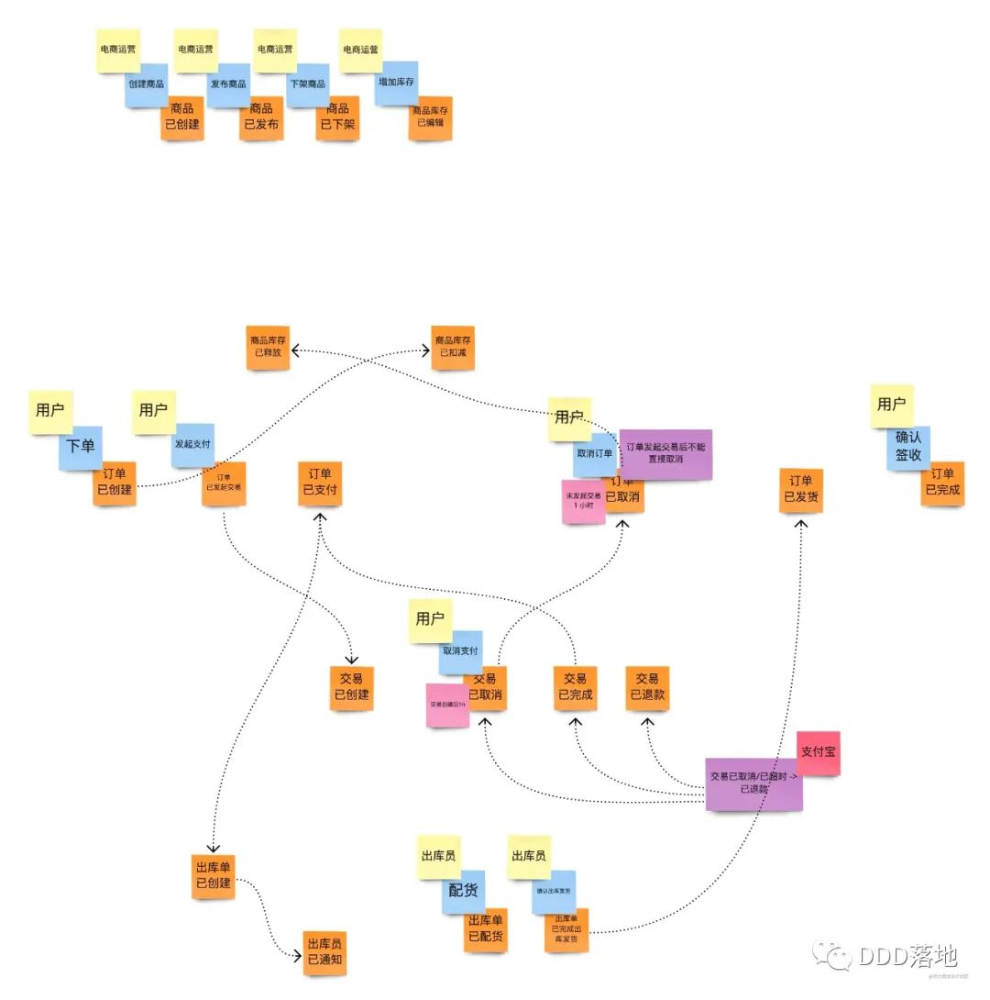

3. 划分聚合
- 目的：识别具有固定规则的业务模型
- 归纳聚合 不能打断实 聚合内的事件应该是强一致的

阶段成果：
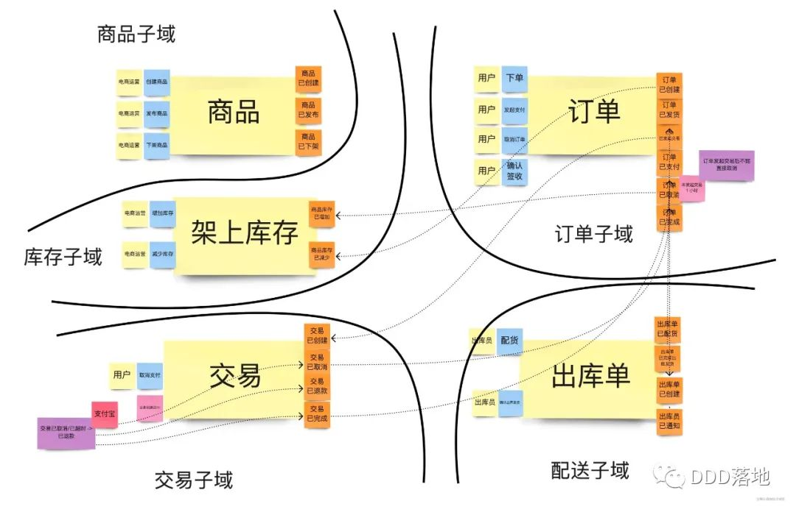

4. 划分子域
- 目的：识别核心域/支撑域/通用域，通过分而治之的方法分析问题。划分依据只是从业务问题角度划分，划分问题域，并没有考虑工作边界。
- 过程：识别核心域（符合产品愿景）-识别核心域周边（衍生关系还是支撑关系）-识别衍生/支撑子域的周边
- 粒度要求：边界清晰即可

阶段成果：

5. 上下文映射
- 目的：在系统架构、组织架构层面上确定对业务的解决方案
- 划分依据：

一是参考组织架构最终限界上下文会对应到各个团队，用以控制工作边界。

二是可以参考子域划分，但子域并不完全对应上下文映射，比如：

一个限界上下文包含多个子域：有的子域太小不值得用单独的上下文解决，可以由同一个上下文解决多个业务问题，
最终会体现在这几个业务都由一个团队来负责

一个子域拆分为多个限界上下文：一个子域中存在需要单独解决的，
比如商品业务中可能会存在智能推荐的部分，这个子域可以被拆分为商品上下文，商品推荐上下文

- 过程

一是划分限界上下文。

二是确定上下文关系，目的是为将来的业务问题解决方案提供指导。

关系有：

合作关系 -耦合，需要一起协调开发计划与发布计划

客户方-供应方 上下游关系，上游独立但需顾及下游需求，下游依赖上游

遵奉者  上下游关系，上游强势，下游被迫使用上游已有能力

分离 解耦关系

大泥球 强耦合，没有边界，今天我处理你的代码，明天你处理我的代码

尽量使协作模式是 客户方-供应方、分离

阶段成果：

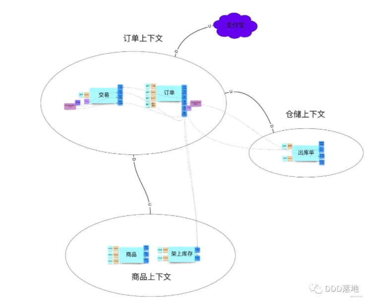

6. 产出
- 通用语言（核心领域词汇表） 用以在一个限界上下文中统一语言
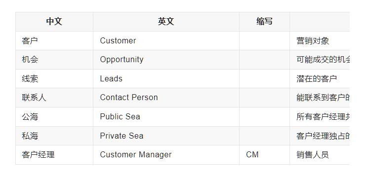
- 领域模型（战略设计的领域模型尽量精简，能反映业务概念即可）

注：

图是表达领域模型最常用的方式，但不是唯一的表达方式，代码或文字描述也能表达领域模型；

领域模型贯穿软件分析、设计，以及开发的整个过程；领域专家、设计人员、
开发人员通过领域模型进行交流，
彼此共享知识与信息
；因为大家面向的都是同一个模型，所以可以防止需求走样，
可以让软件设计开发人员做出来的软件真正满足需求； 

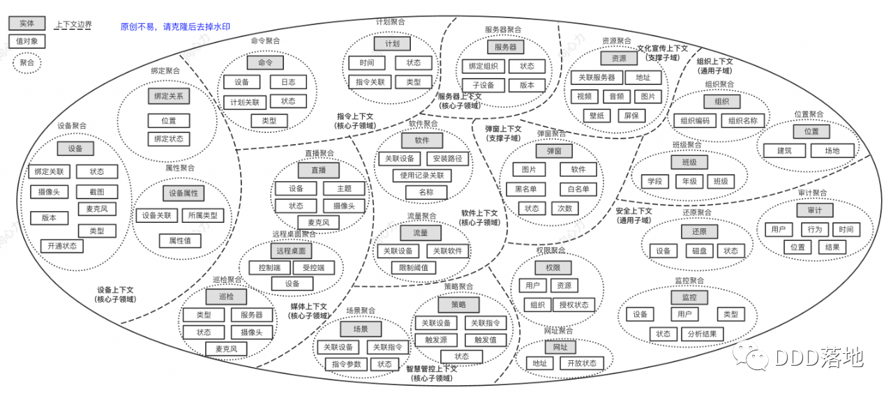
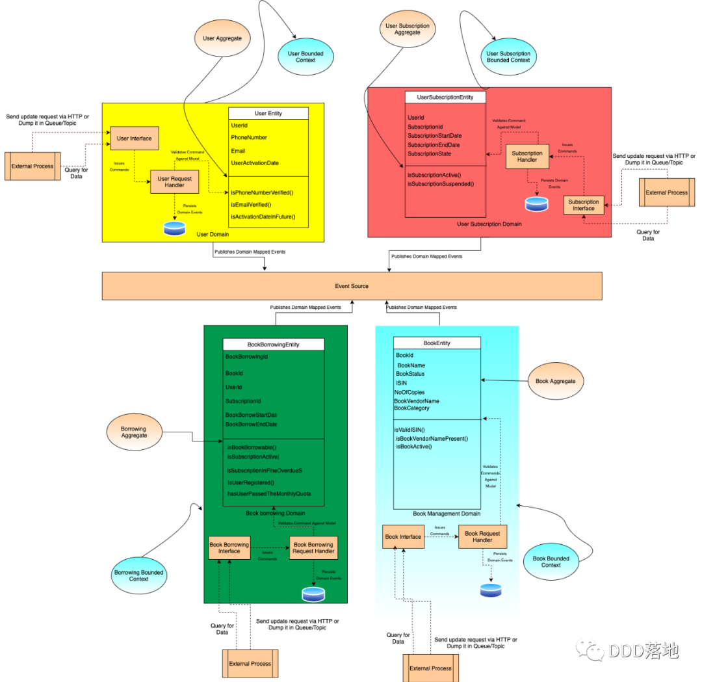
- 子域 用以低业务理解复杂度，拆分不同的问题域，通过分而治之的方法分析问题。

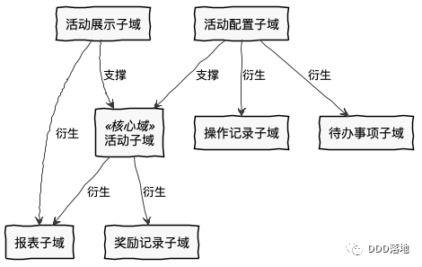
- 限界上下文 用以确定语义所在的领域边界

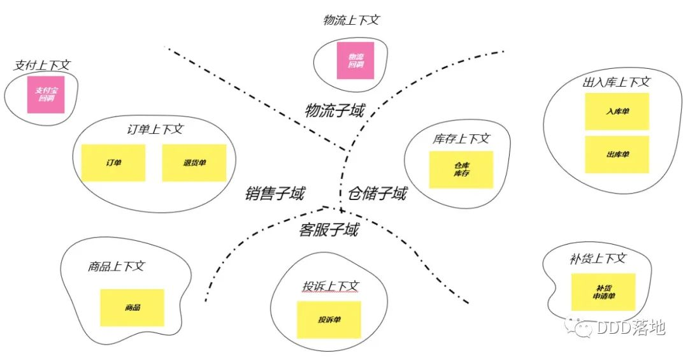
- 上下文映射图 用以表示两个或多个限界上下文之间的映射关系 ACL表示防腐层 OHS表示开放主机服务 PL表示发布语言

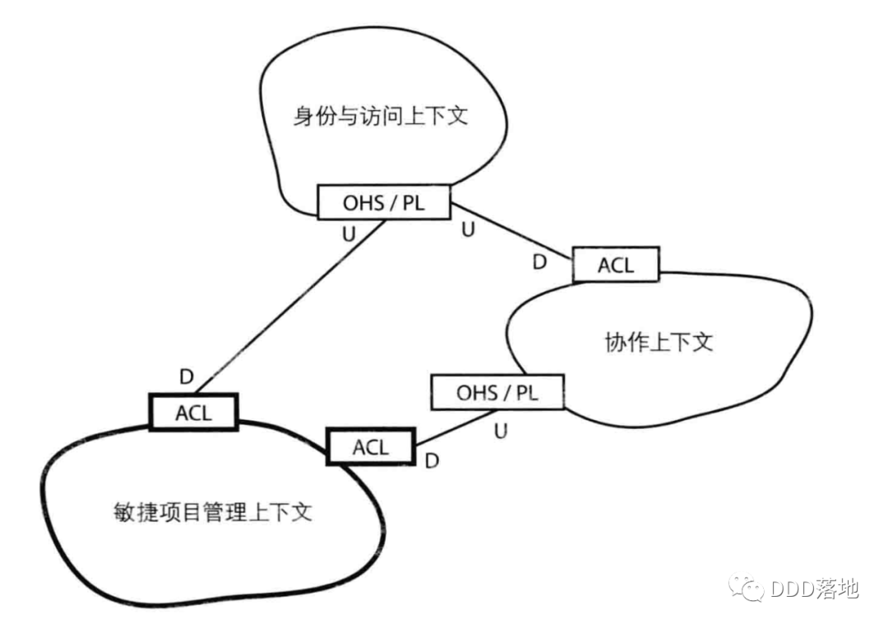

# 战术设计
战术设计，即设计某一特定上下文进行详细的设计，目的应是确保在代码级别可清晰实现。
## 概念
1. 实体
- 与数据库对象的对应关系可能是1对多，多对1,1对0
- 先构建领域模型再针对实际业务场景构建实体对象和行为，再将实体对象映射到数据持久化对象
- 封装单对象的有状态的行为，包括业务校验
2. 值对象
- 不变对象，无标识
- 只是实体的若干个属性的集合;只有数据初始化操作和有限的不涉及修改数据的行为;部分值对象可共享，有自己的限界上下文（数据类微服务）及持久化对象（数据字典）
3. 聚合
- 业务的一致性（强一致）边界
- 数据修改和持久化的基本单元，一个仓储对应一个聚合
- 外部对象只能持有聚合根的唯一引用 
- 聚合之内要求强一致，聚合之间用最终一致性
4. 领域服务
- 跨多个实体的核心业务由领域服务解决
- 允不允许跨聚合 允不允许跨不同的聚合？
  网络上有部分说不允许，应该放在应用层
  个人认为不一定，把领域服务理解为，解决领域层特定问题，并且需要沟通多个领域对象即可，可以根据限界上下文分包，但没必要完全遵守不能跨聚合，因为某些跨聚合的业务也应该由领域层提供能力。
> 你可能会问，聚合之间如果通过对象引用来关联，那聚合之间的交互就比较方便，因为我可以方便的直接拿到关联的聚合的引用；是的，这点是没错，但是如果聚合之间要交互，在经典DDD的架构下，一般可以通过两种方式解决：1）如果A聚合的某个方法需要依赖于B聚合对象，则我们可以将B聚合对象以参数的方式传递给A聚合，这样A对B没有属性上的关联，而只是参数上的依赖；一般当一个聚合需要直接访问另一个聚合的情况往往是在职责上表明A聚合需要通知B聚合做什么事情或者想从B聚合获取什么信息以便A聚合自己可以实现某种业务逻辑；2）如果两个聚合之间需要交互，但是这两个聚合本身只需要关注自己的那部分逻辑即可，典型的例子就是银行转账，在经典DDD下，我们一般会设计一个转账的领域服务，来协调源账号和目标账号之间的转入和转出，但源账号和目标账号本身只需要关注自己的转入或转出逻辑即可。这种情况下，源账号和目标账号两个聚合实例不需要相互关联引用，只需要引入领域服务来协调跨聚合的逻辑即可；
5. 应用服务
- 只依赖领域服务，Repository,ACL,DP,Entity，并对其进行编排，完成业务。
6. DP（Domain Primitive）
- 封装跟实体无关的无状态计算逻辑
- 值对象一般都可以使用DP封装，因为java的数据类型，String,BigDecimal 这种作为入参，没法表达业务上的数据类型限制，但封装为DP后，我们可以添加一些限制行为。
- 根据业务自定义的一个数据类型（就算是String也封装一层DP对象业务类型）
- 跟实体无关的一种充血模型对象，值对象或其他的上下文对象
7. 领域事件
- 领域之间提倡基于事件驱动 最终一致性
8. 工厂
- 负责复杂领域对象的装配
- 主要是供应用层调用，因为领域知识不适应给客户端知晓
- 工厂生成的对象要处于一致的状态（满足所有固定规则），该有的值都有，如果没有直接抛错
9. 资源库/仓储
- 一个聚合对应一个资源库
## 代码结构
### 推荐包名命名规范
   可以参考：公司名称.项目名称.限界上下文.架构分层.组件类型

   com.xtoon.boot.sys.domain.service

   com.xtoon.boot.sys.domain.specification

   com.xtoon.boot.sys.application.impl

   com.xtoon.boot.sys.infrastructure.persistence.repository
 
原则是：包要反映限界上下文的隔离，尽量使限界上下文内聚。主要维持这个原则就好。

### 参考代码结构

#### 1.COLA架构
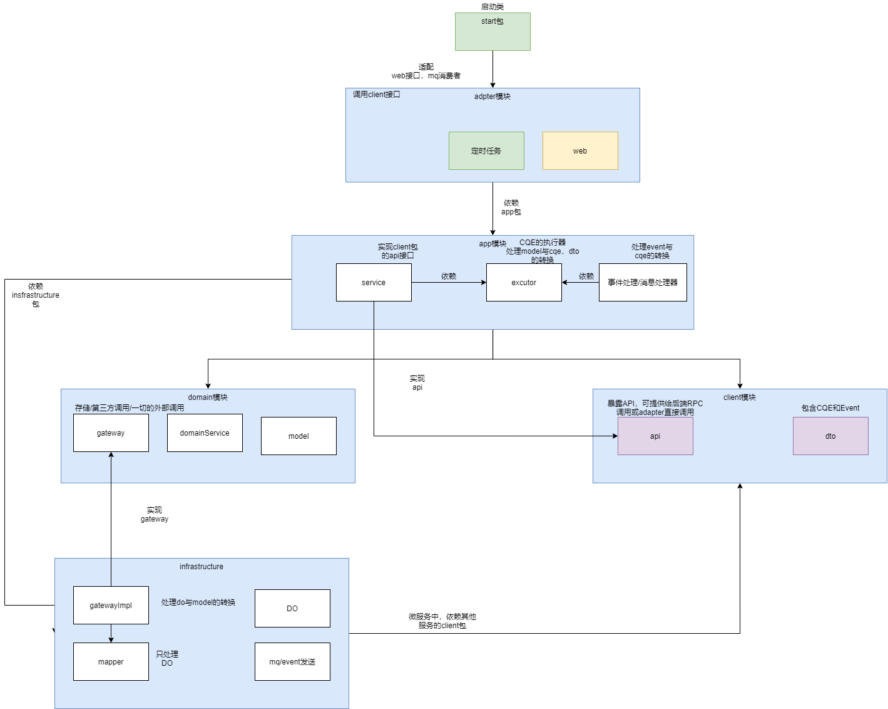

如图所示，可参考：[COLA 4.0：应用架构的最佳实践](https://blog.csdn.net/significantfrank/article/details/110934799)

#### 2.菱形对称架构
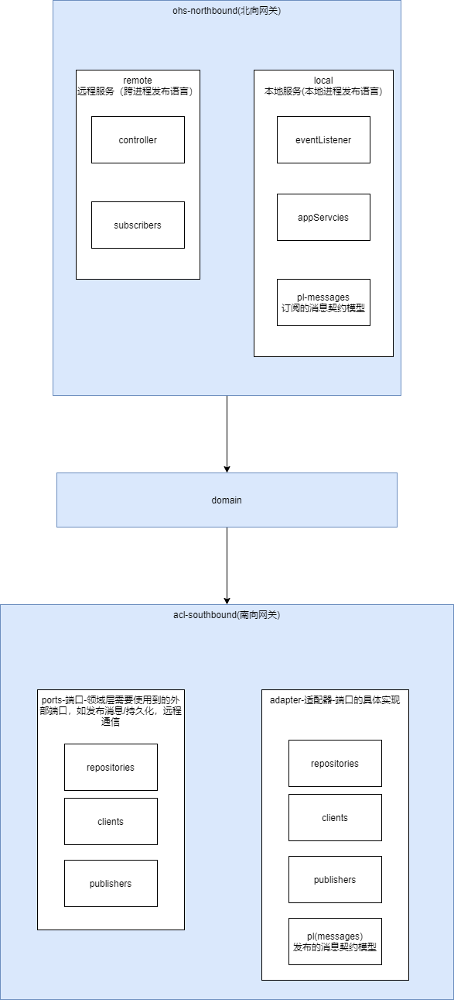

大致如图，参考: [DDD领域驱动战略篇(6) 菱形对称架构](http://it.hzqiuxm.com/%E9%A2%86%E5%9F%9F%E9%A9%B1%E5%8A%A8%E6%9E%B6%E6%9E%84%E7%AF%87/)

#### 3.自己琢磨的
学习了淘宝技术专家殷浩的demo[dddbook](https://github.com/Air433/dddbook)
cola[COLA](https://github.com/alibaba/COLA)
以及享同的开源项目[xtoon-cloud-ddd](https://gitee.com/xtoon/xtoon-cloud)
自己画了一个代码分层分模块架构,供大家参考：

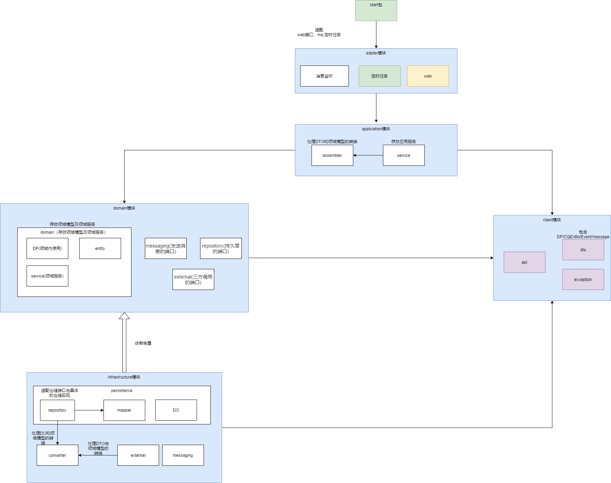

# 存疑
## 关于Domain层是否要进行持久化。也有争议，看到过如淘宝技术专家殷浩所说：

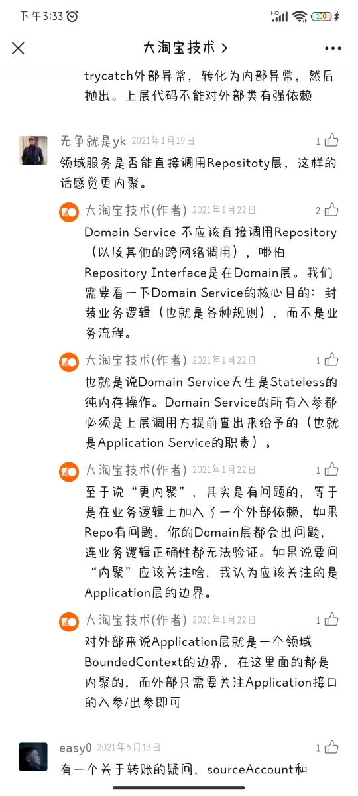

也有其他人说或开源项目里面是domainService在调用Repository。个人更偏向于不进行持久化，而由application层操作。
这样领域层就完全是纯内存操作了,更方便单元测试。

### 参考文献

[DDD实战课 基于DDD的微服务拆分与设计](https://time.geekbang.org/column/intro/238 "DDD实战课 基于DDD的微服务拆分与设计")

[事件风暴](https://mp.weixin.qq.com/s/IJd1fGsND1LAV2EQtyuiUQ)

[关于领域驱动设计（DDD）中聚合设计的一些思考](https://www.cnblogs.com/netfocus/p/3307971.html)

[阿里技术专家详解 DDD 系列- Domain Primitive](https://mp.weixin.qq.com/s/kpXklmidsidZEiHNw57QAQ)

[阿里技术专家详解DDD系列 第二弹 - 应用架构](https://mp.weixin.qq.com/s/MU1rqpQ1aA1p7OtXqVVwxQ)

[阿里技术专家详解DDD系列 第三讲 - Repository模式](https://mp.weixin.qq.com/s/1bcymUcjCkOdvVygunShmw)

[DDD系列第四讲：领域层设计规范](https://mp.weixin.qq.com/s/w1zqhWGuDPsCayiOgfxk6w)

[DDD系列第五讲：聊聊如何避免写流水账代码](https://mp.weixin.qq.com/s/1rdnkROdcNw5ro4ct99SqQ)

[COLA 4.0：应用架构的最佳实践](https://blog.csdn.net/significantfrank/article/details/110934799)

[DDD领域驱动战略篇(6) 菱形对称架构](http://it.hzqiuxm.com/%E9%A2%86%E5%9F%9F%E9%A9%B1%E5%8A%A8%E6%9E%B6%E6%9E%84%E7%AF%87/)
### 版权信息

本文原载于[runningccode.github.io](https://runningccode.github.io)，遵循CC BY-NC-SA 4.0协议，复制请保留原文出处。